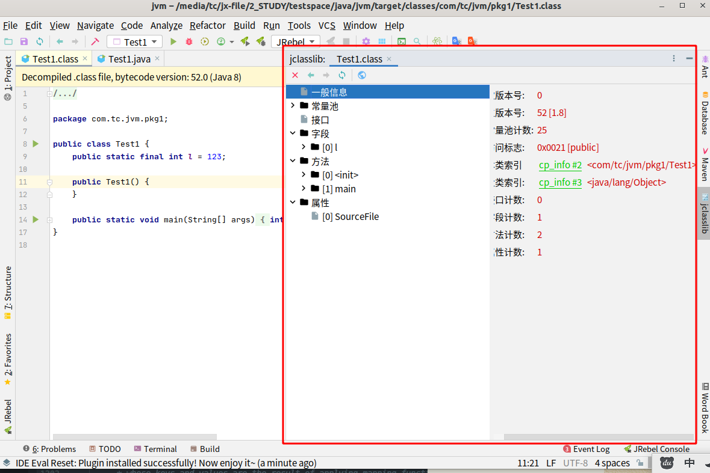
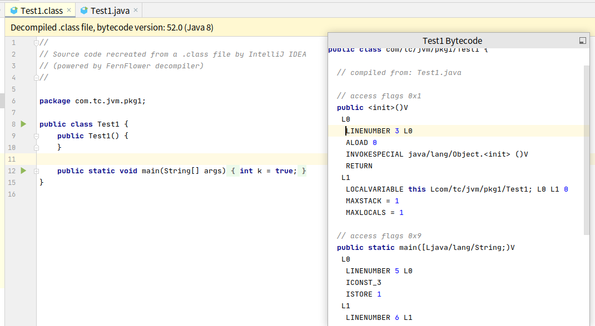
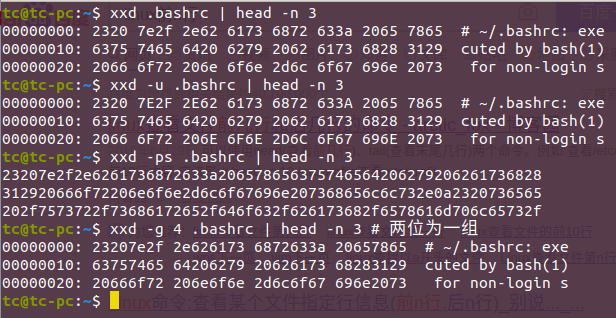
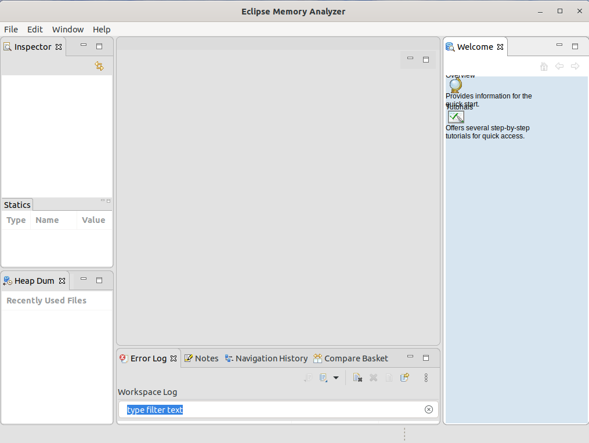

# 工具软件

## jclasslib

​		JClassLib不但是一个字节码阅读器而且还包含一个类库允许开发者读取,修改,写入Java Class文件与字节码。

​		可以单独使用，也可以安装为IDEA插件（方便）。

[IDEA字节码学习查看神器jclasslib bytecode viewer介绍](https://www.cnblogs.com/tangliMeiMei/p/13033572.html)

"view"-->"show bytecode with jclasslib"



## IDEA插件-Bytecode Viewer

​		"view"->"show bytecode":



## Binary Viewer

​		Binary Viewer是一款专业的二进制文件查看工具，可以方便用户查看计算机中所有的二进制文件代码，最大可支持4G大小的文件，同时还支持八进制、十进制或者十六进制代码查看和编辑等操作

​		 **这个软件只有windows才能使用**，在**linux下的替代方法**：

​	**xxd** （2进制）**hexdump** (16进制) 我发现我的ubuntu已经有了这两个软件。

使用方法：

```bash
xxd 文件名
cat 文件名 | xxd
hexdump 文件名
cat 文件名 | hexdump -C
# 在vim中使用
vi -b 文件名
:%!xxd -g 1
# 一定要：%!xxd -r切换回来之后在保存才行
:%!xxd -r
# 这两个命令有很多用法,具体看详细帮助文档
man man
man xxd
man hexdumnp
```

eg:

```bash
xxd .bashrc | head -n 3
xxd -u .bashrc | head -n 3
xxd -ps .bashrc | head -n 3
xxd -g 4 .bashrc | head -n 3 # 两位为一组
```



## Eclipse：Memory Analyzer Tool

​		**Memory Analyzer (Eclipse MAT)**是一个跨平台的开源工具，您不仅可以用它来分析内存问题，也可以用来监控整个 Java 应用程序的状态和行为。通过读取应用程序运行时由 Java 运行时环境生成的转储文件快照，Memory Analyzer 使您能够分析那些调试代码可能无法发现的复杂问题。

​		[官网入口](https://www.eclipse.org/mat/) 支持win、MAC、Linux。

```bash
#!/bin/bash
wget https://eclipse.mirror.rafal.ca/mat/1.11.0/rcp/MemoryAnalyzer-1.11.0.20201202-linux.gtk.x86_64.zip
sudo unzip MemoryAnalyzer-1.11.0.20201202-linux.gtk.x86_64.zip -d /opt/
cd /opt/mat/
sudo chown -R tc:tc ./
mkdir -p ~/.eclipse/workspace
./MemoryAnalyzer -data ~/.eclipse/workspace

# 找一个eclipse的logo
sudo wget https://cdn.freebiesupply.com/logos/large/2x/eclipse-11-logo-svg-vector.svg -O mat-logo.svg

# 制作ubuntu应用图标
sudo cat <<EOF >> /usr/share/applications/EclipseMemoryAnalyzer.desktop
[Desktop Entry]
Version=1.0
Type=Application
Name=MAT Eclipse
Icon=/opt/mat/mat-logo.svg
Exec="/opt/mat/MemoryAnalyzer"
Comment=Eclipse Memory Analyzer
Categories=Memory Analyse tool;
Terminal=false
EOF
```

软件界面




## JDK命令行

​	jinfo

​	jps

​	jstat -gc  

​	

## Jconsole

## Visual VM（实时监控  推荐~）

## Jprofiler（推荐~）

​	[Jprofiler官网](https://www.ej-technologies.com)

​	[Intellij IDEA集成JProfiler性能分析神器](https://blog.csdn.net/wytocsdn/article/details/79258247)

   [ Java性能分析神器-JProfiler详解](https://www.cnblogs.com/jpfss/p/8488111.html) 

​	安装，直接在官网去下载JProfiler 11，然后

## Java Flight Recorder（实时监控）

## GCViewer

## GCEasy


