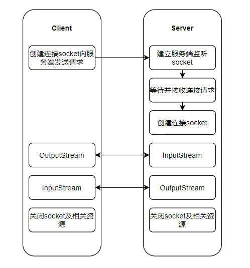

## 傻傻分不清楚的 IO

## 写在前面 

​	`有些废话总想在开头说说嘿嘿，写这篇文章主要目的是对于 网络编程 Netty 的先导学习，学习 Netty 之前我们总应该弄清楚网络 IO 那些事儿。
相信很多同学对于网络 IO 来说是相对陌生的，在很长时间的开发中可能都不会用到 IO 或者说 Netty 。但是网上大家都在夸夸其谈，Netty 怎么怎么好，怎么怎么 np，似乎大家都在用，我也想入门但却很迷糊，Netty这玩意到底是干啥的？我用它干嘛？相信对于初学的你都会有类似的疑问。
本文会带你一起聊聊 这些 IO 有什么区别， Socket 到底是什么？Netty 与他们是什么关系，希望对你有所帮助。`

##  一切的基础 Socket

### Socket 简单介绍及理解

Socket 翻译过来是 **插槽** 。我们一般会称之为 **网络插槽** 。一个简单的理解就是：
在 客户端 与 服务端 进行通信的时候 两端会同时生成一个 Socket ，那么通信时都是通过 该 Socket 进行通信。

> Socket 就像是一个文件进行读写，那么实际多数操作系统对于 Socket 的底层实现就是文件，如我们常用的 Linux。

> 先解释一下常说的 fd 是 (file descriptor)，这种一般是 BSD Socket 伯克利套接字(Berkeley sockets) 的用法，用在 Unix/Linux 系统上。在 Unix/Linux 系统下，一个socket句柄，可以看做是一个文件，在 socket 上收发数据，相当于对一个文件进行读写，所以一个 socket 句柄，通常也用表示文件句柄的 fd 来表示。



### Socket 进一步解释-线程模型

我们从硬件的角度简单理解下数据的传输过程即：
数据 通过网线 到机器网卡 最终将数据写入机器内存
当网卡把数据写入到内存后，网卡向 cpu 发出一个中断信号，操作系统便能得知有新数据到来，再通过网卡中断程序去处理数据。


一个完整的请求处理线程模型如下所示，我们假设 线程 C 运行以下代码

```java
//创建socket
int s = socket(AF_INET, SOCK_STREAM, 0);   
//绑定
bind(s, ...)
//监听
listen(s, ...)
//接受客户端连接
int c = accept(s, ...)
//接收客户端数据
recv(c, ...);
//将数据打印出来
printf(...)
```

当客户端网络请求到服务端时（如 TCP 连接 ），该请求会进入 Pendling Queue 队列中，直到某个线程出发了 接受客户端连接 accept 操作，这里具体化即 上述代码执行到 accept ，该操作会取出某个请求并创建对应的 Socket 文件，该 Socket 包含 发送缓冲区、等待缓冲区、等待队列等。这里会阻塞等待接受数据 即 执行到 recv 时，会将对应线程阻塞，并将其加入到 socket 的等待队列中，直到该 socket 接收到数据后会将该线程恢复到工作队列，并移出等待队列。


通过上面的讲解，相信大家对 Socket 已经有一定的具象化理解了，这个时候我们再来聊聊 IO 模型。
所谓 IO 模型 即 使用**某种模式及通道**来进行**网络数据传输**， Java 为我们提供了 3 种 ：**BIO 、NIO 、AIO**


扩展阅读：

https://blog.csdn.net/w903328615/article/details/113914902?spm=1001.2014.3001.5501
