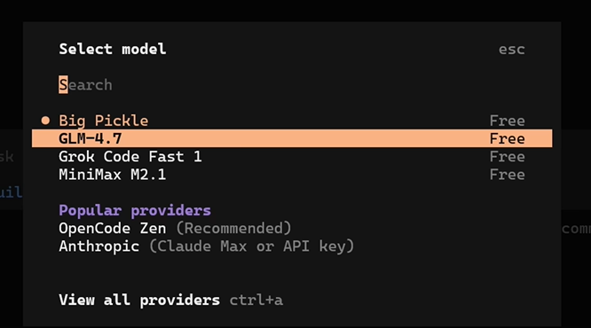
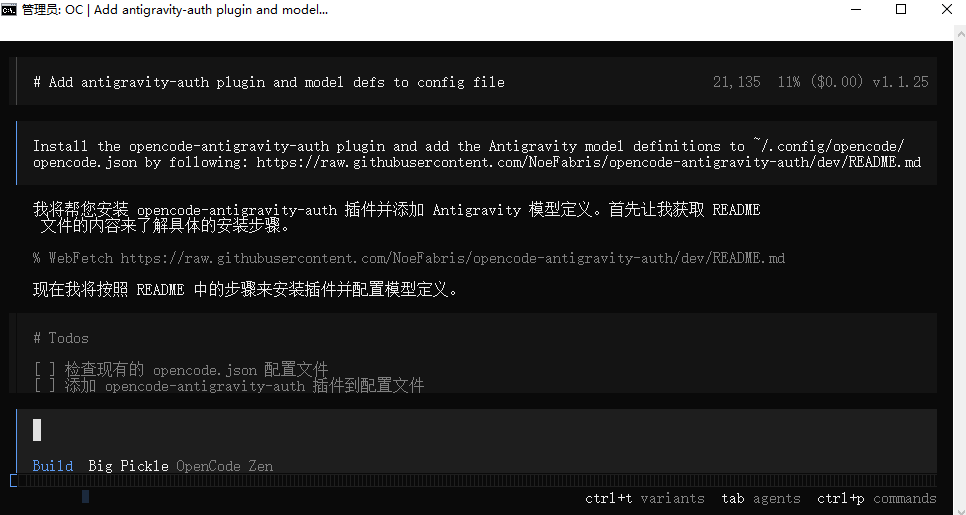
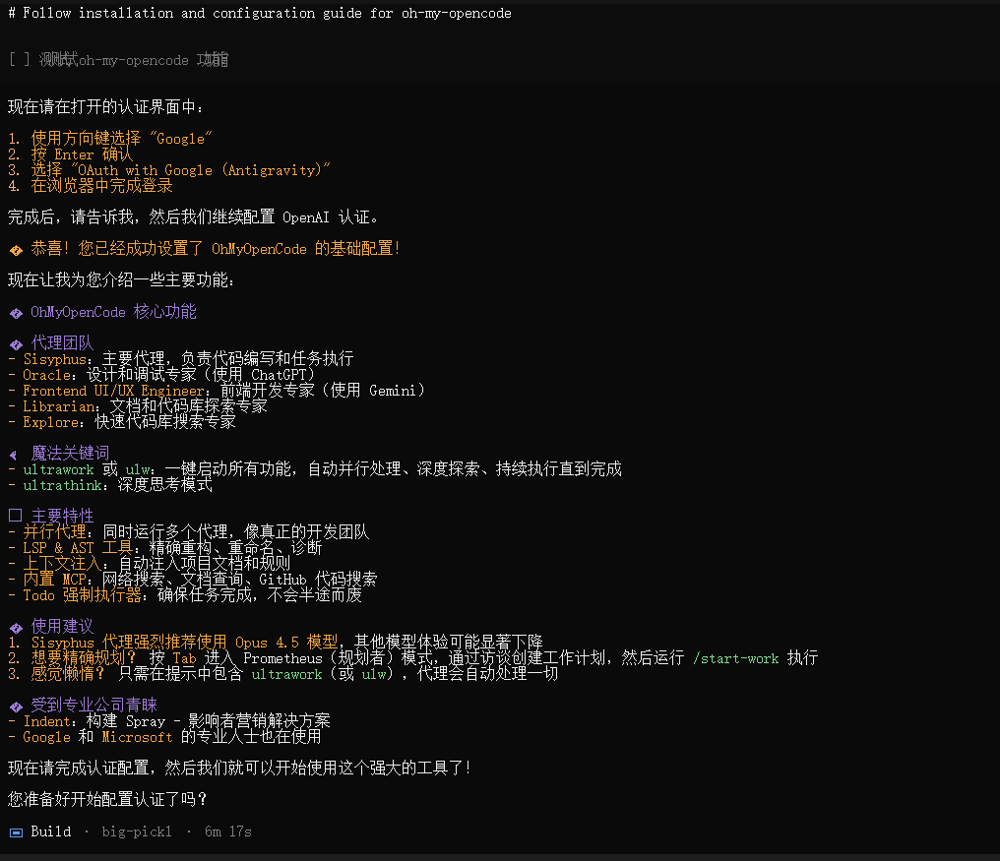

# OpenCode 完整使用笔记

[OpenCode官方仓库](https://github.com/anomalyco/opencode)

[OpenCode中文实战课-非常全的文档](https://learnopencode.com/) [GitHub](https://learnopencode.com/)

[OpenCode官方文档](https://opencode.ai/docs)

## 一、核心优势
- 开源免费，内置GLM4.7、mini max2.1、Grok Code Fast等免费模型，可接入免费模型、插件配置Gemini 3 pro、claude opus4.5等顶级模型
- 可以看做开源版本的Claude Code，几乎具备了Claude Code的一切功能
- 对中国用户友好，无**限速**、**封号**问题，小白易上手
- 支持多形态运行，功能媲美Claude Code，可练习MCP、sub agent等高级特性

## 二、四种运行形态及安装
### 1. 命令行版（推荐）
1. 下载安装对应系统的Node.js

2. 复制NPM安装命令，打开终端粘贴执行

   ```bash
   npm i -g opencode-ai@latest
   ```

3. 输入`opencode`启动，配置完成即可使用

### 2. 桌面客户端版
1. 点击[下载客户端](https://opencode.ai/download)，一路下一步安装
2. 选择文件夹作为项目即可启动
3. 注意：仅基础对话框功能，目前为beta版，bug较多

### 3. 插件版（以VS Code为例）
1. 先打开安装命令行面板
2. 在VS Code左侧扩展栏搜索“opencode”并安装
3. 按`Ctrl+Shift+P`打开命令面板，输入`open opencode`启动
4. 快捷键`Ctrl+Alt+K`可快速粘贴选中代码到聊天窗口

### 4. 云端运行环境（GitHub为例）
1. 将项目上传至GitHub公开仓库
2. 复制安装命令执行，选择模型提供商（需APIKey）
3. 提交配置文件到GitHub，在项目`Settings→Secrets and variables→Actions`中添加环境变量
4. Issues中输入`/open code`即可触发云端工作（如修复bug、创建PR）

## 三、模型接入方法
### 1. 免费内置模型
输入`/models`，带“free”标记的可直接使用，推荐GLM4.7、mini max2.1



免费模型有 IP 级别的使用限额

### 2. 接入GEMINI3 pro/cloud opus4.5（通过谷歌的Antigravity插件）

启用Opencode通过OAuth对**Antigravity**（谷歌的集成开发环境）进行身份验证，这样您就可以使用谷歌凭据享受Antigravity的速率限制，并访问`gemini-3-pro`和`claude-opus-4-5-thinking`等模型。

1. 复制GitHub[该项目首页](https://github.com/NoeFabris/opencode-antigravity-auth)安装提示词，在OpenCode中粘贴执行，然后等待安装完成。

   > Install the opencode-antigravity-auth plugin and add the Antigravity model definitions to ~/.config/opencode/opencode.json by following: https://raw.githubusercontent.com/NoeFabris/opencode-antigravity-auth/dev/README.md

   我在桌面端没成功，应该是BETA版本的原因，在命令行可以安装成。

   

2. 打开新终端执行登录命令，选择谷歌+ANTIGRAVITY登录方式

   ```bash
   -- 注意这里要开启TUN模式，否则google授权后不能成功登录（见截图）
   opencode auth login
   ```

   

3. 登录谷歌账户，粘贴生成的URL回车，重启后通过`/models`选择模型

   

### 3. 接入ChatGPT Codex
1. 需拥有ChatGPT Plus及以上套餐
2. 输入`/connect`，选择OpenAI→gbt pro
3. 浏览器打开链接完成登录，通过`/models`选择对应模型

### 4. 接入更多模型（通过Open Router）
1. 前往Open Router官网获取APIKey
2. 输入`/connect`找到Open Router，填写APIKey即可
3. 支持国内用户获取额度，覆盖绝大多数大模型

## 四、核心功能与命令
### 1. Session功能
- 每次新对话为一个Session，支持后台运行、多Session并行
- 命令`/sessions`查看所有Session状态，可切换、并行开发多需求
- 命令`/share`将对话记录分享为网页，`/unshare`取消分享，`/export`导出对话文件

### 2. 时间线/检查点
- 输入`/timeline`查看对话历史，可通过`revert`功能回退代码与聊天内容到指定节点

### 3. 常用核心命令
- `/models`：查看所有可用模型
- `/connect`：查看75种模型接入方式
- `/init`：通读项目文件夹，生成项目系统提示词文件
- `/compact`：压缩对话上下文，释放模型窗口
- `/ralph-loop（拉尔夫循环）：强制AI长时间循环处理复杂任务

### 4. 自定义命令与智能体
- 自定义命令：在配置文件夹新建`command`文件夹，以Markdown文件定义命令（指定模式、描述）
- 自定义智能体：新建`agent`文件夹，Markdown文件中指定类型（主智能体primary/子智能体sub agent）、模型、功能描述，子智能体可被自动调度

## 五、高级配置：MCP（本地/远程）
### 1. 本地MCP配置
1. 进入`用户/.config/open code`，编辑配置文件
2. 复制文档站MCP配置模板，填写名称、命令（如`NP shed CN`），添加`enable: true`

### 2. 远程MCP配置（以context7为例）
1. 复制远程配置模板，填写类型`remote`、URL、header
2. 前往context7官网获取APIKey并填写，重启后通过`/mcp`查看

## 六、超强插件：Oh My OpenCode

开源仓库地址：[入口](https://github.com/code-yeongyu/oh-my-opencode)

 主要特性
- 并行代理：同时运行多个代理，像真正的开发团队
- LSP & AST 工具：精确重构、重命名、诊断
- 上下文注入：自动注入项目文档和规则
- 内置 MCP：网络搜索、文档查询、GitHub 代码搜索
- Todo 强制执行器：确保任务完成，不会半途而废

### 1. 核心亮点
- 集成LSP、AST、LOC等工具，内置3个MCP server（Web search/Context7/grp app）


| 名称 | 功能 |
| :--- | :--- |
| **lsp 高级版** | 通过编程语言的语法和语义，帮助AI快速定位理解代码 |
| **ast** | 通过代码语法树进行关联搜索 |
| **look_at** | 借助多模态大模型的视觉，理解图片、PDF信息 |
| **delegate-task** | Agent 任务分配 |
| **background-task** | Agent 后台调度 |
| **websearch** | 使用 Exa AI 进行实时网络搜索，返回相关内容 |
| **context7** | 获取代码库或框架的最新官方文档 |
| **grep_app** | 通过 grep.app 在公共 GitHub 仓库中进行超快代码搜索 |


- 包含7大编程智能体，自动匹配最优模型

  - Sisyphus：主要代理，负责代码编写和任务执行
  - Oracle：设计和调试专家（使用 ChatGPT）
  - Frontend UI/UX Engineer：前端开发专家（使用 Gemini）
  - Librarian：文档和代码库探索专家
  - Explore：快速代码库搜索专家


### 2. 安装与使用
1. 复制GitHub首页`install`开头的提示词，在OpenCode中粘贴执行

   > Install and configure by following the instructions here https://raw.githubusercontent.com/code-yeongyu/oh-my-opencode/refs/heads/master/README.md

2. 根据提示选择已有模型订阅（如ChatGPT/GEMINI），完成配置

   

   

### 3. 魔法关键词

   - ultrawork 或 ulw：一键启动所有功能，自动并行处理、深度探索、持续执行直到完成
   - ultrathink：深度思考模式

   用法：`@+智能体名称`指定智能体；输入`ULW`（ultra work）触发多智能体并行工作，主智能体调度

### 4. 使用建议

1. Sisyphus 代理强烈推荐使用 Opus 4.5 模型，其他模型体验可能显著下降
2. 想要精确规划？ 按 Tab 进入 Prometheus（规划者）模式，通过访谈创建工作计划，然后运行 /start-work 执行
3. 感觉懒惰？ 只需在提示中包含 ultrawork（或 ulw），代理会自动处理一切

## 七、Skill迁移（从Claude Code到OpenCode）
1. 找到Claude Code的技能包文件夹
2. 将文件夹中的`.cloud`后缀改为`.open code`
3. 在OpenCode项目文件夹新建`.open code/skills`，复制技能包即可直接使用


> claude文档中的ZCF也可以应用到OpenCode中
