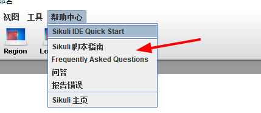
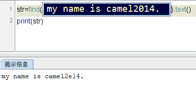
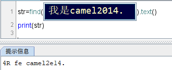
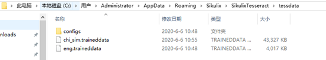
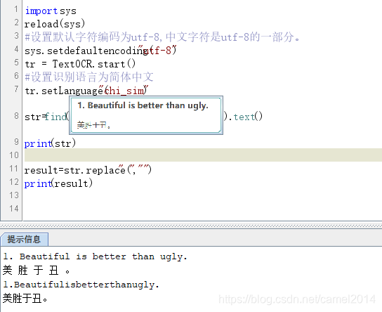
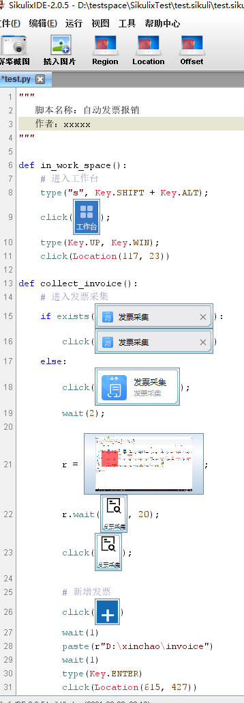

# Sikuli

## 简介

基于GUI的自动测试工具。


**优点**

1.与平台无关

可以实现任意类型的UI（GUI）测试，轻松实现跨平台测试，并可以解决web测试中的浏览器兼容性测试问题。

2.可读性强

代码可读性强，用图形表示逻辑关系更生动、形象，容易理解，便于维护。

3.提供.jar包

便于构建大型的测试框架，实现各类测试工具之间的互补。

4.用例设计与程序实施可分离

用例设计人员可以只关注图型逻辑关系和测试检查点，不需要懂得具体开发与程序语言基础；程序实施人员可以只进行编程而不过多参与设计。

**缺点**

1、sikuli不支持中文，因此无论在编程中或者保存路径，都不可以使用中文！否则运行报错。

2、图片的分辨率、色彩、尺寸、唯一性对程序的影响 （如果有两个相同的，无法区分具体哪一个）

3、sikuli本身还不完善（处于开发、升级阶段） 还有很多程序bug,能否继续发展还是未知数

4、只认识当前活动的图标（只有当前桌面有才行）

5、用例组织方面有提供但是目前有bug，还未调研尝试便利性

6、截图的话，脚本存储占用空间较大

7、相似度调整需要手动一个个的调整，工作量

## sikulix

1)       SikuliX的前身是 Sikuli。Sikuli 一词取自墨西哥 Huichol Indian 土著语，意为“上帝之眼”，Sikuli 让电脑能像人一样“看”这个“真实世界”。

2)       Sikuli是由MIT（麻省理工学院）研究团队发布的一种基于OpenCV图像识别技术的自动化工具软件。2009 年在麻省理工学院用户界面设计小组作为一个开源研究项目，负责人是Tsung-Hsiang Chang 和 Tom Yeh。两人在 2012 年离开了 Sikuli-X-1.0rc3 的项目，后续由RaiMan接管开发和支持至今，并将其命名为 SikuliX。

3)       SikuliX可对人眼能看到的任意应用软件界面进行自动控制，以实现各种软件操作步骤的自动化。软件界面可以是Windows、Mac或则Linux/Unix系统上的任何可见内容。

4)       提供了SikuliX IDE，用户可通过简单的脚本开发实现屏幕上人眼可见的任何图形界面进行各种操作，如实现自动的操作鼠标点击、拖动事件或则键盘的输入等。


###  SikuliX使用场景

1)       在软件自动测试中，被测软件的组件不能准确识别时，可以使用SikuliX

2)       在 IT 运维中，你希望自动化管理任务开发

3)       在日常学习工作中，你希望控制软件自动的执行重复性的任务

在做自动化测试的时候，我们一般不会单独使用这种基于图像识别的工具来进行测试。但是这些工具可以和其他工具组合使用，如AutoIt、Appium、RobotFrameWork等。掌握这种图像识别的技术后，我们可以将它作为目前主流技术的一个补充。

### SikuliX官网资料

1)       概述性资料

https://Sikulix.github.io/docs/，适合入门了解

2. 通过帮助菜单，到网站的Index下去查api比较方便 [link](https://sikulix-2014.readthedocs.io/en/latest/genindex.html)

   

2)       详细资料

https://Sikulix-2014.readthedocs.io/en/latest/#，可查阅类的详细使

### sikulix默认安装不支持中文OCR

资料来源：[这里](https://blog.csdn.net/camel2014/article/details/106894233/)

sikulix具有OCR功能，可以识别显示屏上显示的字符，但是默认设置仅能识别英文字符，并不支持识别简体中文字符。
经过网上查找资料及不断尝，终于找到了sikulix成功识别中文字符的方法，具体步骤如下。
1.使用sikulix OCR功能
Sikulix自带英文字符OCR功能。
例如，您可以使用以下语法通过OCR从目标图像读取字符，并将OCR执行结果保存在名为str的变量中。



使用text()方法，sikulix只需一行就可以识别图片中的英文字符。准确率还可以，以上“my name is camel2014”字符的识别结果只有一个字符0，识别成了字符e。

2.问题：sikulix的OCR默认只支持英文字符及数字
我们再用以上方法识别一段中文。



以上中英文混合字符的识别结果中中文字符一个也没能识别成功。可见，sikulix本身不支持中文字符OCR。
但是在日常自动化工作中，我们非常需要中文OCR功能，怎么办？

3.如何让sikulix支持中文OCR
经网上查阅资料，得知安装sikulix后，默认OCR只包括英文数据包，不包括中文数据包。
因此，要实现中文ocr，就必须包括中文OCR数据包！ sikulix使用“ Tesseract”作为OCR引擎。
在Tesseract中，准备了英语以外的各种语言的ocr学习数据包。我们只要将中文的的ocr数据包下载并在sikulix中进行正确设置，就可以实现中文OCR。

4.Tesseract 中文OCR数据包导入sikulix的步骤
https://github.com/tesseract-ocr/tessdata下载或网上百度搜索（关键字chi_sim.traineddata）Tesseract中文数据包chi_sim.traineddata。
2)安装数据包到sikulix相关文件夹下。对于windows系统将chi_sim.traineddata文件拷贝到C:\Users\（用户名）\AppData\Roaming\Sikulix\SikulixTesseract\tessdata文件夹下。
我测试的文件路径如下：



3)经过以上2个步骤，就完成了中文OCR数据导入sikulix的设置。重新启动sikulix，现在可以让sikulix进行中文OCR。
**sikulix中文OCR示例代码**

```python
import sys
reload(sys)
#设置默认字符编码为utf-8,中文字符是utf-8的一部分。
sys.setdefaultencoding("utf-8")
tr = TextOCR.start()
#设置识别语言为简体中文
tr.setLanguage("chi_sim")
str=find("1592755560273.png").text()
print(str)

result=str.replace(" ","")
print(result)
```




## 技巧

SikulixIDE是不带语法提示的，所以使用SikulixIDE来进行截图定位，使用IDEA来进行写java代码更不错。

参考：待完善

## sikulix实战使用

### 自动发票报销应用



```python
"""
   脚本名称：自动发票报销
   作者：xxxxx
"""

def in_work_space():
    # 进入工作台
    type("s", Key.SHIFT + Key.ALT);
    click("1720754277492.png");
    type(Key.UP, Key.WIN);
    click(Location(117, 23))

def collect_invoice():
    # 进入发票采集
    if exists("1720768863175.png"):
        click("1720768863175.png")
    else:
        click("1720754867502.png");
        wait(2);
        
        r = Region(130,293,326,315);
        r.wait("1720764333329.png", 20);
        click("1720764333329.png");
    
        # 新增发票
        click("1720765625090.png")
        wait(1)
        paste(r"D:\xinchao\invoice")
        wait(1)
        type(Key.ENTER)
        click(Location(615, 427))
        type(Key.SPACE)
        type(Key.ENTER)
        click(Location(615, 427))
        type(Key.SPACE)
        type("a", Key.CTRL)
        type(Key.ENTER)

        # 发票验证等待
        wait(3)

        # 发票已经存在检查
        if exists("1720770245292.png"):
            popError("invoice exist!")
            exit(1)

def baoxiao_invoice():
    click("1720770755249.png")
    wait(2)
    Region(26,59,284,265).wait("1720770871274.png", 20)
    # 点击日常费用报账单
    mouseMove(Location(1714, 611))
    click("1720771010211.png")
    wait("1720771683975.png", 10)
    
    # 成本中心
    wait(1)
    while exists("1720778844190.png"):
        wait(1)
    # mouseMove(Pattern("1720771616792.png").targetOffset(405, 0))
    click(Pattern("1720771616792.png").targetOffset(405, 0))
    click(Pattern("1720773249329.png").targetOffset(30, 207))
    click("1720773327432.png")
    
    # 业务类型 062
    click(Pattern("1720773417608.png").targetOffset(405, 0))
    wait(1)
    click(Pattern("1720773575642.png").targetOffset(0, 0))
    type("a", Key.CTRL)
    type(Key.DELETE * 20)
    paste("062")
    type(Key.ENTER)
    click(Pattern("1720773575642.png").targetOffset(0, 75))
    click(Pattern("1720773575642.png").targetOffset(247, 0))
    
    # 项目
    click(Pattern("1720774359311.png").targetOffset(405, 0))
    wait(1)
    click("1720774422004.png")
    # 部门项目 XM001
    paste("XM001")
    type(Key.ENTER)
    click(Pattern("1720774422004.png").targetOffset(0, 75))
    click("1720773327432.png")

    # 附件张数
    click("1720774694313.png")
    type("3")

    # 摘要
    # Do.popup("continue type form util finshed", "notify", 3)

    # 选择发票
    click("1720777681876.png")
    wait(3)
    click(Pattern("1720777722744.png").targetOffset(21, 76))
    click("1720773327432.png")

    # 加班大类
    click(Pattern("1722233391178.png").targetOffset(296, 0))
    wait(1)
    click(Pattern("1722233715010.png").targetOffset(0, 52))
    type("a", Key.CTRL)
    type(Key.DELETE * 6)
    paste("06202")
    type(Key.ENTER)
    wait(1)
    click(Pattern("1722233715010.png").targetOffset(0, 121))
    click("1720773327432.png") 
    # 加班小类
    # -- 目前会自动选择

    # 鼠标下滚
    wheel(Pattern("1722233391178.png"), Button.WHEEL_DOWN, 10)

    # 收款明细
    click(Pattern("1720777894723.png").targetOffset(-28, -121))
    click("1720777970184.png")
    click("1720778007061.png")
    # 收款明细--收款人
    click(Pattern("1722234235380.png").targetOffset(140, 0))
    # 收款明细--收款银行
    click(Pattern("1722234397703.png").targetOffset(0, 162))
    click("1720773327432.png") 

    wheel("1722238534886.png", Button.WHEEL_DOWN, 10)
    # 上传附件
    # 上传附件--发票及行程单
    click(Pattern("1722234549052.png").targetOffset(1304, 0))
    wait(1)
    paste(r"D:\xinchao\invoice")
    wait(1)
    type(Key.ENTER)
    
    click(Pattern("1722237651102.png").targetOffset(187, 167))
    type(Key.RIGHT)
    type(Key.ENTER)
    click(Location(615, 427))
    type(Key.SPACE)
    type("a", Key.CTRL)
    type(Key.ENTER)

    wheel(Pattern("1722234549052.png"), Button.WHEEL_DOWN, 4)
    # 上传附件--打卡截图
    click(Pattern("1722236975395.png").targetOffset(1442, 0))
    wait(1)
    paste(r"D:\xinchao\invoice")
    wait(1)
    type(Key.ENTER)
    click(Pattern("1722237651102.png").targetOffset(187, 167))
    type(Key.RIGHT*2)
    type(Key.ENTER)
    click(Location(615, 427))
    type(Key.SPACE)
    type("a", Key.CTRL)
    type(Key.ENTER)

    # 上传附件
    # TODO::tc
    Do.popup("continue type form util finshed", "notify", 10)

def main():
    items = ("1.collect voince", "2.bao xiao", "1 and 2")
    selected = select("select application", options = items)
    if selected == items[0]:
        # 进入工作台
        in_work_space()
        # 采集发票
        collect_invoice()
        exit(1)
    elif selected == items[1]:
        # 进入工作台
        in_work_space()
        # 发票报销
        baoxiao_invoice()
        exit(1)
    elif selected == items[2]:
        # 进入工作台
        in_work_space()
        # 采集发票
        collect_invoice()
        # 进入工作台
        in_work_space()
        # 发票报销
        baoxiao_invoice()
        exit(1)   


setFindFailedResponse(PROMPT)
main()
```

### 自动刷视频

参考：待完善。 用到的工具，脚本，项目的结构，如何和SikulixIDE结合使用的，部分代码。


