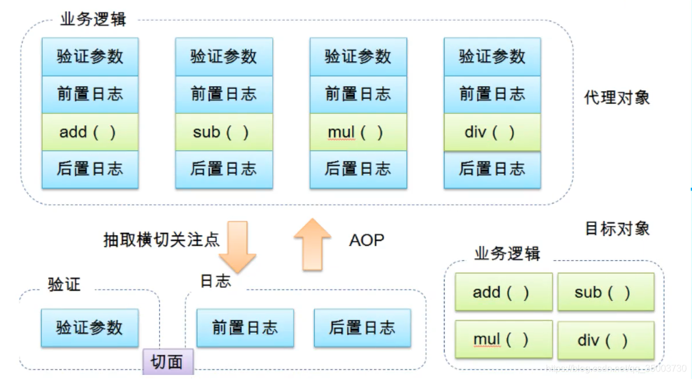
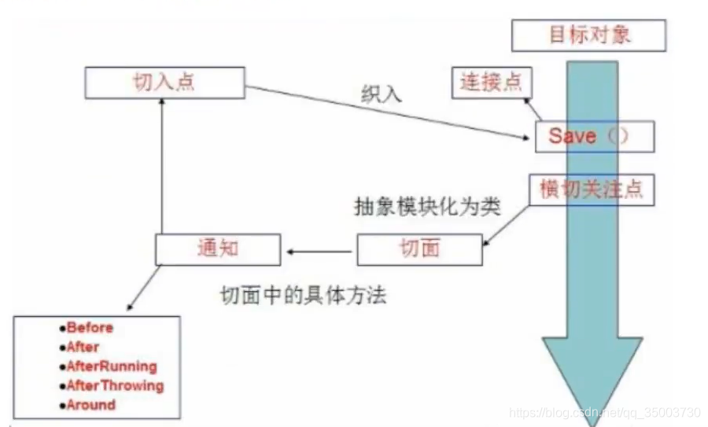

# AOP

## 什么是AOP

​		AOP（Aspect Oriented Programming） 意为：面向切面编程，通过预编译方式和运行期动态代理实现程序功能的统一维护的一种技术。AOP是OOP的延续，是软件开发中的一个热点，也是Spring框架的一个重要内容，是函数式编程的一种衍生范型。利用AOP可以对业务逻辑的各个部分进行隔离，从而使得业务逻辑各个部分之间的耦合度降低，提高程序的可重用性，同时提高了开发的效率。



## AOP在Spring中的作用

 **提供声明式编程：允许用户自定义切面
 相关术语概念：**

横切关注点：跨越应用程序多个模块的方法或功能，即是，与我们业务逻辑无关的，但是我们需要关注的部分，就是横切关注点。如日志，安全，逻辑，缓存，事务等等

切面（Aspect）: 横切关注点被模块化的特殊对象，即它是一个类

通知（Advice）: 切面必须要完成的工作。即它是类中的一个方法。

目标（Target）: 被通知的对象

代理（Proxy）: 向目标对象应用通知后创建的对象

切入点（Ponitcut）: 切面通知执行的地点（位置）的定义

连接点（JointPoint）: 与切入点匹配的执行点



SpringAOP中，通过advice定义横切逻辑，Spring中支持五种类型的Advice：

| 通知类型     | 链接点               | 实现接口                                        |
| ------------ | -------------------- | ----------------------------------------------- |
| 前置通知     | 方法前               | org.springframework.aop.MethodBeforeAdvice      |
| 后置通知     | 方法后               | org.springframework.aop.AfterReturningAdvice    |
| 环绕通知     | 方法前后             | org.aopalliance.intercept.MethodInterceptor     |
| 异常抛出通知 | 方法跑出异常         | org.springframework.aop.ThrowsAdvice            |
| 引介通知     | 类中增加新的方法属性 | org.springframework.aop.IntroductionInterceptor |

即AOP在不改变原有代码情况下，去增加新的功能。

## 使用Spring实现Aop

使用aop织入，需要导入依赖包

```xml
<dependency>
 	<groupId>org.aspectj</group>
 	<artifactId>aspectjweaver</artifactId>
 	<version>1.9.4</version>
</dependency>
```

### 方式一：使用spring API接口

UserService.java

```java
public interface UserService {
    void add();
    void del();
    void modify();
    void query();
}
```

UserServiceImpl.java

```java
public class UserServiceImpl implements UserService {
    public void add() {
        // 日志输出
//        System.out.println("[debug] 用户使用了add方法");
        // 业务操作
        System.out.println("用户新增");
    }

    public void del() {
        // 日志输出
//        System.out.println("[debug] 用户使用了del方法");
        // 业务操作
        System.out.println("用户删除");
    }

    public void modify() {
        // 日志输出
//        System.out.println("[debug] 用户使用了modify方法");
        // 业务操作
        System.out.println("用户修改");
    }

    public void query() {
        // 日志输出
//        System.out.println("[debug] 用户使用了query方法");
        // 业务操作
        System.out.println("用户查询");
    }
}
```

LogAfterAdvice.java

```java
public class LogAfterAdvice implements AfterReturningAdvice {
    public void afterReturning(Object returnValue, Method method, Object[] args, Object target) throws Throwable {
        System.out.println("LogAfterAdvice-[debug] 调用" + method.getName() + "方法 End...");
    }
}
```

LogBeforeAdvice.java

```java
public class LogBeforeAdvice implements MethodBeforeAdvice {
    /**
     *
     * @param method    要执行的目标对象的方法
     * @param args  参数
     * @param target    目标对象
     * @throws Throwable
     */
    public void before(Method method, Object[] args, Object target) throws Throwable {
        System.out.println("LogBeforeAdvice-[debug] 调用" + method.getName() + "方法 start...");
    }
}
```

LogRoundAdvice.java

```java
// 实现环绕通知
public class LogRoundAdvice implements MethodInterceptor {
    public Object invoke(MethodInvocation invocation) throws Throwable {

        System.out.println("LogRoundAdvice-[debug] 前面搞事情！");
        Object result = invocation.getMethod().invoke(invocation.getThis(), invocation.getArguments());
        System.out.println("LogRoundAdvice-[debug] 后面搞事情！");

        return result;
    }
}
```

beans-1.xml

```xml
<?xml version="1.0" encoding="UTF-8"?>
<beans xmlns="http://www.springframework.org/schema/beans"
       xmlns:xsi="http://www.w3.org/2001/XMLSchema-instance"
       xmlns:p="http://www.springframework.org/schema/p"
       xmlns:context="http://www.springframework.org/schema/context"
       xmlns:aop="http://www.springframework.org/schema/aop"
       xmlns:c="http://www.springframework.org/schema/c"
       xsi:schemaLocation="http://www.springframework.org/schema/beans
        https://www.springframework.org/schema/beans/spring-beans.xsd
http://www.springframework.org/schema/aop
        https://www.springframework.org/schema/aop/spring-aop.xsd
http://www.springframework.org/schema/context
        https://www.springframework.org/schema/context/spring-context.xsd">

    <bean id="userService" class="com.tc.aop.service.UserServiceImpl"/>

    <bean id="logBeforeAdvice" class="com.tc.aop.aspect.advice.LogBeforeAdvice"/>
    <bean id="logAfterAdvice" class="com.tc.aop.aspect.advice.LogAfterAdvice"/>
    <bean id="logRoundAdvice" class="com.tc.aop.aspect.advice.LogRoundAdvice"/>

    <!-- 方式一：使用原生Spring API接口 -->
    <!-- 配置aop需要先导入aop依赖 -->
    <aop:config>
        <aop:pointcut id="logPointCut" expression="execution(* com.tc.aop.service..*.*(..))"/>

        <aop:advisor advice-ref="logBeforeAdvice" pointcut-ref="logPointCut"/>
        <aop:advisor advice-ref="logAfterAdvice" pointcut-ref="logPointCut"/>
        <aop:advisor advice-ref="logRoundAdvice" pointcut-ref="logPointCut"/>
    </aop:config>
</beans>
```

### 方式二：使用切面

DiyPointCut.java

```java
// 自定义切面
public class DiyPointCut {
    public void before() {
        System.out.println("在之前执行");
    }

    public void after() {
        System.out.println("在之后执行");
    }
}
```

beans-2.xml

```xml
<?xml version="1.0" encoding="UTF-8"?>
<beans xmlns="http://www.springframework.org/schema/beans"
       xmlns:xsi="http://www.w3.org/2001/XMLSchema-instance"
       xmlns:p="http://www.springframework.org/schema/p"
       xmlns:context="http://www.springframework.org/schema/context"
       xmlns:aop="http://www.springframework.org/schema/aop"
       xmlns:c="http://www.springframework.org/schema/c"
       xsi:schemaLocation="http://www.springframework.org/schema/beans
        https://www.springframework.org/schema/beans/spring-beans.xsd
http://www.springframework.org/schema/aop
        https://www.springframework.org/schema/aop/spring-aop.xsd
http://www.springframework.org/schema/context
        https://www.springframework.org/schema/context/spring-context.xsd">

    <bean id="userService" class="com.tc.aop.service.UserServiceImpl"/>

    <bean id="diyPointCut" class="com.tc.aop.aspect.advice.DiyPointCut"/>
    <!-- 方式二：自定义类 -->
    <aop:config>
        <!-- 自定义切面，ref指向要引用的类 -->
        <aop:aspect id="logAspect" ref="diyPointCut">
            <!-- 切入点 -->
            <aop:pointcut id="point" expression="execution(* com.tc.aop.service..*.*(..))"/>
            <!-- 通知 -->
            <aop:before method="before" pointcut-ref="point"/>
            <aop:after method="after" pointcut-ref="point"/>
         </aop:aspect>
    </aop:config>
</beans>
```

### 方式三：使用注解

AnnotationPointCut.java

```java
package com.tc.aop.aspect.advice;

import org.aspectj.lang.ProceedingJoinPoint;
import org.aspectj.lang.Signature;
import org.aspectj.lang.annotation.*;

// 方式三:使用注解实现AOP
@Aspect // 标注这个类是一个切面
public class AnnotationPointCut {

    @Before("execution(* com.tc.aop.service..*.*(..))")
    public void before() {
        System.out.println("在之前执行");
    }

    @After("execution(* com.tc.aop.service..*.*(..))")
//    @AfterReturning
//    @AfterThrowing
    public void after() {
        System.out.println("在之后执行");
    }

    // 在环绕增强中，我们可以给定一个参数，代表我们要获取处理切入点。
    @Around("execution(* com.tc.aop.service..*.*(..))")
    public void round(ProceedingJoinPoint jp) throws Throwable {
        System.out.println("环绕前");

        // 看一下签名信息
        Signature signature = jp.getSignature();
        System.out.println("signature:" + signature);

        Object proceed = jp.proceed();
        System.out.println("环绕后");
    }
}
```

beans-3.xml

```xml
<?xml version="1.0" encoding="UTF-8"?>
<beans xmlns="http://www.springframework.org/schema/beans"
       xmlns:xsi="http://www.w3.org/2001/XMLSchema-instance"
       xmlns:p="http://www.springframework.org/schema/p"
       xmlns:context="http://www.springframework.org/schema/context"
       xmlns:aop="http://www.springframework.org/schema/aop"
       xmlns:c="http://www.springframework.org/schema/c"
       xsi:schemaLocation="http://www.springframework.org/schema/beans
        https://www.springframework.org/schema/beans/spring-beans.xsd
http://www.springframework.org/schema/aop
        https://www.springframework.org/schema/aop/spring-aop.xsd
http://www.springframework.org/schema/context
        https://www.springframework.org/schema/context/spring-context.xsd">

    <bean id="userService" class="com.tc.aop.service.UserServiceImpl"/>

    <bean id="annotationPointCut" class="com.tc.aop.aspect.advice.AnnotationPointCut"/>
    <!-- 开启aop注解支持  AOP实现：JDK(默认proxy-target-class="false") cglib（proxy-target-class="true"）-->
    <aop:aspectj-autoproxy proxy-target-class="false"/>
</beans>
```


## AOP(execution表达式)

​	[参考资料1](https://blog.csdn.net/somilong/article/details/74568223)  [参考资料2](https://www.cnblogs.com/sjqq/p/10241781.html)


## AOP典型使用场景

1. 日志记录：使用AOP将日志记录逻辑从业务逻辑中分离出来，可以更好地维护和管理代码。
2. 事务管理：通过在方法前后添加事务拦截器，可以实现声明式事务管理，使得事务控制变得更加简单易懂。
3. 安全性控制：使用AOP在方法调用前进行权限校验或其他安全性控制，以确保系统的安全性。
4. 性能监控：通过AOP拦截关键方法并记录执行时间、调用次数等信息，可以帮助开发人员分析和优化应用程序的性能。
5. 缓存处理：将缓存逻辑与业务逻辑分离，通过AOP实现缓存切面，可以提高应用程序的性能。
6. 异常处理：使用AOP处理异常可以将错误处理逻辑与业务逻辑分离，避免代码重复，并且能够更好地管理和处理系统中的异常。
7. 计数器和统计信息：通过AOP拦截关键方法或事件并记录调用次数，可以实现计数器和统计信息功能，方便开发人员进行监控和优化。
8. 权限校验：使用AOP对系统进行细粒度的权限控制，可以确保只有具备相应权限的用户才能访问特定的资源或执行某些操作。
9. 分布式事务：在分布式系统中，使用AOP实现分布式事务管理可以减少事务管理的复杂性，并确保事务的一致性和完整性。
10. 分布式缓存：使用 AOP 实现分布式缓存功能，可以将数据缓存在分布式缓存系统中，从而提高系统的读取速度和并发能力。
11. 动态代理：通过AOP创建动态代理对象可以实现各种功能，例如延迟加载、缓存处理、装饰器模式等。
12. 消息通知：通过AOP拦截事件并发送通知消息，例如邮件、短信等，可以方便地实现各种通知功能。
13. 日志切面：使用AOP实现日志切面可以帮助我们方便地对系统中的所有方法进行日志记录，并且可以根据需要灵活地配置日志级别和输出格式。
14. 容错处理：使用AOP对方法调用进行容错处理，例如重试、降级等，可以增强系统的健壮性和可靠性。
15. 资源释放：例如关闭数据库连接、删除临时文件等操作，我们可以使用AOP来实现资源的自动释放，避免出现资源泄露等问题，实现资源池管理，例如数据库连接池、线程池等，可以提高系统的资源利用率和性能，并且能够更好地管理和维护资源。
16. 参数校验：使用AOP实现参数校验可以避免代码冗余，提高代码复用性，并且能够更好地管理和维护校验逻辑。
17. 懒加载：使用AOP实现懒加载可以延迟对象的创建，降低系统开销，并且能够更好地管理和维护对象的生命周期。
18. 分离关注点：通过AOP将不同的关注点分离出来，例如日志、事务、权限控制等，可以使得代码更加模块化、易于维护和扩展。
19. 接口限流：通过AOP在接口调用前进行限流控制，可以防止系统被恶意攻击或过度请求造成的访问压力过大。
20. 动态路由：使用AOP组合方法调用并动态转发到不同的目标对象，可以实现动态路由的功能，从而提高系统的灵活性和可扩展性。
21. 执行顺序：使用AOP控制方法执行的先后顺序，可以确保方法按照预期的顺序执行，从而避免因为执行顺序问题导致的错误。
22. 统一异常处理：通过AOP拦截异常并进行统一的处理，可以提高开发效率，避免代码重复，同时也能够更好地管理和维护系统中的异常。
23. 时间监控：使用AOP记录方法的执行时间，可以帮助开发人员分析和优化系统的性能，从而提高系统的响应速度和稳定性。
24. 版本控制：使用AOP实现版本控制功能，可以记录每次方法调用的版本信息，方便开发人员跟踪问题和进行回溯。
25. 资源加锁：通过AOP实现资源加锁，通过表达式指定加锁的属性，确保资源不能同时操作。
26. 大数据处理：使用AOP拦截大数据处理过程中的关键点，例如读写数据、计算指标等，并进行统计和分析，可以帮助开发人员优化程序性能，从而提高业务效率。
27. 定时任务：通过AOP实现定时任务调度，可以方便地管理和维护任务信息，同时也能够更好地控制任务执行的时间和频率。
28. API 接口监控：通过AOP拦截 API 接口请求，记录请求参数、响应结果、请求时间等信息，以便开发人员监控接口调用情况，及时排查问题。
29. 代码生成器：通过AOP对程序的结构和方法进行拦截，自动生成一些重复性代码，如 CRUD 方法，从而减少编码量，提高开发效率。
30. 接口转发：通过AOP将接口调用转发到其他系统或服务，可以方便地实现系统间的通信和整合。
31. 数据库路由：使用AOP实现数据库路由功能，可以将不同的请求路由到不同的数据库中，从而提高系统的灵活性和可扩展性。
32. 数据请求定制返回：根据http的header中设置这个接口使用方只需要哪几个属性，那么就只返回那几个属性，减少返回数据，提高响应速度。
33. 无感同步方法转异步处理：通过切面拦截，直接返回请求流水号，通过线程池异步处理业务逻辑，然后前端通过流水号来查看业务的处理的结果情况。
34. .......

总之，Spring AOP具有良好的灵活性和扩展性，可以方便地应用于各种场景中，帮助开发人员提高系统的可维护性、可扩展性和可靠性。