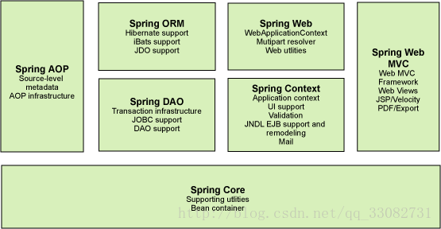
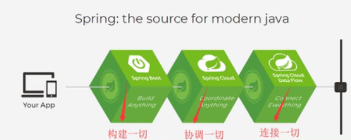

## Spring

### 简介

- spring：春天----->给软件行业带来了春天！
- 2002，首次提出了Spring框架的雏形：interface21框架！
- Spring框架以interface21框架为基础，经过重新设计，并不断丰富其内涵，于2004年3月24日，发布了1.0正式版。
- Rod Johnson。Spring Framework创始人，著名作者。很难想象Rod Johnson的学历，真的好多人大吃一惊，他是悉尼大学的博士，然后他的专业不是计算机，而是音乐学。
- spring理念：使现有的技术更加容易使用，本身是一个大杂烩，整合了现有的技术框架。

```xml
<!-- https://mvnrepository.com/artifact/org.springframework/spring-webmvc -->
<dependency>
    <groupId>org.springframework</groupId>
    <artifactId>spring-webmvc</artifactId>
    <version>5.2.10.RELEASE</version>
</dependency>
<!-- https://mvnrepository.com/artifact/org.springframework/spring-jdbc -->
<dependency>
    <groupId>org.springframework</groupId>
    <artifactId>spring-jdbc</artifactId>
    <version>5.2.10.RELEASE</version>
</dependency>
```

官网： https://spring.io/

官方下载地址： https://repo.spring.io/release/org/springframework/spring/

GitHub：https://github.com/spring-projects/spring-framework

文档还是多看spring官方文档比较好，结合翻译软件看。 

https://docs.spring.io/spring-framework/docs/ 能看见各个版本的文档


### 优点

- Spring是一个开源的免费的框架（容器）！
- Spring是一个轻量级，非入侵式框架！
- 控制反转（IOC），面向切面编程（AOP）！
- 支持事务的处理，对框架整合的支持！

> 总结一句话：Spring就是一个轻量级的控制反转IOC和面向切面编程AOP的框架！

### 组成

[Spring的七大模块，以及每个模块的作用](https://blog.csdn.net/qq_33082731/article/details/75066956)



**核心容器(Spring Core)**：核心容器提供 Spring 框架的基本功能。核心容器的主要组件是 BeanFactory，它是工厂模式的实现。BeanFactory 使用控制反转 （IOC） 模式将应用程序的配置和依赖性规范与实际的应用程序代码分开。 

**Spring 上下文(Spring Context)**：Spring 上下文是一个配置文件，向 Spring  框架提供上下文信息。Spring 上下文包括企业服务，例如 JNDI(Java命名和目录接口)、EJB(Enterprise Java  Beans称为Java 企业Bean)、电子邮件、国际化、校验和调度功能。

**Spring AOP**：通过配置管理特性，Spring AOP 模块直接将面向切面的编程功能集成到了 Spring  框架中。所以，可以很容易地使 Spring 框架管理的任何对象支持 AOP。Spring AOP 模块为基于 Spring  的应用程序中的对象提供了事务管理服务。通过使用 Spring AOP，不用依赖 EJB 组件，就可以将声明性事务管理集成到应用程序中。

**Spring DAO**：JDBC DAO  抽象层提供了有意义的异常层次结构，可用该结构来管理异常处理和不同数据库供应商抛出的错误消息。异常层次结构简化了错误处理，并且极大地降低了需要编写 的异常代码数量（例如打开和关闭连接）。Spring DAO 的面向 JDBC 的异常遵从通用的 DAO 异常层次结构。

**Spring ORM**：Spring 框架插入了若干个 ORM 框架，从而提供了 ORM 的对象关系工具，其中包括 JDO、Hibernate 和 iBatis SQL Map。所有这些都遵从 Spring 的通用事务和 DAO 异常层次结构。 

**Spring Web 模块**：Web 上下文模块建立在应用程序上下文模块之上，为基于 Web 的应用程序提供了上下文。Web 模块还简化了处理多部分请求以及将请求参数绑定到域对象的工作。 

**Spring MVC 框架**：MVC 框架是一个全功能的构建 Web 应用程序的 MVC 实现。通过策略接口，MVC 框架变成为高度可配置的，MVC 容纳了大量视图技术，其中包括 JSP。 

### 拓展

在Spring的官网有这个介绍：现代化的java开发！说白了就是基于Spring的开发！



- Spring Boot
  - 一个快速开发的脚手架
  - 基于SpringBoot可以快速的开发
  - 约定大于配置！
- Spring Cloud
  - Spring Cloud是基于Spring Boot

​       因为现在大多数公司都在使用SpringBoot进行快速开发，学习SpringBoot的前提，需要完全掌握Spring及SpringMVC！承上启下！

​		**弊端：发展了太久之后，违背了原来的理念！配置十分繁琐，人称：“配置地狱”。**


### 不错的资料

[Spring源码解析：BeanFactory深入理解](https://blog.csdn.net/qq_36688143/article/details/84968036)

[最详细的Spring核心IOC的源码分析](https://blog.csdn.net/nuomizhende45/article/details/81158383)

[Spring源码分析](https://www.cnblogs.com/warehouse/p/9372260.html)