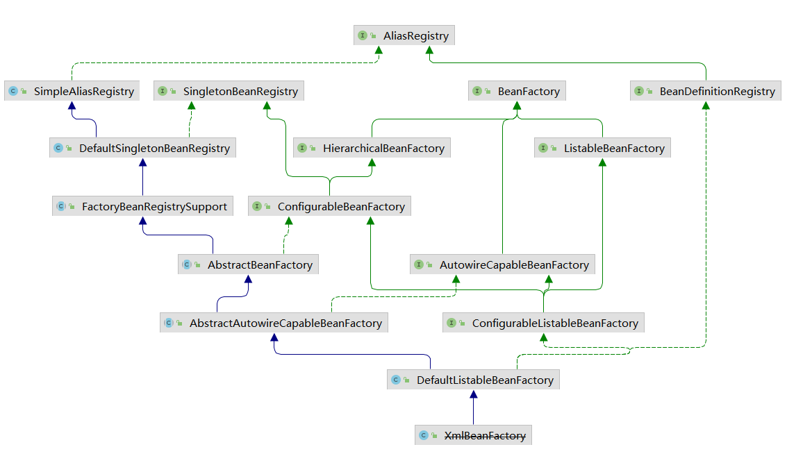
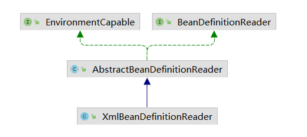

# XmlBeanFactory

## 从测试代码开始分析

BeanFactoryLearn.java

```java
public class BeanFactoryLearn {
	@Test
	public void XmlBeanFactoryTest() {
		BeanFactory beanFactory = new XmlBeanFactory(new ClassPathResource("beanFactory.xml"));
		HelloBean hello = beanFactory.getBean("hello", HelloBean.class);
		hello.sayHello();
	}
}
```

beanFactory.xml

```xml
<?xml version="1.0" encoding="UTF-8"?>
<beans xmlns="http://www.springframework.org/schema/beans"
	   xmlns:xsi="http://www.w3.org/2001/XMLSchema-instance"
	   xsi:schemaLocation="http://www.springframework.org/schema/beans http://www.springframework.org/schema/beans/spring-beans.xsd">
	<bean id="hello" class="com.tc.bean.HelloBean"></bean>
</beans>
```

## XmlBeanFactory层次结构



**让我们先简单地了解图中各个类的作用：**

**AliasRegistry：**定义对alias的简单删改等操作；

**SimpleAliasRegistry：**主要使用map作为alias的缓存，并对接口AliasRegistry进行实现。

**SingletonBeanRegistry：**定义对单例的注册及获取。

**BeanFactory：**定义获取bean及bean的各种属性。

**DefaultSingletonBeanRegistry：**对接口SingletonBeanRegistry及各函数的实现。

**HierarchicalBeanFactory：**继承BeanFactory，也就是再BeanFactory定义的功能的基础上增加了对parentFactory的支持。

**BeanDefinitionRegistry：**定义对BeanDefinition的各种增删改操作。

**FactoryBeanRegistrySupport：**在DefaultSingletonBeanRegistry基础上增加了对FactoryBean的特殊处理功能。

**ConfigurableBeanFactory：**提供配置Factory 的各种方法。

**ListableBeanFactory：**根据各种条件获取 bean 的配置清单。

**AbstractBeanFactory：**综合FactoryBeanRegistrySupport和ConfigurableBeanFactory的功能

**AutowireCapableBeanFactory：**提供创建bean、自动注入、初始化以及应用bean的后置处理器。

**AbstractAutowireCapableBeanFactory：**综合AbstractBeanFactory并对AutowireCapableBeanFactory进行实现。

**ConfigurableListableBeanFactory：**BeanFactory配置清单，指定忽略类型及接口等。

**DefaultListableBeanFactory：**综合上面所有功能，主要对bean注册后的处理。

**XmlBeanFactory：** XmlBeanFactory继承向 DefaultListableBeanFactory ，而 DefaultListableBeanFactory 是整个 bean加载的核心部分，是 Spring 注册及加载 bean的默认实现，而对于 XmlBeanFactory与DefaultListableBeanFactory 不同的地方其实是在 XmlBeanFactory 中使用了自定义的 XML 读取器XmlBeanDefinitionReader ，实现了个性化的 BeanDefinitionReader 读取。

## XmlBeanDefinitionReader

xml bean资源文件读取、解析及注册



EnvironmentCapable：提供获取环境的能力
BeanDefinitionReader ：提供加载bean定义的能力，以及获取注册器、加载器相关能力。
AbstractBeanDefinitionReader：对EnvironmentCapable和BeanDefinitionReader的实现
XmlBeanDefinitionReader：提供通过XML加载BeanDefinition的实现。


