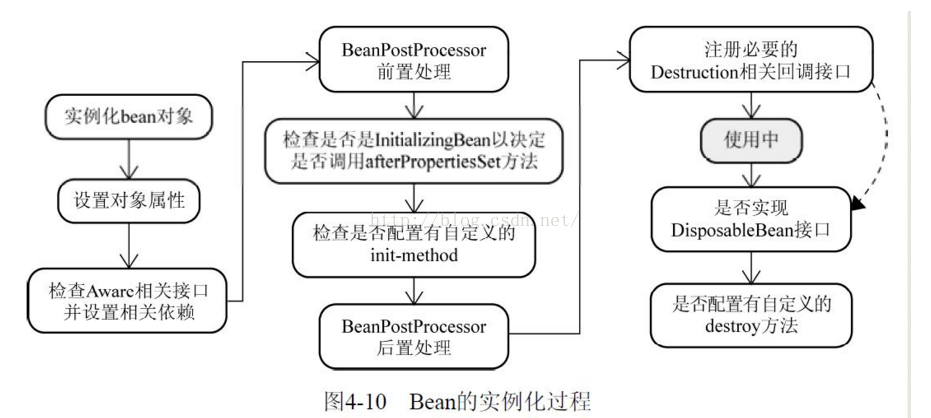
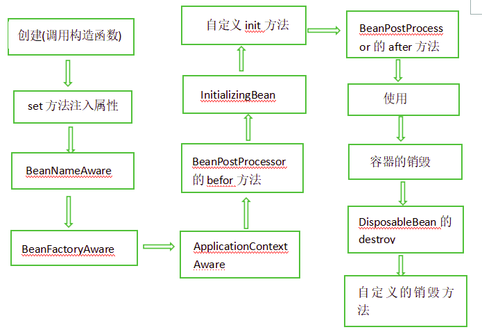

## 依赖注入DI

​	知识点：[循环依赖](https://blog.csdn.net/u010853261/article/details/77940767)

### 构造注入

```xml
<beans>
    <bean id="beanOne" class="x.y.ThingOne">
        <constructor-arg ref="beanTwo"/>
        <constructor-arg ref="beanThree"/>
    </bean>

    <bean id="beanTwo" class="x.y.ThingTwo"/>

    <bean id="beanThree" class="x.y.ThingThree"/>
</beans>
```

### Set方式注入

- 依赖注入: Set注入！
  - 依赖： bean对象的创建依赖于容器；
  - 注入： bean对象中所有属性，由容器来注入；

pom.xml

```xml
<?xml version="1.0" encoding="UTF-8"?>
<project xmlns="http://maven.apache.org/POM/4.0.0"
         xmlns:xsi="http://www.w3.org/2001/XMLSchema-instance"
         xsi:schemaLocation="http://maven.apache.org/POM/4.0.0 http://maven.apache.org/xsd/maven-4.0.0.xsd">
    <parent>
        <artifactId>spring</artifactId>
        <groupId>com.tc.spring</groupId>
        <version>1.0-SNAPSHOT</version>
    </parent>
    <modelVersion>4.0.0</modelVersion>

    <artifactId>spring-04-di</artifactId>

    <dependencies>
        <dependency>
            <groupId>org.springframework</groupId>
            <artifactId>spring-webmvc</artifactId>
        </dependency>
    </dependencies>
</project>
```

address.java

```java
package com.tc.spring.pojo;

public class Address {
    private String address;

    public String getAddress() {
        return address;
    }

    public void setAddress(String address) {
        this.address = address;
    }

    @Override
    public String toString() {
        return "Address{" +
                "address='" + address + '\'' +
                '}';
    }
}
```

Student.java

```java
package com.tc.spring.pojo;

import java.util.List;
import java.util.Map;
import java.util.Properties;
import java.util.Set;

public class Student {
    private String name;
    private Address address;
    private String[] books;
    private List<String> hobby;
    private Map<String, String> card;
    private Set<String> games;
    private String wife;
    private Properties info;

    public String getName() {
        return name;
    }

    public void setName(String name) {
        this.name = name;
    }

    public Address getAddress() {
        return address;
    }

    public void setAddress(Address address) {
        this.address = address;
    }

    public String[] getBooks() {
        return books;
    }

    public void setBooks(String[] books) {
        this.books = books;
    }

    public List<String> getHobby() {
        return hobby;
    }

    public void setHobby(List<String> hobby) {
        this.hobby = hobby;
    }

    public Map<String, String> getCard() {
        return card;
    }

    public void setCard(Map<String, String> card) {
        this.card = card;
    }

    public Set<String> getGames() {
        return games;
    }

    public void setGames(Set<String> games) {
        this.games = games;
    }

    public String getWife() {
        return wife;
    }

    public void setWife(String wife) {
        this.wife = wife;
    }

    public Properties getInfo() {
        return info;
    }

    public void setInfo(Properties info) {
        this.info = info;
    }
}
```

Main.java

```java
package com.tc.spring;

import com.tc.spring.pojo.Student;
import org.springframework.context.ApplicationContext;
import org.springframework.context.support.ClassPathXmlApplicationContext;

public class Main {
    public static void main(String[] args) {
        ApplicationContext context = new ClassPathXmlApplicationContext("beans.xml");

        Student zhangsan = (Student) context.getBean("zhangsan");
        System.out.println("Name:" + zhangsan.getName());
        System.out.println("Address:" + zhangsan.getAddress());
        System.out.println("Books:" + zhangsan.getBooks());
        System.out.println("Hobby:" + zhangsan.getHobby());
        System.out.println("Card:" + zhangsan.getCard());
        System.out.println("Games:" + zhangsan.getGames());
        System.out.println("Wife:" + zhangsan.getWife());
        System.out.println("Info:" + zhangsan.getInfo());
    }
}
```

beans.xml

```xml
<?xml version="1.0" encoding="UTF-8"?>
<beans xmlns="http://www.springframework.org/schema/beans"
       xmlns:xsi="http://www.w3.org/2001/XMLSchema-instance"
       xmlns:p="http://www.springframework.org/schema/p"
       xsi:schemaLocation="http://www.springframework.org/schema/beans
        https://www.springframework.org/schema/beans/spring-beans.xsd">

<!--    <bean id="address" class="com.tc.spring.pojo.Address">-->
<!--        <property name="address" value="xxxxkk位置"/>-->
<!--    </bean>-->

    <bean id="zhangsan" class="com.tc.spring.pojo.Student">
        <property name="name" value="zhangsan"></property>
<!--        <property name="address" ref="address"></property>-->
<!--        <property name="address">-->
<!--            <ref bean="address"/>-->
<!--        </property>-->
        <property name="address">
            <bean class="com.tc.spring.pojo.Address">
                <property name="address" value="xxxxkk位置"/>
            </bean>
        </property>
        <property name="books">
            <array> <!-- 试过，使用list也可以 -->
                <value>语文</value>
                <value>数学</value>
                <value>英语</value>
            </array>
        </property>
        <property name="hobby">
            <list>
                <value>game</value>
                <value>basketball</value>
                <value>football</value>
            </list>
        </property>
        <property name="card">
            <map>
                <entry key="key1" value="value1"/>
                <entry key="key2" value="value2"/>
            </map>
        </property>
        <property name="games">
            <set>
                <value>魂斗罗</value>
                <value>绝地求生</value>
                <value>QQ飞车</value>
                <value>Cross Fire(CF)</value>
            </set>
        </property>
        <property name="info">
            <props>
                <prop key="prop1">prop1-value</prop>
                <prop key="prop2">prop2-value</prop>
            </props>
        </property>
        <property name="wife">
            <null/>
        </property>
    </bean>
</beans>
```


### 拓展方式注入

#### p命名空间注入

​		导入命名空间：xmlns:p="http://www.springframework.org/schema/p"，这个p命名空间注入方式是针对setter方式提供的。

```xml
<?xml version="1.0" encoding="UTF-8"?>
<beans xmlns="http://www.springframework.org/schema/beans"
       xmlns:xsi="http://www.w3.org/2001/XMLSchema-instance"
       xmlns:p="http://www.springframework.org/schema/p"
       xsi:schemaLocation="http://www.springframework.org/schema/beans
        https://www.springframework.org/schema/beans/spring-beans.xsd">

    <bean id="address" class="com.tc.spring.pojo.Address">
        <property name="address" value="xxxxkk位置"/>
    </bean>

    <!-- p命名空间注入，可以直接注入属性的值；property -->
    <bean id="lishi" class="com.tc.spring.pojo.Student"
        p:name="lishi" p:address-ref="address"
    >
    </bean>
</beans>
```

#### c命名空间注入

​		导入命名空间：xmlns:c="http://www.springframework.org/schema/c"，这个c命名空间注入方式是针对构造注入方式提供的。

```xml
<?xml version="1.0" encoding="UTF-8"?>
<beans xmlns="http://www.springframework.org/schema/beans"
       xmlns:xsi="http://www.w3.org/2001/XMLSchema-instance"
       xmlns:p="http://www.springframework.org/schema/p"
       xmlns:c="http://www.springframework.org/schema/c"
       xsi:schemaLocation="http://www.springframework.org/schema/beans
        https://www.springframework.org/schema/beans/spring-beans.xsd">
    <!-- 先给Address的java类添加一个有参构造，然后操作 -->
<!--    <bean id="address" class="com.tc.spring.pojo.Address" c:_0="xxxxkk位置"></bean>-->
    <bean id="address" class="com.tc.spring.pojo.Address" c:address="xxxxkk位置"></bean>
</beans>
```

#### 复合属性名称

```xml
<bean id="something" class="things.ThingOne">
    <property name="fred.bob.sammy" value="123" />
</bean>
```

​	所述`something`具有`fred`属性，该属性具有`bob`属性，其具有`sammy` 特性，并且最终`sammy`属性被设置为值`123`。为了使其工作，bean的`fred`属性`something`和的`bob`属性`fred`一定不能`null`在构造bean之后。否则，将引发`NullPointerException`。

### bean的作用域


​		Singleton是单例类型，就是在创建起容器时就同时自动创建了一个bean的对象，不管你是否使用，他都存在了，每次获取到的对象都是同一个对象。注意，Singleton作用域是Spring中的缺省作用域。

​		Prototype是原型类型，它在我们创建容器的时候并没有实例化，而是当我们获取bean的时候才会去创建一个对象，而且我们每次获取到的对象都不是同一个对象。

​		bean的作用域为Request，表示在一次HTTP请求中，一个bean定义对应一个实例；即每个HTTP请求都会有各自的bean实例；

​		session作用域，与request作用域一样，可以根据需要放心的更改所创建实例的内部状态，而别的HTTP Session中根据userPreferences创建的实例，将不会看到这些特定于某个HTTP Session的状态变化。

​		request、session和global session三种作用域仅在基于web的应用中使用。


### bean的生命周期



与上图类似，bean的生命周期流程图：



　　Bean实例生命周期的执行过程如下：

- Spring对bean进行实例化，默认bean是单例；
- Spring对bean进行依赖注入；
- 如果bean实现了BeanNameAware接口，spring将bean的id传给setBeanName()方法；
- 如果bean实现了BeanFactoryAware接口，spring将调用setBeanFactory方法，将BeanFactory实例传进来；
- 如果bean实现了ApplicationContextAware接口，它的setApplicationContext()方法将被调用，将应用上下文的引用传入到bean中；
- 如果bean实现了BeanPostProcessor接口，它的postProcessBeforeInitialization方法将被调用；
- 如果bean实现了InitializingBean接口，spring将调用它的afterPropertiesSet接口方法，类似的如果bean使用了init-method属性声明了初始化方法，该方法也会被调用；
- 如果bean实现了BeanPostProcessor接口，它的postProcessAfterInitialization接口方法将被调用；
- 此时bean已经准备就绪，可以被应用程序使用了，他们将一直驻留在应用上下文中，直到该应用上下文被销毁；
- 若bean实现了DisposableBean接口，spring将调用它的distroy()接口方法。同样的，如果bean使用了destroy-method属性声明了销毁方法，则该方法被调用；