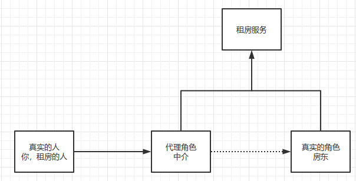
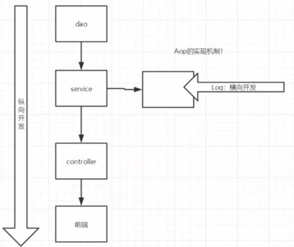

# 代理模式 

​	为什么要学习代理模式？因为这就是SpringAOP的底层！

代理模式的分类：

- 静态代理
- 动态代理



## 静态代理

角色分析：

- 抽象角色：一般会使用接口或者抽象类来解决；
- 真实角色：被代理的角色；
- 代理角色：代理真实角色，代理真实角色后，我们一般会做一些附属操作；
- 客户：访问代理对象的人。


代码步骤：

1. 接口

   ```java
   // 租房接口
   public interface Rent {
       public void rent();
   }
   ```

2. 真实角色

   ```java
   // 房东
   public class Landlord implements Rent{
       public void rent() {
           System.out.println("房东要出租房子");
       }
   }
   ```

3. 代理角色

   ```java
   // 房屋代理
   public class HouseProxy implements Rent{
       private Rent renter;
   
       public HouseProxy(Rent renter) {
           this.renter = renter;
       }
   
       public void rent() {
           // 中介不光可以买房，中介还可以带你看房，签合同，收中介费
           this.seeHouse();
           // 房屋代理找房东租房子
           this.renter.rent();
           this.agreement();
           this.charge();
       }
   
       public void seeHouse() {
           System.out.println("中介带你去看房");
       }
   
       public void agreement() {
           System.out.println("签租赁合同");
       }
   
       public void charge() {
           System.out.println("收中介费");
       }
   }
   ```

4. 客户端访问代理角色

   ```java
   public class Client {
       public static void main(String[] args) {
   //        直接找房东出租房子
   //        Landlord landlord = new Landlord();
   //        landlord.rent();
   
   //        如果找不到房东租房子，我们可以通过中介代理来找房子
           HouseProxy proxy = new HouseProxy(new Landlord());
           // 找中介租房子（中介手上有房源）
           proxy.rent();
       }
   }
   ```

输出：

`中介带你去看房`
`房东要出租房子`
`签租赁合同`
`收中介费`

静态代理模式的好处：

- 可以使真实角色的操作更加纯粹！不用去关注一些公共的业务
- 公共的部分也就交给了代理角色，实现了业务分工！
- 公共业务发生扩展的时候，方便集中管理。

缺点：

- 一个真实角色就会产生一个代理角色，代码量会翻倍（动态代理能解决）~开发效率会降低~


**加深理解**



案例：为所有操作添加执行后都要打印出日志的操作。

UserService.java

```java
package com.tc.demo2;

public interface UserService {
    void add();
    void del();
    void modify();
    void query();
}
```

UserServiceImpl.java

```java
public class UserServiceImpl implements UserService {
    public void add() {
        // 日志输出
//        System.out.println("[debug] 用户使用了add方法");
        // 业务操作
        System.out.println("用户新增");
    }

    public void del() {
        // 日志输出
//        System.out.println("[debug] 用户使用了del方法");
        // 业务操作
        System.out.println("用户删除");
    }

    public void modify() {
        // 日志输出
//        System.out.println("[debug] 用户使用了modify方法");
        // 业务操作
        System.out.println("用户修改");
    }

    public void query() {
        // 日志输出
//        System.out.println("[debug] 用户使用了query方法");
        // 业务操作
        System.out.println("用户查询");
    }
}
```

UserServiceProxy.java

```java
public class UserServiceProxy implements UserService {
    private UserService userService;

    public UserServiceProxy(UserService userService) {
        this.userService = userService;
    }

    public void add() {
        this.log("add");
        this.userService.add();
    }

    public void del() {
        this.log("del");
        this.userService.del();
    }

    public void modify() {
        this.log("modify");
        this.userService.modify();
    }

    public void query() {
        this.log("query");
        this.userService.query();
    }

    private void log(String msg) {
        System.out.println("[debug] 用户使用了" + msg +"方法");
    }
}
```

Client.java

```java
public class Client {
    public static void main(String[] args) {
//        UserService userService = new UserServiceImpl();
        UserService userService = new UserServiceProxy(new UserServiceImpl());
        // 需求：为所有的业务操作添加日志信息
        userService.add();
        userService.query();
    }
}
```

## 动态代理

- 动态代理和静态代理角色一样。
- 动态代理的代理类是动态生成的，不是我们直接写好的！
- 动态代理分为两大类：基于接口的动态代理、基于类的动态代理。
  - 基于接口----JDK 动态代理【我们这里使用】
  - 基于类：cglib。
  - java字节码实现：javassist。

需要了解两个类：Proxy，InvocationHandler。

动态代理模式的好处：

- 可以使真实角色的操作更加纯粹！不用去关注一些公共的业务
- 公共的部分也就交给了代理角色，实现了业务分工！
- 公共业务发生扩展的时候，方便集中管理。
- 一个动态代理类代理的手一个接口，一般就是对应一类业务。
- 一个动态代理类可以代理多个类，只要实现了同一个接口即可。

1.接口

```java
// 租房接口
public interface Rent {
    public void rent();
    public void argument();
}
```

2.真实角色

```java
// 房东
public class Landlord implements Rent {
    public void rent() {
        System.out.println("房东要出租房子");
    }

    @Override
    public void argument() {
        System.out.println("房东签了出租房屋合同");
    }
}
```

3.实现操作前置处理

```java
// 调用之前处理
@FunctionalInterface
public interface ProxyInvokeBefore {
    public void invoke(Object proxy, Method method, Object[] args);
}
```

4.实现操作后置处理

```java
// 调用之处理
@FunctionalInterface
public interface ProxyInvokeAfter {
    public void invoke(Object proxy, Method method, Object[] args);
}
```

5.实现InvocationHandler

```java
package com.tc.demo3;

import java.lang.reflect.InvocationHandler;
import java.lang.reflect.Method;
import java.lang.reflect.Proxy;

public class ProxyInvocationHandler implements InvocationHandler {
    // 被代理的对象
    private Object proxyedObj;
    // 操作之前处理动作
    private ProxyInvokeBefore proxyInvokeBefore;
    // 操作之后处理动作
    private ProxyInvokeAfter proxyInvokeAfter;

    public ProxyInvocationHandler(Object proxyedObj) {
        this.proxyedObj = proxyedObj;
    }

    // 生成得到代理累
    public Object getProxyObj() {
        return Proxy.newProxyInstance(
                this.getClass().getClassLoader(),
                this.proxyedObj.getClass().getInterfaces(),
                this);
    }

    // 处理代理实例，并返回结果
    public Object invoke(Object proxy, Method method, Object[] args) throws Throwable {
        // 操作之前处理
        if (null != proxyInvokeBefore) proxyInvokeBefore.invoke(proxy, method, args);
        // 动态代理的本质，就是使用反射机制实现！
        Object result = method.invoke(proxyedObj, args);
        // 操作之后处理
        if (null != proxyInvokeAfter) proxyInvokeAfter.invoke(proxy, method, args);

        return result;
    }

    public Object getProxyedObj() {
        return proxyedObj;
    }

    public void setProxyedObj(Object proxyedObj) {
        this.proxyedObj = proxyedObj;
    }

    public ProxyInvokeBefore getProxyInvokeBefore() {
        return proxyInvokeBefore;
    }

    public void setProxyInvokeBefore(ProxyInvokeBefore proxyInvokeBefore) {
        this.proxyInvokeBefore = proxyInvokeBefore;
    }

    public ProxyInvokeAfter getProxyInvokeAfter() {
        return proxyInvokeAfter;
    }

    public void setProxyInvokeAfter(ProxyInvokeAfter proxyInvokeAfter) {
        this.proxyInvokeAfter = proxyInvokeAfter;
    }
}
```

6.客户端访问代理角色

```java
public class Client {
    public static void main(String[] mainArgs) {
        // 真实角色
//        Landlord landlord = new Landlord();

        // 代理角色： 现在没有
        ProxyInvocationHandler pih = new ProxyInvocationHandler(new Landlord());
        // 设置前置处理
        pih.setProxyInvokeBefore((Object proxy, Method method, Object[] args) -> {
            System.out.println("[debug] 调用" + method.getName() + "方法 start...");
        });
        // 设置后置处理
        pih.setProxyInvokeAfter((Object proxy, Method method, Object[] args) -> {
            System.out.println("[debug] 调用" + method.getName() + "方法 end...");
        });
        // 这里的proxyObj手动态生成的，我们并没有去写
        Rent proxyObj = (Rent) pih.getProxyObj();

        proxyObj.rent();
        proxyObj.argument();
    }
}
```

输出：

`[debug] 用户使用了add方法`
`用户新增`
`[debug] 用户使用了query方法`
`用户查询`