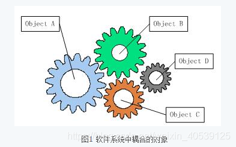
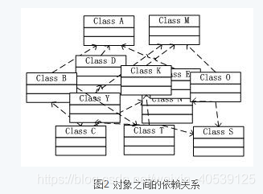
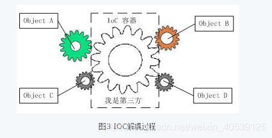
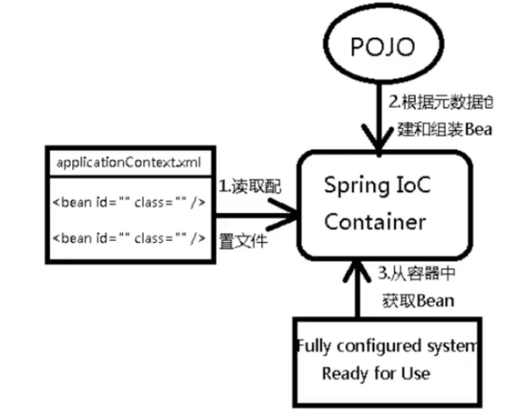

## IOC

### IOC理论

		控制反转IoC(Inversion of Control)，是面向对象编程中的一种设计原则，可以用来减低计算机代码之间的耦合度。其中最常见的方式叫做**依赖注入**（Dependency Injection，简称**DI**），还有一种方式叫“**依赖查找**”（Dependency Lookup）。
	
		没有Ioc的程序中，我们使用面向对象编程，对象的创建与对象间的依赖关系完全硬编码在程序中，对象的创建由程序自己控制，控制反转后将对象的创建转移给第三方，个人认为所谓控制反转就是：获得依赖对象的方式反转了。
	
		参考资料： [资料一](https://blog.csdn.net/weixin_40539125/article/details/103230638)







IOC是Spring框架的核心内容，使用多重方式完美的实现了Ioc，可以使用XML配置，也可以使用注解，新版本的Spring也可以零配置实现Ioc。

Spring容器在初始化时先读取配置文件，根据配置文件或元数据创建与组织对象存入容器中，程序使用时再从Ioc容器中取出需要的对象。



		采用XML方式配置Bean的时候，Bean的定义信息和实现分离的，而采用注解的方式可以把两者合为一体，Bean的定义信息直接以注解的形式定义在实现类中，从而达到了零配置的目的。
		控制反转是一种通过描述（XML或注解）并通过第三方去生产或获取特定对象的方式。在Spring中实现控制反转的是Ioc容器，其实现方法是依赖注入（Dependency Injection， DI）。

### hello-spring

pom.xml

```xml
<dependency>
    <groupId>org.springframework</groupId>
    <artifactId>spring-webmvc</artifactId>
    <version>5.2.2.RELEASE</version>
</dependency>
```

Hello.java

```java
package com.tc.spring.pojo;

public class Hello {
    private String msg;

    public void say() {
        System.out.println(msg);
    }

    public String getMsg() {
        return msg;
    }

    public void setMsg(String msg) {
        this.msg = msg;
    }
}
```

beans.xml

```xml
<?xml version="1.0" encoding="UTF-8"?>
<beans xmlns="http://www.springframework.org/schema/beans"
       xmlns:xsi="http://www.w3.org/2001/XMLSchema-instance"
       xsi:schemaLocation="http://www.springframework.org/schema/beans
        https://www.springframework.org/schema/beans/spring-beans.xsd">
    <description>
        bean define xml
    </description>
    <bean id="hello" class="com.tc.spring.pojo.Hello">
        <property name="msg" value="hello world!"/>
    </bean>
</beans>
```

MyTestMain.java

```java
package com.tc.spring;

import com.tc.spring.pojo.Hello;
import org.springframework.context.ApplicationContext;
import org.springframework.context.support.ClassPathXmlApplicationContext;

public class MyTestMain {
    public static void main(String[] args) {
        // 获取Spring的上下文对象
        ApplicationContext ctx = new ClassPathXmlApplicationContext("beans.xml");
        // 我们的对象现在都在spring中管理了，我们要使用，直接从里面取就行。
        Hello hello = (Hello) ctx.getBean("hello");
        hello.say();

        System.out.println();
    }
}
```

可以看出，所谓的IoC，一句话搞定：对象由Spring来创建，管理，装配！

### IOC创建对象的方式

1.使用无参构造对象。

```xml
    <bean id="hello" class="com.tc.spring.pojo.Hello">
    </bean>
```

2.使用有参构造

1. 下标赋值

   ```xml
   <bean id="hello" class="com.tc.spring.pojo.Hello">
       <constructor-arg index="0" value="hello world!"/>
   </bean>
   ```

2. 类型(不建议使用)

   ```xml
   <bean id="hello" class="com.tc.spring.pojo.Hello">
       <constructor-arg type="java.lang.String" value="hello world!"/>
   </bean>
   ```

3. 参数名

   ```xml
   <bean id="hello" class="com.tc.spring.pojo.Hello">
       <constructor-arg name="msg" value="hello world!"/>
   </bean>
   ```

### spring配置

#### 别名

```xml
<!-- 别名，如果添加了别名，我们可以使用别名获取到这个对象 -->
<alias name="user" alias="userNew"/>
```

#### Bean的配置

```xml
<!-- 
	id: bean的唯一标识符，也就是相当于我们学的对象名
	class：bean对象所对应的全局限定名：包名+类名；
	name： 也就是别名，而且name可以同时去多个别名   通过空格或者,或者;分隔。
	scope: bean的作用域  prototype singleton request session
	factory-bean: 工厂bean
	factory-method: 工厂方法
	abstract: true/false
	autowire: 自动注入方式： byName byType constructor default no
	autowire-candidate: default true false
	depends-on: 依赖项
	init-method: 初始化方法
	destory-method: 销毁方法
	lazy-init: 懒初始化  default true false
	parent:
	primary: true/false
-->
<bean id="userT" class="com.tc.pojo.User" name="user2 u3,u4;u5">
</bean>
```

#### import

		这个import，可以讲多个配置文件，导入合并起来。

```xml
<?xml version="1.0" encoding="UTF-8"?>
<beans xmlns="http://www.springframework.org/schema/beans"
       xmlns:xsi="http://www.w3.org/2001/XMLSchema-instance"
       xsi:schemaLocation="http://www.springframework.org/schema/beans
        https://www.springframework.org/schema/beans/spring-beans.xsd">
    <import resource="sprint-db.xml"/>
    <import resource="spring-tx.xml"/>
    <import resource="spring-web.xml"/>
</beans>
```