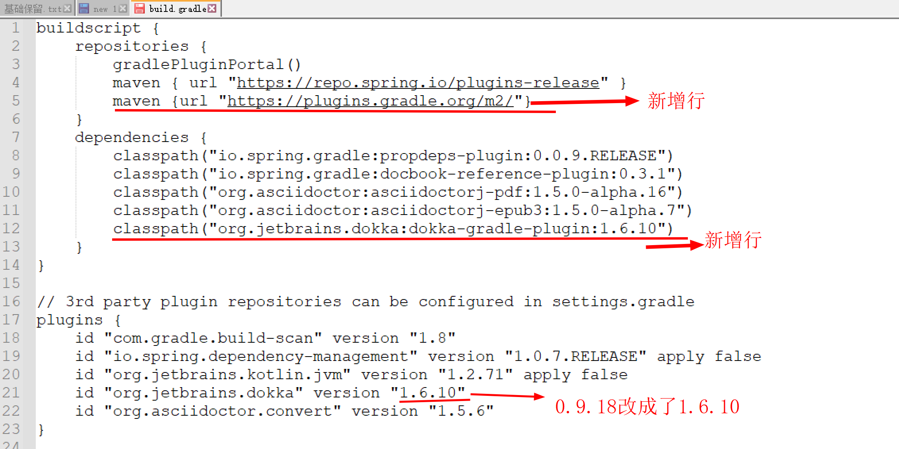
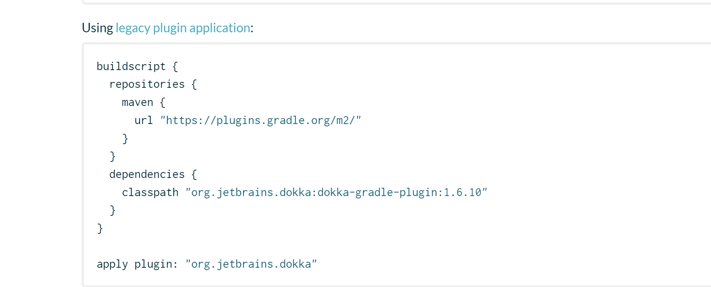
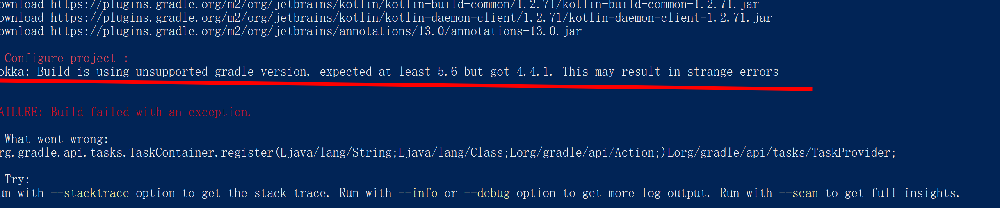

## 搭建spring阅读源码环境

### 搭建源码步骤
1. 拉取源码
    git clone -b 5.0.x  https://gitee.com/AntHubTC/Spring-Framework.git
2. 执行\Spring-Framework\gradlew.bat，执行完成以后，会出现build success的提示，但是这个时候还不算完，为了导入能导入idea中，还需要用gradlew命令去编译spring-oxm文件包。
          Tips：在下面有我总结的遇到的问题的记录。
3. 2

### 遇到的问题
1. **执行gradlew.bat报错： ** Could not generate a proxy class for class org.jetbrains.dokka.gradle.DokkaTask. （这个问题困扰了我2天，用了各种方法最后都快放弃了）

网上各种方法都试了，最后还是不行。网上最多的无非是把那个版本改来改去，但没有说明白原因，导致无法直接套用。
我的解决办法：
      

      我从网上拉下来的源码，dokka使用的0.9.18，最后我改成了1.6.10,得到解决，这个解决方法可能失效，就像网上说的那些改版本，我一个都用不了。
到网址https://plugins.gradle.org/plugin/org.jetbrains.dokka查看可用的dokka版本，然后选用一个版本并将网页上提示信息配置成我我上面的形式。

2.**dokka版本太高，导致FAILURE: Build failed with an exception.**

