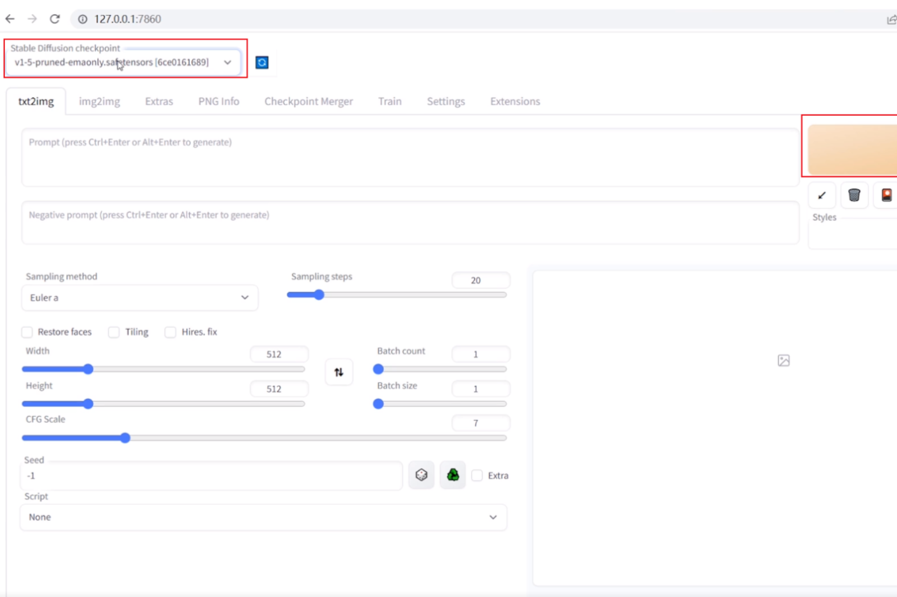

# 本地安装

SD有本地和网络版本，网络的要fq才能用。


## 安装前的准备

硬件与网络要求

- ‌**显卡**‌：需要配置中高端显卡，并具备足够的显存（建议8GB以上）。
- ‌**网络**‌：良好的网络环境，如果访问GitHub等国外网站受限，可能需要“科学上网”。

## 安装必要的软件

1. ‌**Python**‌：
   - 安装Python 3.10.6版本（其他版本可能不兼容）。
   - 安装过程中勾选“Add Python to PATH”。
2. ‌**Git**‌：
   - 从[Git官网](https://git-scm.com/downloads)下载并安装Git。
   - 安装完成后，验证Git是否安装成功（在命令行中输入“git”，回车后出现相关信息即为成功）。

## 下载并安装Stable Diffusion

三、下载stable-diffusion-webui仓库
https://github.com/AUTOMATIC1111/stable-diffusion-webui
在空间比较大的盘里新建一个文件夹，如下图名为【AI】的文件夹，然后在这个文件夹里点击鼠标右键，选择【Git Bash Here】打开Git终端。

```bash
git clone https://github.com/AUTOMATIC1111/stable-diffusion-webui.git
```

出现问题：
OpenSSL SSL_read: Connection was reset, errno 10054

解决方法：
关闭git的https证书验证

```
git config --global http.sslVerify false
```

## 运行webui-user.bat

在上面下载好的文件夹里找到它，双击运行


表示本地电脑启动了一个服务，端口是127.0.0.1:7860
把http://127.0.0.1:7860复制到浏览器中打开，进入Stable Diffusion界面




