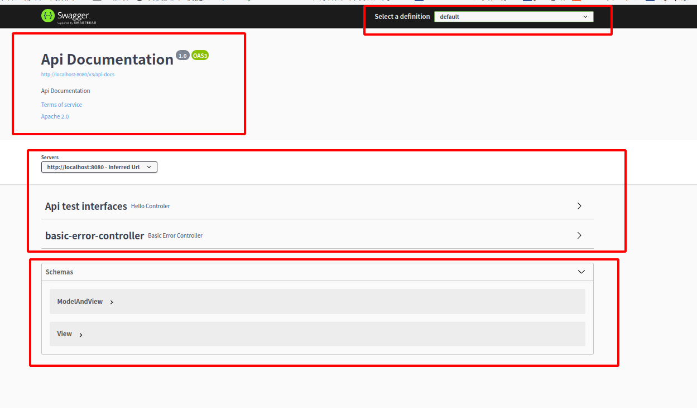
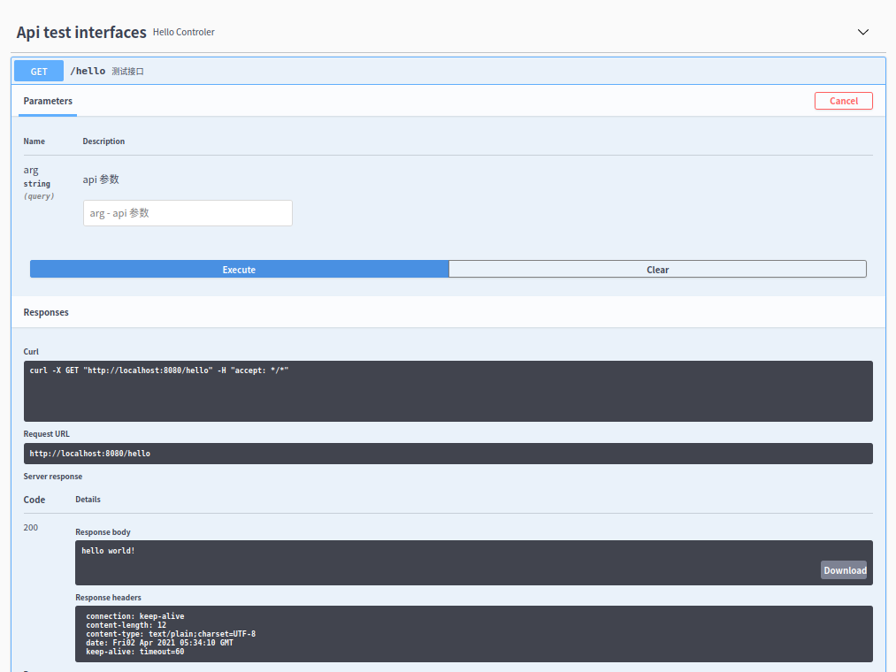

# springboot集成swagger

springfox-swagger

## pom

```xml
<!-- https://mvnrepository.com/artifact/io.springfox/springfox-boot-starter -->
<dependency>
    <groupId>io.springfox</groupId>
    <artifactId>springfox-boot-starter</artifactId>
    <version>3.0.0</version>
</dependency>
```

或者

```xml
<!-- https://mvnrepository.com/artifact/io.springfox/springfox-swagger2 -->
<dependency>
    <groupId>io.springfox</groupId>
    <artifactId>springfox-swagger2</artifactId>
    <version>3.0.0</version>
</dependency>
<!-- https://mvnrepository.com/artifact/io.springfox/springfox-swagger-ui -->
<dependency>
    <groupId>io.springfox</groupId>
    <artifactId>springfox-swagger-ui</artifactId>
    <version>3.0.0</version>
</dependency>
```

## 配置swagger

### 自定义swagger配置

```yaml
# ===== 自定义swagger配置 ===== #
swagger:
  enable: true
  application-name: ${spring.application.name}
  application-version: 1.0
  application-description: springfox swagger 3.0整合Demo
  try-host: http://localhost:${server.port}
```

### SwaggerProperties

```java
package com.tc.doc.config;

import org.springframework.boot.context.properties.ConfigurationProperties;
import org.springframework.stereotype.Component;

@Component
@ConfigurationProperties("swagger")
public class SwaggerProperties {
    /**
     * 是否开启swagger，生产环境一般关闭，所以这里定义一个变量
     */
    private Boolean enable;

    /**
     * 项目应用名
     */
    private String applicationName;

    /**
     * 项目版本信息
     */
    private String applicationVersion;

    /**
     * 项目描述信息
     */
    private String applicationDescription;

    /**
     * 接口调试地址
     */
    private String tryHost;

    public Boolean getEnable() {
        return enable;
    }

    public void setEnable(Boolean enable) {
        this.enable = enable;
    }

    public String getApplicationName() {
        return applicationName;
    }

    public void setApplicationName(String applicationName) {
        this.applicationName = applicationName;
    }

    public String getApplicationVersion() {
        return applicationVersion;
    }

    public void setApplicationVersion(String applicationVersion) {
        this.applicationVersion = applicationVersion;
    }

    public String getApplicationDescription() {
        return applicationDescription;
    }

    public void setApplicationDescription(String applicationDescription) {
        this.applicationDescription = applicationDescription;
    }

    public String getTryHost() {
        return tryHost;
    }

    public void setTryHost(String tryHost) {
        this.tryHost = tryHost;
    }
}

```

### Swagger2Config

```java
package com.tc.doc.config;

import io.swagger.models.auth.In;
import org.apache.commons.lang3.reflect.FieldUtils;
import org.springframework.boot.SpringBootVersion;
import org.springframework.context.annotation.Bean;
import org.springframework.context.annotation.Configuration;
import org.springframework.core.env.Environment;
import org.springframework.core.env.Profiles;
import org.springframework.util.ReflectionUtils;
import org.springframework.web.servlet.config.annotation.InterceptorRegistration;
import org.springframework.web.servlet.config.annotation.InterceptorRegistry;
import org.springframework.web.servlet.config.annotation.WebMvcConfigurer;
import springfox.documentation.builders.ApiInfoBuilder;
import springfox.documentation.builders.PathSelectors;
import springfox.documentation.builders.RequestHandlerSelectors;
import springfox.documentation.oas.annotations.EnableOpenApi;
import springfox.documentation.service.*;
import springfox.documentation.spi.DocumentationType;
import springfox.documentation.spi.service.contexts.SecurityContext;
import springfox.documentation.spring.web.plugins.Docket;

import java.lang.reflect.Field;
import java.util.*;

//@EnableOpenApi
@Configuration
public class Swagger2Config implements WebMvcConfigurer {
    private final SwaggerProperties swaggerProperties;

    public Swagger2Config(SwaggerProperties swaggerProperties) {
        this.swaggerProperties = swaggerProperties;
    }

    @Bean
    public Docket docket(Environment environment) {
        //根据环境决定是否启用swagger
//        Profiles profiles = Profiles.of("dev", "test");
//        boolean flag = environment.acceptsProfiles(profiles);
//        swaggerProperties.setEnable(flag);

        return new Docket(DocumentationType.OAS_30).pathMapping("/")
                // 定义是否开启swagger，false为关闭，可以通过变量控制
                .enable(swaggerProperties.getEnable())
                // 将api的元信息设置为包含在json ResourceListing响应中。
                .apiInfo(apiInfo())
                // 接口调试地址
                .host(swaggerProperties.getTryHost())
            	.groupName("FallenGodCoder的文档") // 分组名称，默认default
                // 选择哪些接口作为swagger的doc发布
                .select()
                // RequestHandlerSelectors配置扫描接口的方式
                //      any() 扫描全部
                //      none() 不扫描
                //      withClassAnnotation 扫描注解，比如RestController注解
                //      withMethodAnnotation 扫描方法上的注解
//                .apis(RequestHandlerSelectors.any())
                .paths(PathSelectors.any()) // 过滤什么路径
//                .paths(PathSelectors.ant("/com/tc/doc/**"))
                .apis(RequestHandlerSelectors.basePackage("com.tc.doc"))
                .build()
                // 支持的通讯协议集合
                .protocols(newHashSet("https", "http"))
                // 授权信息设置，必要的header token等认证信息
                .securitySchemes(securitySchemes())
                // 授权信息全局应用
                .securityContexts(securityContexts());
    }

    /**
     * API 页面上半部分展示信息
     */
    private ApiInfo apiInfo() {
        return new ApiInfoBuilder().title(swaggerProperties.getApplicationName() + " Api Doc")
                .description(swaggerProperties.getApplicationDescription())
                .contact(new Contact("lighter", null, "123456@gmail.com"))
                .version("Application Version: " + swaggerProperties.getApplicationVersion() + ", Spring Boot Version: " + SpringBootVersion.getVersion())
                .build();
    }

    /**
     * 设置授权信息
     */
    private List<SecurityScheme> securitySchemes() {
        ApiKey apiKey = new ApiKey("BASE_TOKEN", "token", In.HEADER.toValue());
        return Collections.singletonList(apiKey);
    }

    /**
     * 授权信息全局应用
     */
    private List<SecurityContext> securityContexts() {
        return Collections.singletonList(
                SecurityContext.builder()
                        .securityReferences(Collections.singletonList(new SecurityReference("BASE_TOKEN", new AuthorizationScope[]{new AuthorizationScope("global", "")})))
                        .build()
        );
    }

    @SafeVarargs
    private final <T> Set<T> newHashSet(T... ts) {
        if (ts.length > 0) {
            return new LinkedHashSet<>(Arrays.asList(ts));
        }
        return null;
    }

    /**
     * 通用拦截器排除swagger设置，所有拦截器都会自动加swagger相关的资源排除信息
     */
    @SuppressWarnings("unchecked")
    @Override
    public void addInterceptors(InterceptorRegistry registry) {
        try {
            Field registrationsField = FieldUtils.getField(InterceptorRegistry.class, "registrations", true);
            List<InterceptorRegistration> registrations = (List<InterceptorRegistration>) ReflectionUtils.getField(registrationsField, registry);
            if (registrations != null) {
                for (InterceptorRegistration interceptorRegistration : registrations) {
                    interceptorRegistration
                            .excludePathPatterns("/swagger**/**")
                            .excludePathPatterns("/webjars/**")
                            .excludePathPatterns("/v3/**")
                            .excludePathPatterns("/doc.html");
                }
            }
        } catch (Exception e) {
            e.printStackTrace();
        }
    }

}
```

## 测试使用

```java
package com.tc.doc.controller;

import io.swagger.annotations.Api;
import io.swagger.annotations.ApiOperation;
import io.swagger.annotations.ApiParam;
import org.springframework.util.StringUtils;
import org.springframework.web.bind.annotation.GetMapping;
import org.springframework.web.bind.annotation.RestController;

@RestController
@Api(value = "myHello", tags = "Api test interfaces")
public class HelloControler {

    @GetMapping("/hello")
    @ApiOperation(value = "测试接口")
    public String hello(@ApiParam(value = "api 参数") String arg) {
        if (StringUtils.isEmpty(arg)) {
            return "hello world!";
        }
        return arg;
    }
}

```

## 启动查看





## swagger注解总结

用于controller类上：
@Api	对请求类的说明

用于方法上面（说明参数的含义）：
@ApiOperation	方法的说明
@ApiImplicitParams、@ApiImplicitParam	方法的参数的说明；@ApiImplicitParams 用于指定单个参数的说明

用于方法上面（返回参数或对象的说明）：
@ApiResponses、@ApiResponse	方法返回值的说明 ；@ApiResponses 用于指定单个参数的说明

对象类：
@ApiModel	用在JavaBean类上，说明JavaBean的 用途。
@ApiModelProperty	用在JavaBean类的属性上面，说明此属性的的含义。

`@ApiModel`的用途有2个：

1. 当请求数据描述，即 `@RequestBody` 时， 用于封装请求（包括数据的各种校验）数据；

2. 当响应值是对象时，即 `@ResponseBody` 时，用于返回值对象的描述。

   

## 总结

- 我们可以通过Swagger给一些比较难理解的属性或接口，增加注释。
- 接口文档实时更新。
- 可以在线测试。

注意点：在正式发布的时候，出于安全考虑，性能考虑，关闭Swagger。


## 生成离线文档springfox-staticdocs

