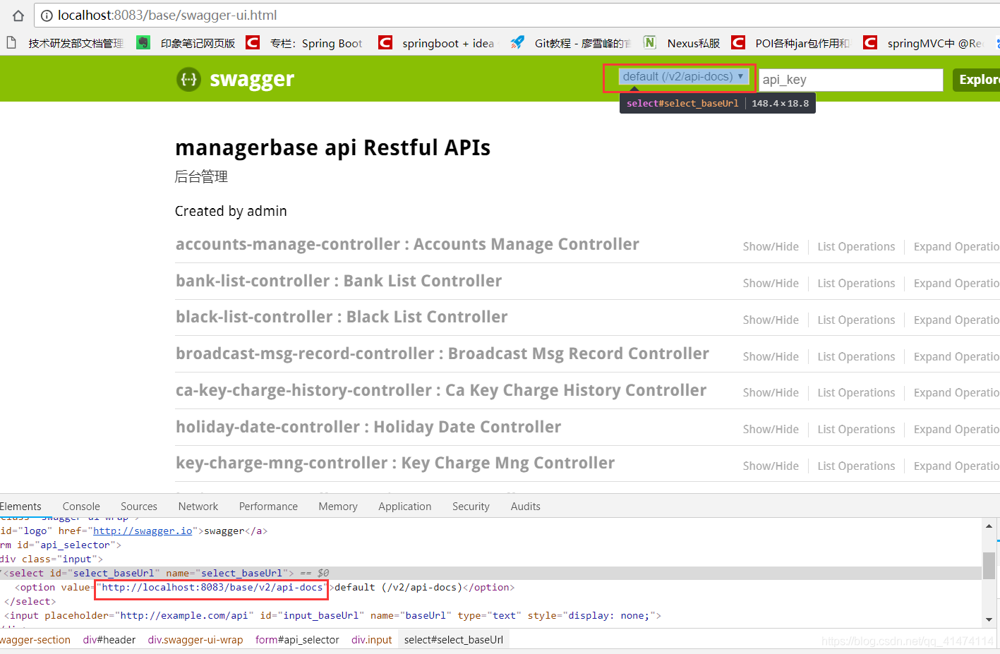
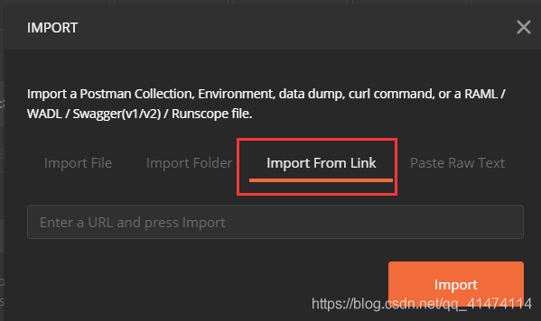

# 通过swagger将接口导入postman教程

​		swagger提供的文档页面中的测试接口能力好像不是很强，这个时候我们可以讲OpenAPI文档导入到postman中然后进行测试。

转载：https://blog.csdn.net/qq_41474114/article/details/89515248

## 操作步骤

打开浏览器，输入http://localhost:8083/base/swagger-ui.html地址

如图，找到对应元素的连接，并复制连接：

打开postman工具，点击左上角“Import”：

选择“Import From Link”，将刚才复制的链接粘贴到文本框内，点击“Import”

完成导入，可看到左侧已导入

如果接口已配置过swagger注释，列表中和接口标题中会出现中文注释（参数中文注释暂时不支持）。

