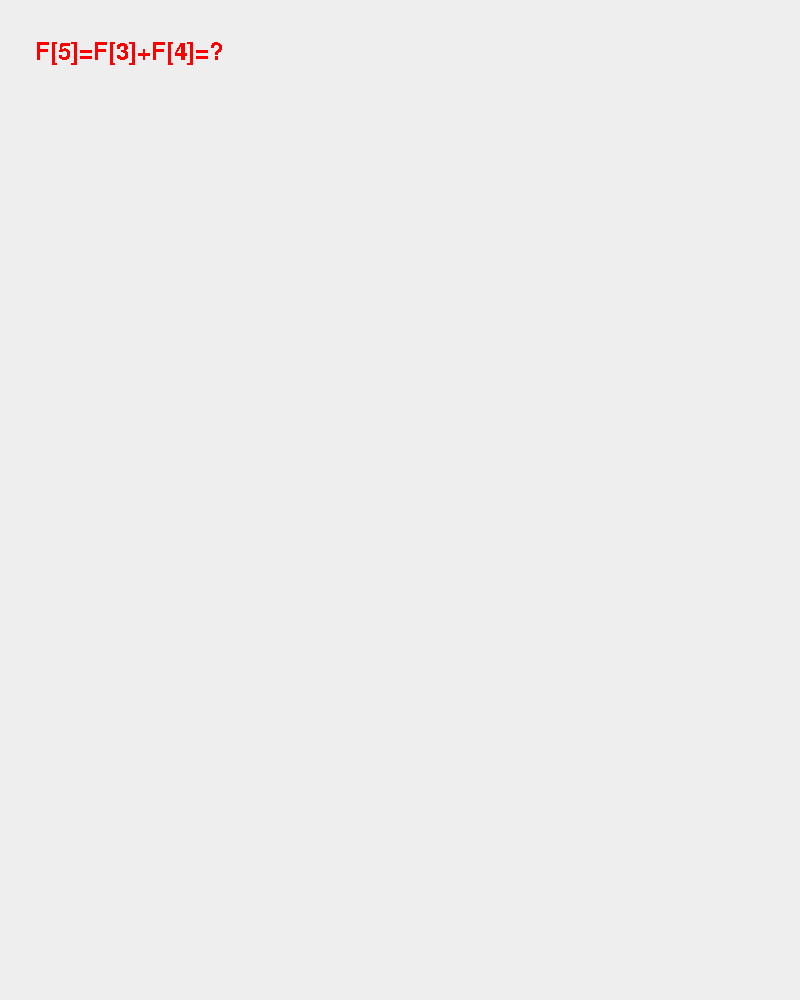
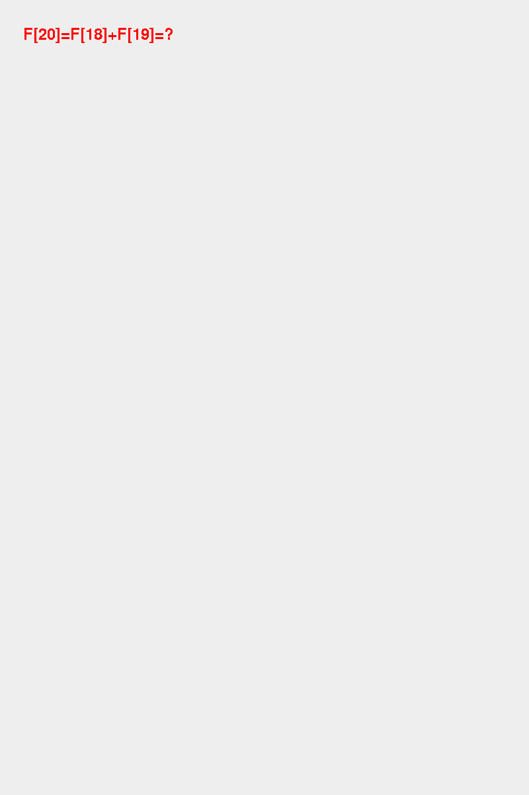
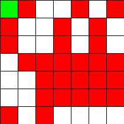
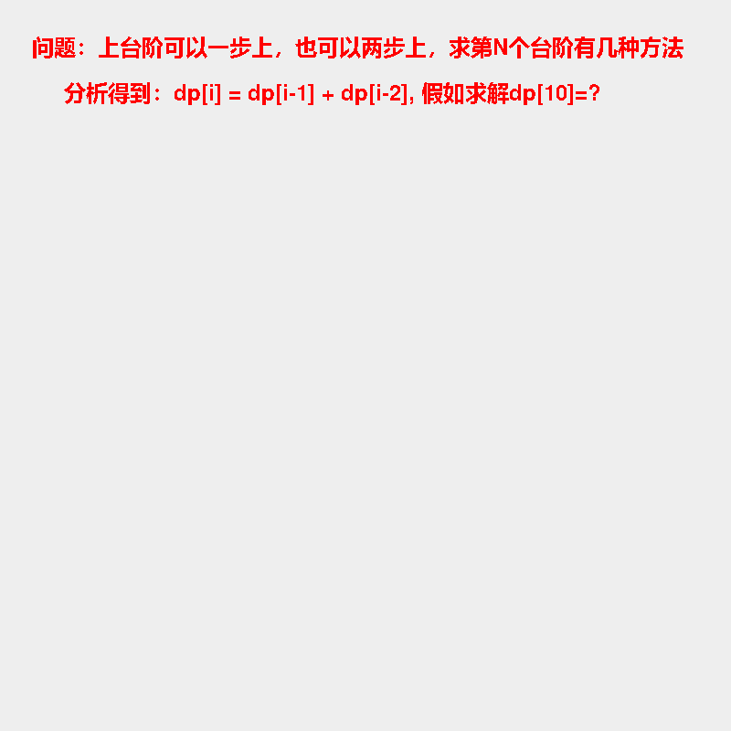

# 首页

数据结构和算法理论笔记： https://anthubtc.github.io/DataStructureAndAlgorithms/

配套算法刷题工程github： https://github.com/AntHubTC/algQuestion

## 递归

### 斐波那契数列

问题：斐波那契数列指的是这样一个数列 0, 1, 1, 2, 3, 5, 8, 13, 21, 34, 55, 89, 144, 233，377，610，987，1597，2584，4181，6765，10946，17711，28657，46368……

特别指出：第0项是0，第1项是第一个1。

这个数列从第三项开始，每一项都等于前两项之和。

以下实例演示了 Java 斐波那契数列的实现：

```java
public class MainClass {
    public static void main(String[] args) {
        for (int counter = 0; counter <= 10; counter++){
            System.out.printf("Fibonacci of %d is: %d\n", counter, fibonacci(counter));
        }
    }
 
    public static long fibonacci(long number) {
        if ((number == 0) || (number == 1))
            return number;
        else
            return fibonacci(number - 1) + fibonacci(number - 2);
    }
}
```

动画版本：[algQuestion](https://github.com/AntHubTC/algQuestion)工程 com.tc.alg.recursion.FibonacciIssue



**带记忆的优化版本：**



## 回溯

### 数列计算结果是否等于目标值

> 给定一个长度为4的整数数组 cards 。你有 4 张卡片，每张卡片上都包含一个范围在 [1,9] 的数字。您应该使用运算符 ['+', '-', '*', '/'] 和括号 '(' 和 ')' 将这些卡片上的数字排列成数学表达式，以获得值24。
> 你须遵守以下规则:
> 除法运算符 '/' 表示实数除法，而不是整数除法。
> 例如， 4 /(1 - 2 / 3)= 4 /(1 / 3)= 12 。
> 每个运算都在两个数字之间。特别是，不能使用 “-” 作为一元运算符。
> 例如，如果 cards =[1,1,1,1] ，则表达式 “-1 -1 -1 -1” 是 不允许 的。
> 你不能把数字串在一起
> 例如，如果 cards =[1,2,1,2] ，则表达式 “12 + 12” 无效。
> 如果可以得到这样的表达式，其计算结果为 24 ，则返回 true ，否则返回 false 。
> 示例 1:
> 输入: cards = [4, 1, 8, 7]
> 输出: true
> 解释: (8-4) * (7-1) = 24
> 示例 2:
> 输入: cards = [1, 2, 1, 2]
> 输出: false
>
> 提示:
> cards.length == 4
> 1 <= cards[i] <= 9

方法一：回溯

> 一共有 4 个数和 3 个运算操作，因此可能性非常有限。一共有多少种可能性呢？
> 首先从 4 个数字中有序地选出 2 个数字，共有 4×3=12 种选法，并选择加、减、乘、除 4 种运算操作之一，用得到的结果取代选出的 2 个数字，剩下 3 个数字。
> 然后在剩下的 3 个数字中有序地选出 2 个数字，共有 3×2=6 种选法，并选择 4 种运算操作之一，用得到的结果取代选出的 2 个数字，剩下 2 个数字。
> 最后剩下 2 个数字，有 2 种不同的顺序，并选择 4 种运算操作之一。
> 因此，一共有 12×4×6×4×2×4=921612 种不同的可能性。
> 可以通过回溯的方法遍历所有不同的可能性。具体做法是，使用一个列表存储目前的全部数字，每次从列表中选出 2 个数字，再选择一种运算操作，用计算得到的结果取代
> 选出的 2 个数字，这样列表中的数字就减少了 1 个。重复上述步骤，直到列表中只剩下 1 个数字，这个数字就是一种可能性的结果，如果结果等于 24
> 则说明可以通过运算得到 24。如果所有的可能性的结果都不等于 24，则说明无法通过运算得到 24。
> 实现时，有一些细节需要注意。
> 除法运算为实数除法，因此结果为浮点数，列表中存储的数字也都是浮点数。在判断结果是否等于 24 时应考虑精度误差，这道题中，误差小于 1e-6 (10的负十六次方)可以认为是相等。
> 进行除法运算时，除数不能为 0，如果遇到除数为 0 的情况，则这种可能性可以直接排除。由于列表中存储的数字是浮点数，因此判断除数是否为 0 时应考虑精度误差，这道题中，当一个数字的绝对值小于 1e-6 时，可以认为该数字等于 0。
> 还有一个可以优化的点：
>   加法和乘法都满足交换律，因此如果选择的运算操作是加法或乘法，则对于选出的 222 个数字不需要考虑不同的顺序，在遇到第二种顺序时可以不进行运算，直接跳过。

```java
package com.tc.alg.backtracking;


import java.util.ArrayList;
import java.util.List;

public class ListNumCalcEqTargetVal {

    public static final int TARGET_RESULT_VAL = 24;
    // 浮点数中误差小于 1e-6 (10的负十六次方)可以认为是相等。
    public static final double EPSILON = 1e-6;
    public static final int ADD = 0, MULTIPLY = 1, 
    						SUBTRACT = 2, DIVIDE = 3;


    public static void main(String[] args) {
        int[] nums = new int[]{4, 1, 8, 7};
//        int[] nums = new int[]{1, 2, 1, 2};
        boolean flag = judgePoint24_backtracking(nums);
        System.out.printf("是否能够计算出目标值%s,结果：%s%n", TARGET_RESULT_VAL, flag);
    }

    public static boolean judgePoint24_backtracking(int[] nums) {
        List<Double> list = new ArrayList<>();
        for (int num : nums) {
            list.add((double) num);
        }

        return solve_backtracking(list);
    }

    /**
     * 使用回溯法解决给定列表中数字的组合问题，尝试通过加减乘除四种运算符找到一个组合，
     * 使得结果接近目标值TARGET_RESULT_VAL。
     *
     * @param list 包含一系列双精度浮点数的列表。
     * @return 如果找到一个组合，其计算结果与目标值的差小于EPSILON，则返回true；否则返回false。
     */
    private static boolean solve_backtracking(List<Double> list) {
        // 当列表中只有一个元素时，检查该元素是否接近目标结果
        if (list.size() == 1) {
            return Math.abs(list.get(0) - TARGET_RESULT_VAL) < EPSILON;
        }

        int size = list.size();
        // 遍历列表中的每对元素（不包括相同的元素），尝试所有可能的运算操作
        for (int i = 0; i < size; i++) {
            for (int j = 0; j < size; j++) {
                if (i != j) {
                    List<Double> nextList = new ArrayList<Double>();
                    // 从原列表中去除当前选择的两个元素
                    for (int k = 0; k < size; k++) {
                        if (k != i && k != j) {
                            nextList.add(list.get(k));
                        }
                    }
                    // 尝试四种运算操作，并回溯搜索结果
                    for (int k = 0; k < 4; k++) {
                        // 控制加减乘除的顺序，避免重复计算
                        if (k < 2 && i > j) {
                            continue;
                        }
                        // 执行四种运算，并根据运算结果继续回溯搜索
                        if (k == ADD) {
                            nextList.add(list.get(i) + list.get(j));
                        } else if (k == MULTIPLY) {
                            nextList.add(list.get(i) * list.get(j));
                        } else if (k == SUBTRACT) {
                            nextList.add(list.get(i) - list.get(j));
                        } else if (k == DIVIDE) {
                            // 避免除以零的情况
                            if (Math.abs(list.get(j)) < EPSILON) {
                                continue;
                            } else {
                                nextList.add(list.get(i) / list.get(j));
                            }
                        }
                        // 如果通过运算得到的结果接近目标值，则返回true
                        if (solve_backtracking(nextList)) {
                            return true;
                        }
                        // 回溯，移除最后一个添加的元素
                        nextList.remove(nextList.size() - 1);
                    }
                }
            }
        }
        // 如果无法找到任何组合满足条件，则返回false
        return false;
    }
}
```
>>>>>>> 3b0dae46276429b555b583996e8760ff397a7590


## 深度优先

### 求感染面积

> 问题：给一个感染矩阵，1代表感染，0代表没感染，求最大感染区的面积

```java
public class MaxInfectionArea {
    
    // 主函数，计算最大感染区的面积
    public static int maxInfectionArea(int[][] grid) {
        int maxArea = 0; // 初始化最大感染区的面积为0
        int rows = grid.length; // 获取矩阵的行数
        int cols = grid[0].length; // 获取矩阵的列数
        
        // 遍历整个矩阵
        for (int i = 0; i < rows; i++) {
            for (int j = 0; j < cols; j++) {
                // 如果当前位置为感染区（值为1），进行深度优先搜索（DFS）
                if (grid[i][j] == 1) {
                    int area = dfs(grid, i, j); // 计算当前感染区的面积
                    maxArea = Math.max(maxArea, area); // 更新最大感染区的面积
                }
            }
        }
        
        return maxArea; // 返回最大感染区的面积
    }
    
    // 深度优先搜索函数，用于计算感染区的面积
    public static int dfs(int[][] grid, int i, int j) {
        int rows = grid.length; // 获取矩阵的行数
        int cols = grid[0].length; // 获取矩阵的列数
        
        // 如果当前位置超出矩阵范围或者当前位置不是感染区（值为0），返回面积0
        if (i < 0 || i >= rows || j < 0 || j >= cols || grid[i][j] == 0) {
            return 0;
        }
        
        grid[i][j] = 0; // 将当前位置标记为已访问
        
        int area = 1; // 初始化当前感染区的面积为1（当前位置已经是感染区）
        // 分别向上、下、左、右四个方向进行深度优先搜索，并累加面积
        area += dfs(grid, i+1, j);
        area += dfs(grid, i-1, j);
        area += dfs(grid, i, j+1);
        area += dfs(grid, i, j-1);
        
        return area; // 返回当前感染区的面积
    }
    
    // 主函数，用于测试
    public static void main(String[] args) {
        int[][] grid = { // 给定的感染矩阵
            {1, 1, 0, 0, 1},
            {1, 0, 0, 1, 0},
            {0, 1, 1, 1, 1},
            {0, 0, 1, 1, 1},
            {1, 0, 1, 0, 0}
        };
        
        // 输出最大感染区的面积
        System.out.println("最大感染区的面积为: " + maxInfectionArea(grid));
    }
}
```

动画版本：[algQuestion](https://github.com/AntHubTC/algQuestion)工程 com.tc.alg.dfs.MaximumInfectionArea




## 动态规划

### 上台阶问题

> 问题：上台阶可以一步上，也可以两步上，求第N个台阶有几种方法。

分析：

要求第N个台阶有几种方法，可以使用动态规划的方法来解决。设dp[i]表示到达第i个台阶的方法数，则有以下递推关系：

- 当i = 1时，只有一种方法到达第一个台阶，即dp[1] = 1；
- 当i = 2时，有两种方法到达第二个台阶，可以一步一步上或者一次性上两步，即dp[2] = 2；
- 当i > 2时，到达第i个台阶的方法数为到达第i-1个台阶的方法数加上到达第i-2个台阶的方法数，即dp[i] = dp[i-1] + dp[i-2]。

因此，可以通过填充数组dp来求解第N个台阶的方法数。 其实这个问题就是斐波那契数列问题类似。

> 斐波那契数列指的是这样一个数列 0, 1, 1, 2, 3, 5, 8, 13, 21, 34, 55, 89, 144, 233，377，610，987，1597，2584，4181，6765，10946，17711，28657，46368……
>
> 特别指出：第0项是0，第1项是第一个1。
>
> **这个数列从第三项开始，每一项都等于前两项之和。**

```java
package com.tc.alg.dfs;

public class StairAlgIssue {

    public static void main(String[] args) {
        /**
         * 问题：上台阶可以一步上，也可以两步上，求第N个台阶有几种方法。
         *
         * 拿到问题开始分析：
         * 要求第N个台阶有几种方法，可以使用动态规划的方法来解决。设dp[i]表示到达第i个台阶的方法数，则有以下递推关系：
         * 当i = 1时，只有一种方法到达第一个台阶，即dp[1] = 1；
         * 当i = 2时，有两种方法到达第二个台阶，可以一步一步上或者一次性上两步，即dp[2] = 2；
         * 当i > 2时，到达第i个台阶的方法数为到达第i-1个台阶的方法数加上到达第i-2个台阶的方法数，即dp[i] = dp[i-1] + dp[i-2]。
         * 因此，可以通过填充数组dp来求解第N个台阶的方法数。
         */
        int targetNth = 10;
        // long result = countWaysToNthStair1(targetNth);
        long result = countWaysToNthStair2(targetNth);
        System.out.printf("到达第%s个台阶有%s种方法%n", targetNth, result);
    }


    // 递归求解(效率不高，会有很多重复计算)
    public static long countWaysToNthStair1(int n) {
        // 如果N为1，只有一种方法到达第一个台阶
        if (n == 1) return 1;
        // 如果N为2，有两种方法到达第二个台阶
        if (n == 2) return 2;

        return countWaysToNthStair1(n - 1) + countWaysToNthStair1(n - 2);
    }

    // 递推求解
    public static long countWaysToNthStair2(int n) {
        // 如果N为1，只有一种方法到达第一个台阶
        if (n == 1) return 1;
        // 如果N为2，有两种方法到达第二个台阶
        if (n == 2) return 2;

        // 创建一个数组来存储每个台阶的方法数(最好使用long来进行存储，int很快就要超长)
        long[] dp = new long[n + 1];
        dp[1] = 1;
        dp[2] = 2;

        // 使用循环填充数组，根据递推关系dp[i] = dp[i-1] + dp[i-2]来计算到达每个台阶的方法数
        for (int i = 3; i <= n; i++) {
            dp[i] = dp[i - 1] + dp[i - 2];
        }

        // 返回第N个台阶的方法数
        return dp[n];
    }

}
```

动画版本：[algQuestion](https://github.com/AntHubTC/algQuestion)工程 com.tc.alg.derivation.StairAlgIssue


