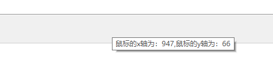
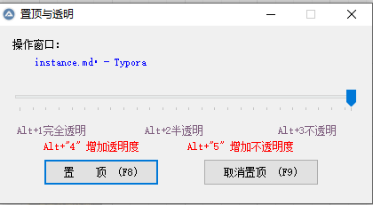
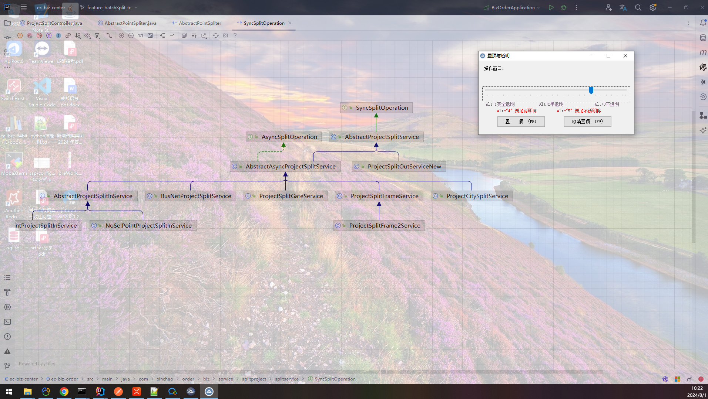
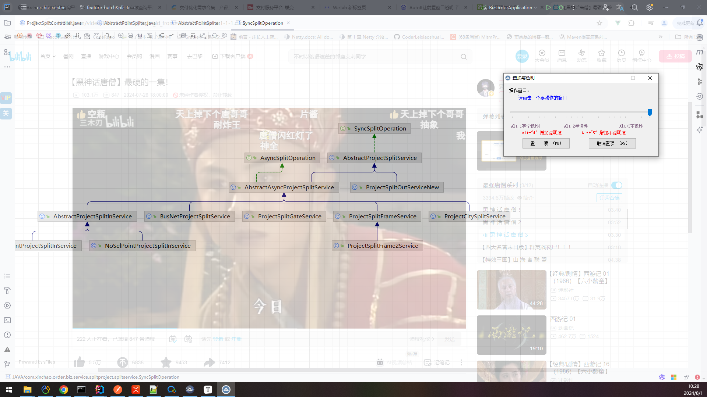
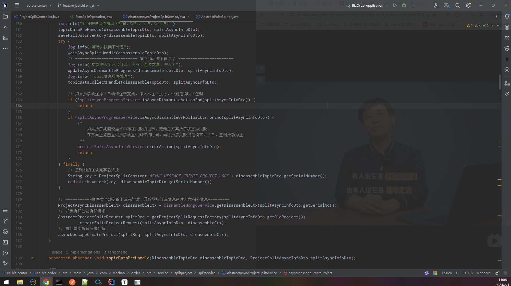

# 实战应用案例

## 获取鼠标点击坐标

```basic
#include<Misc.au3>

While 1
    Local $pos = MouseGetPos()
    ;当鼠标左键被按下时
    If _isPressed("01") Then
        ToolTip("鼠标的x轴为：" & $pos[0] & ",鼠标的y轴为：" & $pos[1], Default, Default)
        Sleep(200)
     EndIf
 WEnd
```

效果展示：



## 窗口置顶与透明

windowBox.au3

```basic
; #Region ;**** 参数创建于 AutoIt3Wrapper_GUI ****
; 脚本来源于网络
#AutoIt3Wrapper_outfile_type=a3x
#EndRegion ;**** Directives created by AutoIt3Wrapper_GUI ****
#include <GUIConstants.au3>
 
Opt("TrayMenuMode", 1)
Opt("WinTitleMatchMode", 2)
Opt("GUICloseOnESC", 0)
 
$xianshi = TrayCreateItem("显示窗口")
TrayCreateItem("")
$zhiding = TrayCreateItem("置顶  F8")
$qxzhiding = TrayCreateItem("取消置顶 F9")
TrayCreateItem("")
$guanyu = TrayCreateItem("关于")
TrayCreateItem("")
$_exit = TrayCreateItem("退出")
TraySetState()
 
Dim $i = 1, $bck, $dqck = "1", $ck, $dqtmd, $cftmd
 
HotKeySet("", "zhiding");;置顶
HotKeySet("", "qxzhiding");;取消置顶
HotKeySet("!1", "tmd");;完全透明
HotKeySet("!2", "tmd");;半透明
HotKeySet("!3", "tmd");;不透明
HotKeySet("!4", "zjtm");;减少不透明
HotKeySet("!5", "jstm");;增加不透明
 
GUICreate("置顶与透明", 420, 200, 100, 200)
$slider1 = GUICtrlCreateSlider(10, 70, 400, 40)
GUICtrlSetLimit(-1, 255, 0)
$Label1 = GUICtrlCreateLabel("请点击一个要操作的窗口", 40, 35, 360, 35)
GUICtrlSetColor(-1, 0x0000FF)
$Label2 = GUICtrlCreateLabel("操作窗口：", 15, 15, 100, 17)
$Label3 = GUICtrlCreateLabel("Alt+1完全透明  " & @TAB & @TAB & "Alt+2半透明    " & @TAB & @TAB & " Alt+3不透明", 20, 112, 380, 17)
GUICtrlSetColor(-1, 0x806080)
$Label4 = GUICtrlCreateLabel('Alt+"4" 增加透明度         Alt+"5" 增加不透明度', 50, 130, 350, 17)
GUICtrlSetColor(-1, 0xFF0000)
$button1 = GUICtrlCreateButton("置    顶  (F8)", 50, 150, 130, 30)
$button2 = GUICtrlCreateButton("取消置顶  (F9)", 230, 150, 130, 30)
GUISetState()
GUICtrlSetData($slider1, 255)     ; set cursor
WinSetOnTop(WinGetTitle(""), "", $i)
$bck = WinGetTitle("")
While 1
    $msg = TrayGetMsg()
    $nMsg = GUIGetMsg()    
    If $nMsg = $GUI_EVENT_CLOSE or $msg=$_exit Then Exit
    If $nMsg = $GUI_EVENT_MINIMIZE Then WinSetState($bck,"",@SW_HIDE)
    If $msg = $xianshi Then WinSetState ($bck,"",@SW_RESTORE)
    if $msg=$guanyu then MsgBox(64,"关于","作者：星驰周 "&@CRLF&"完成于2008年5月21日")
    If $nMsg = $button1 Or $msg = $zhiding Then zhiding()
    If $nMsg = $button2 Or $msg = $qxzhiding Then qxzhiding()
    $dqtmd = GUICtrlRead($slider1)
    If $dqtmd <> $cftmd And GUICtrlRead($Label1) <> "" Then
        WinSetTrans($dqck, "", $dqtmd)
        $cftmd = $dqtmd
    EndIf
    $ck = WinGetTitle("")
    If $ck <> $bck And $ck <> $dqck and $ck<> "AutoIt V3" Then
        $dqck = $ck
        GUICtrlSetData($Label1, $dqck)
    EndIf
    Sleep(20)
WEnd
Func zhiding()
    WinSetOnTop($dqck, "", 1)
    GUICreate("置顶与透明", 420, 200, 100, 200, "", "", $dqck)
    WinSetOnTop($bck, "", 1)
EndFunc   ;==>zhiding
Func qxzhiding()
    WinSetOnTop($dqck, "", 0)
EndFunc   ;==>qxzhiding
Func tmd()
    If @HotKeyPressed = "!1"  Then WinSetTrans($dqck, "", 0)
    If @HotKeyPressed = "!2"  Then WinSetTrans($dqck, "", 150)
    If @HotKeyPressed = "!3"  Then WinSetTrans($dqck, "", 255)
    GUICtrlSetData($slider1, $dqtmd)
EndFunc   ;==>tmd
Func wqtm()
    WinSetTrans($dqck, "", 0)
EndFunc   ;==>wqtm
Func bantm()
    WinSetTrans($dqck, "", 150)
EndFunc   ;==>bantm
Func butm()
    WinSetTrans($dqck, "", 255)
EndFunc   ;==>butm
Func zjtm()
    If $dqtmd >= 5 Then
        $dqtmd = $dqtmd - 5
        GUICtrlSetData($slider1, $dqtmd)
        WinSetTrans($dqck, "", $dqtmd)
    EndIf
EndFunc   ;==>zjtm
Func jstm()
    If $dqtmd < 251 Then
        $dqtmd = $dqtmd + 5
        GUICtrlSetData($slider1, $dqtmd)
        WinSetTrans($dqck, "", $dqtmd)
    EndIf
EndFunc   ;==>jstm`
```

效果展示：








更高级一点：

