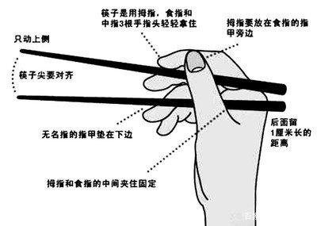

# 餐桌礼仪

## 筷子礼仪

### 筷子规范使用方法

​		取位于筷子头的三分之一，上面的那根筷子用大拇指、食指和中指控制：拇指、食指、中指捏住，上面那根能活动；下面的筷子要固定（通常用虎口和无名指压住），只动上面的筷子夹食物。

### 礼仪注意事项

1、在家中，筷子摆上桌准备吃饭时，长辈没动筷子小孩是不能先动的，这是对长辈的尊敬。在外赴宴时，不应提前于主人动筷子，汤匙亦然。

2、夹菜时不能一个盘子里到处夹，夹起食物之后，不应该再放回盘碟。

3、在用餐过程中，已经举起筷子，但不知道该吃哪道菜，这时不可将筷子在各碟菜中来回移动或在空中游弋，在菜盘上来回地转而却又不夹菜。

4、不能用筷子对着人或用餐时拿筷子指手画脚。

5、在用餐时，不要用一只筷子去插盘子里的菜品，也不能将筷子插入一碗米饭中。

6、不与他人的筷子相争。

7、吃饭中不能将筷子颠倒使用，也不能用筷子敲击盘子叮当作响。

8、吃完饭不能将筷子架在碗上，要两根筷子并齐在桌子上放好。

吃完饭后筷子应该放在碗上，还是放在桌子上？所以，吃完饭后筷子还是应该靠在碗边，并齐在桌上放好，不要东一根西一根地乱放，或是将筷子随便交叉放在桌上，这都是不礼貌的。

9、筷子平放在碗上或插在饭上，那是办丧事时才那样做的！

10、筷子放在碗上表示你还没吃饱，还想再吃，给主人的感觉是你在他这没吃好。