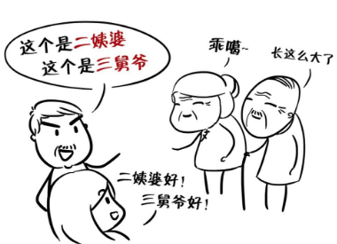

# 亲戚称呼礼仪

不要说稍微远点的亲戚了，近亲的称呼都让你懵圈，逢年过节的时候，叫错让人很尴尬，不叫的话亲戚又会想，**“这个娃儿咋那闷没礼貌呢！”**。

## 成都版

爸爸的爸爸，叫爷爷

爸爸的妈妈，叫奶奶

爸爸的兄弟，叫X伯儿/X爸

爸爸的姐妹，叫X粑粑/X孃/x姥子

爷爷的兄弟，叫X爷

爷爷的姐妹，叫X姑婆

奶奶的兄弟，叫X舅爷

奶奶的姐妹，叫X姑婆

妈妈的爸爸，叫外公

妈妈的妈妈，叫外婆

妈妈的兄弟，叫X舅舅

妈妈的姐妹，叫X姨/娘

外公的兄弟，叫X公/X外公

外公的姐妹，叫X婆

外婆的兄弟，叫X舅爷

外婆的姐妹，叫X姨婆

## 自贡方向版

爸爸的爸爸，叫爷爷/阿公

爸爸的妈妈，叫娘孃/阿婆

爸爸的兄弟，叫X爸/X爹

爸爸的姐妹，叫X姑妈

爷爷的兄弟，叫X爷

爷爷的姐妹，叫X婆

奶奶的兄弟，叫X舅公

奶奶的姐妹，叫X姨婆

妈妈的爸爸，叫外公

妈妈的妈妈，叫外婆

妈妈的兄弟，叫X舅舅

妈妈的姐妹，叫X孃

外公的兄弟，叫X家公

外公的姐妹，叫X姑婆

外婆的兄弟，叫X舅公

外婆的姐妹，叫X姨婆

## 广安方向版

爸爸的爸爸，叫噶（gā）公

爸爸的妈妈，叫噶婆

爸爸的兄弟，叫X爸

爸爸的姐妹，叫姑姑

爷爷的兄弟，叫X巴

爷爷的姐妹，叫X姑婆

奶奶的兄弟，叫X舅爷

奶奶的姐妹，叫X姨婆

妈妈的爸爸，叫外公

妈妈的妈妈，叫外婆

妈妈的兄弟，叫X舅舅

妈妈的姐妹，叫X姨/娘

外公的兄弟，叫X公

外公的姐妹，叫X婆

外婆的兄弟，叫X舅爷

外婆的姐妹，叫X姨婆

## 德阳方向版本

爸爸的爸爸，叫爷爷

爸爸的妈妈，叫奶奶

爸爸的兄弟，叫X爸/X伯

爸爸的姐妹，叫X姑

爷爷的兄弟，叫X爷爷

爷爷的姐妹，叫X姑娘

奶奶的兄弟，叫舅爷爷

奶奶的姐妹，叫X姨婆

妈妈的爸爸，叫家公

妈妈的妈妈，叫家婆

妈妈的兄弟，叫X舅

妈妈的姐妹，叫姨妈

外公的兄弟，叫X爷爷

外公的姐妹，叫X婆婆

外婆的兄弟，叫X舅爷

外婆的姐妹，叫X姨娘