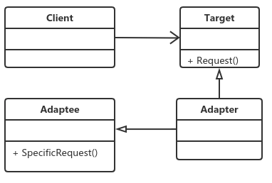

# 适配器模式

## 定义

​		将一个类的接口变成客户端所期待的另一种接口，从而使原本因接口不匹配而无法在一起工作的两个类能够一起工作。

适配器模式又叫做变压器模式，也叫做包装模式（Wrapper）。
适配器的本质：
    转换匹配，复用功能。

适配器按照实现方式分为：对象适配器、类适配器（多继承，java可以变相实现）。
适配器按照适配的是否是双适配分为：单向适配器、双向适配器。

适配器模式的三个角色：
- Target目标角色

  该角色定义把其他类转换为何种接口，也就是我们的期望接口。

- Adaptee源角色

  你想把谁转换为目标角色，“谁”就是源角色，它是已经存在的、运行良好的类或对象、经过适配器角色的包装，它会成为一个崭新、靓丽的角色。

- Adapter适配器角色

  核心角色，其他两个都是已经存在的角色，而适配器角色是需要新建立的，它的职责非常简单：把源角色转换为目标角色。怎么转换？通过继承或类关联的方法。

## 应用

### 优点

- 适配器模式可以让两个没有任何关系的类在一起运行，只要适配器这个角色能够搞定他们就成。

- 增加了类的透明性

  想想看，我们访问的Target目标角色，但是具体的实现都委托给了源角色，而这些对高层次模块是透明的，也是它不需要关心的。

- 提高了类的复用度

  当然了，源角色在原有的系统中还是可以正常使用，而目标角色中也可以充当新的成员。

- 灵活性非常好

  某一天，突然不想要适配器，没问题，删除掉这个适配器就可以了，其他的代码都不用修改，基本上就类似一个灵活的构件，想用就用，不想就卸载。

### 使用场景

​	你有动机修改一个已经投产中的接口

## 适配器模式的扩展

​		代码参见case3
​		如何将多个接口和实现适配为内部的一个接口。java是不支持多继承的，但是可以通过类关联的方式实现。
对象适配器和类适配器的区别：类适配器是类间继承，对象适配器是对象的合成关系，也可以说是类的关联关系，这是两者的区别。