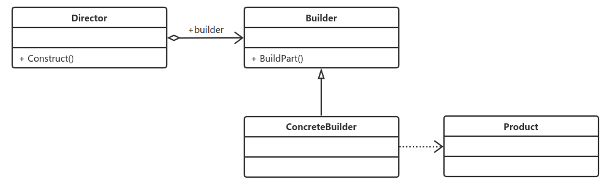

# 建造者模式(也叫：生成器模式)
## **定义：**
> 将一个复杂对象的构建与它的表示分离，使得同样的构建过程可以创建不同的表示。

## **在建造者中，有如下4个角色：**
> * Product 产品类
>> 通常是实现了模板方法模式，也就是有模板方法和基本方法。
> * Builder 抽象建造者
>> 规范产品的组建，一般是由子类实现。
> * ConcreteBuilder 具体建造者
>> 实现抽象类定义的所有方法，并且返回一个组建好的对象。例
> * Director导演类
>> 负责安排已有模块的顺序，然后告诉Builder开始建造。

通用源码请参见: case1

## **优点：**
> * 封装性
>> 使用建造者模式可以使客户端不必要知道产品内部的组成的细节。
> * 扩展性
>> 建造者独立，容易扩展
> * 便于控制细节风险
>> 由于具体的建造者是独立的，因此可以对建过程逐步细化，而不对其他的模块产生任何影响。

## **使用场景：**
> * 相同的方法，不同的执行顺序，产生不同的事件结果时，可以采用建造者模式。
> * 多个部件或零件，都可以装配到一个对象中，但是产生的运行结果又不相同时，则可以使用该模式。
> * 产品类非常复杂，或者产品类中的调用顺序不同产生了不同的效能，这个时候使用建造者模式非常合适。
> * 在对象创建过程中会使用到系统中的一些其他对象，这些对象在产品对象的创建过程中不易得到时，也可以采用建造者模式封装该对象的创建过程。该种场景只能是一个补偿方法，因为一个对象不容易获得，而在设计阶段竟然没有发觉，而要通过创建者模式柔化创建过程，本身已经违反设计的最初目标

## **注意事项：**
> 建造者模式关注的是零件的类型和装配的工艺（顺序），这是它与工厂方法模式最大的不同的地方，虽然同为创建类模式，但是注重点不同。