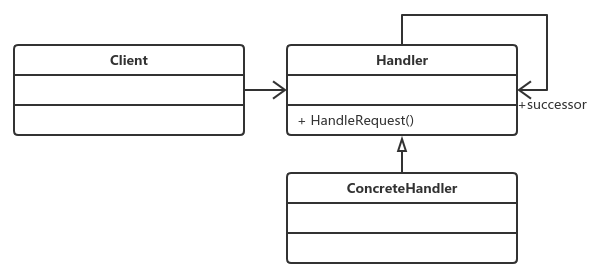

# 责任链模式
## **定义：**
> 使多个对象都有机会处理请求，从而避免了请求的发送者和接受者之间的耦合关系。将这些对象连成一条链，并沿着这条链传递该请求，直到有对象处理它为止。

注意：case1没有用责任链模式

case2使用了该模式。

> 责任链模式的重点是在“链”上，由一条链去处理相似的请求在链中决定谁来处理这个请
求，并返回相应的结果。

## **注意事项：**
>在实际应用中，一般会有一个封装类对责任模式进行封装，也就是替代Client类，直接
返回链中的第一个处理者，具体链的设置不需要高层次模块关系，这样，更简化了高层次模
块的调用，减少模块间的耦合，提高系统的灵活性。

## **责任链模式的优点**
>责任链模式非常显著的优点是将请求和处理分开。请求者可以不用知道是谁处理的，处
 理者可以不用知道请求的全貌（例如在J2EE项目开发中，可以剥离出无状态Bean由责任链处
 理），两者解耦，提高系统的灵活性。

## **责任链模式的缺点** 
 > 责任链有两个非常显著的缺点：一是性能问题，每个请求都是从链头遍历到链尾，特别
  是在链比较长的时候，性能是一个非常大的问题。二是调试不很方便，特别是链条比较长，
  环节比较多的时候，由于采用了类似递归的方式，调试的时候逻辑可能比较复杂

## **责任链模式的注意事项**
> 链中节点数量需要控制，避免出现超长链的情况，一般的做法是在Handler中设置一个
  最大节点数量，在setNext方法中判断是否已经是超过其阈值，超过则不允许该链建立，避免
  无意识地破坏系统性能。(在java中栈的深度是有限制的，链条深度太深虚拟机会报错！~)