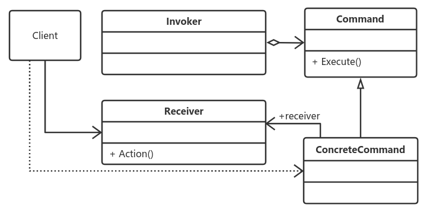

# 命令模式
​		命令模式是一个高内聚的模式
## **定义：**
> ​		将一个请求封装成一个对象，从而让你使用不同的请求把客户端参数化，对请求排队或者记录请求日志，可以 提供命令的撤销和恢复功能。）

通用源码参见case2

## 命令模式的三个角色： ##
* Receiver接收者角色
> 该角色就是干活的角色，命令传递到这里是应该被执行的，具体到我们上面的例子中就是Group的三个实现类。
* Command命令角色
> 需要执行的所有命令都在这里声明。
* Invoker调用者角色
> 接收到命令，并执行命令。

## 命令模式的优点 ##
* 类间解耦
> 调用者角色与接收者角色之间没有任何依赖关系，调用者实现功能时只需调用Command抽象类的execute方法就可以，不需要了解到底是哪个接收者执行。
* 可扩展性
> Command的子类可以非常容易地扩展，而调用者Invoker和高层次的模块Client不产生严重的代码耦合。

* 命令模式结合其它模式更优秀
> 命令模式可以结合责任链模式，实现命令族解析任务；结合模板方法模式，则可以减少Command子类的膨胀问题。

## 缺点 ##
> 命令模式也是有缺点的，请看Command的子类：如果有N个命令，问题就出来了，Command的子类就可不是几个，而是N个，这个类膨胀得非常大，这个就需要读者在项目中慎重考虑使用。

## 使用场景 ##
> 只要你认为是命令的地方就可以采用命令模式，例如，在GUI开发中，一个按钮的点击是一个命令，可以采用命令模式；模拟DOS命令的时候，当然也要采用命令模式；触发－反馈机制的处理等。