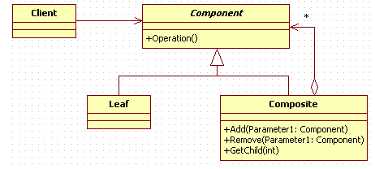
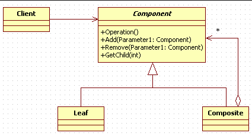
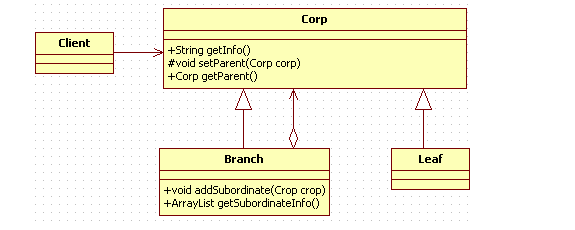

# 组合模式

​		也叫合成模式，有时也叫做部分-整体模式，主要是用来描述部分和整体的关系。

## 定义

​		将对象组合成树形结构以表示“部分-整体”的层次结构，使得用户对单个对象和组合对象的使用具有一致性。

通用类图【安全模式】:

## 优点

- 高层模块调用简单：树形机构中所有节点都是Component，高层模块不必关心自己处理的是单个对象还是整个组合结构，简化了高层模块的代码；
- 节点自由增加：容易扩展，符合OCP，对维护有利。

## 缺点

- 在上述遍历树时，需要判断是叶子还是树枝，这点若直接通过类型判断，则会形成“对实现类的依赖”与依赖倒置原则冲突。不过似乎可以通过在Component中添加标识，在子类中实现它。

## 应用场景

- 维护和展示部分－整体关系的场景，如树形菜单、文件和文件夹管理；
- 从一个整体中能够独立出部分模块或功能的场景；
- 家族关系图谱（倒推方可）

## 模式扩展

组合模式的真实引用：依靠关系数据库的非对象存储性能，保存树形结构。

透明模式下，遍历整个树形结构是比较容易的，不用进行强制类型转换，其他组装则没有任何变化。透明模式的好处就是它基本遵循了依赖倒置原则，方便系统的扩展。

## 组合模式的遍历

​		组合模式构成的对象其实就是一棵树，那要如何遍历这颗树呢？ 我们给节点添加一个父亲节点，有里父节点后，什么先序遍历、后序遍历、中序遍历等都不成问题了。

​	