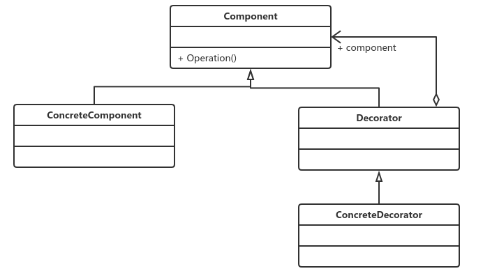

# 装饰模式

## **定义**

​	动态地给一个对象添加一些额外的职责。就增加功能来说，装饰器模式相比生成子类更为灵活。

在类图中，有四个角色需要说明：

- Component抽象构建

  Component是一个接口或者是抽象类，就是定义我们核心的对象，也就是原始的对象。

- ConcreteComponent具体构件

  ConcreteComponent是最核心、最原始、最基本的接口或抽象类的实现，你要装饰的就是它。

- Decorator装饰角色

  一般就是一个抽象类，做什么用呢？实现接口或者抽象方法，它里面可不一定有抽象的方法呀，在它的属性里必然有一个private变量指向Component抽象构件。

- 具体装饰角色

  ConcreteDecoratorA和ConcreteDecoratorB是两个具体的装饰类，你要把你最核心、最原始的、最基本的东西装饰成其他东西。

> 注意：在装饰模式中，必然有一个最基本、最核心、最原始的接口或抽象类充当Component抽象构件。

《设计模式之禅》书中提到的装饰成绩单的例子很形象，很贴切。

## 装饰模式应用

### 优点

- 装饰类和被装饰类可以独立发展，而不会相互耦合。换句话说，Component类无需知道Decorator类，Decorator类是从外部扩展Component类的功能，而Decorator也不用知道具体的构件。
- 装饰模式是继承关系的一个替代方案。我们看装饰类Decorator，不管装饰多少层，返回的对象还是Component，实现的还是is-a的关系。
- 装饰模式可以动态扩展一个实现类的功能，这个不需要多说，装饰模式的定义就是如此。

### 缺点

​	多层的装饰是比较复杂的。为什么会复杂呢？你想想看，就像剥洋葱一样，你剥到最里层的装饰出现了问题，想象一下工作量吧。因此尽量减少装饰类的数量，以便降低系统的复杂度。

### 使用场景

- 需要扩展一个类的功能，或给一个类增加附加功能；
- 需要动态地给一个对象增加功能，这些功能可以再动态地撤销；
- 需要为一批的兄弟类进行改装或者加装功能，当然首选装饰模式。

