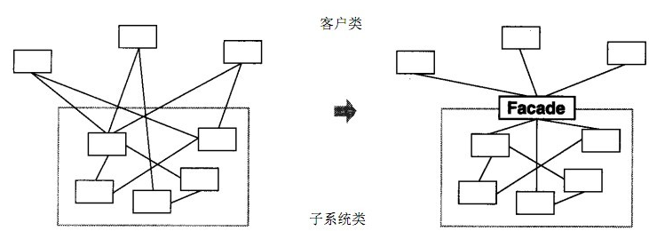
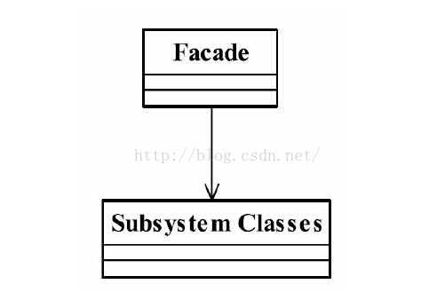

# 门面模式

​		门面模式(Facade Pattern)，也叫做外观模式，比较常用的封装模式。

## 定义

​		要求子系统的外部与其内部的通信必须通过一个统一的对象进行。门面模式提供一个高层次的接口，使得子系统更容易使用。





**Facade门面角色**
客户端可以调用这个角色的方法。此角色知晓子系统的所有功能和责任。一般情况下，本角色会将所有从客户端发来的请求委派到相应的子系统去，也就说该角色没有实际的业务逻辑，只是一个委托类。

**Subsystem子系统角色**
子系统角色可以同时有一个或者多个子系统。每一个子系统都不是一个单独的类，而是一个类的集合。子系统并不知道门面的存在。对于子系统而言，门面仅仅是另外一个客户端而已。

## 优点

● **减少系统的相互依赖**
想想看，如果我们不使用门面模式，外界访问直接深入到子系统内部，相互之间是一种强耦合关系，你死我就死，你活我才能活，这样的强依赖是系统设计所不能接受的，门面模式的出现就很好地解决了该问题，所有的依赖都是对门面对象的依赖，与子系统无关。
**● 提高了灵活性**
依赖减少了，灵活性自然提高了。不管子系统内部如何变化，只要不影响到门面对象，任你自由活动。
**● 提高安全性**
想让你访问子系统的哪些业务就开通哪些逻辑，不在门面上开通的方法，你休想访问到。

## 缺点

门面模式最大的缺点就是不符合开闭原则，对修改关闭，对扩展开放。

## 使用场景

- 为一个复杂的模块或子系统提供一个外界访问的接口；

- 子系统相对独立---外界对子系统的访问只要黑箱操作即可；

- 预防低水平人员带来的风险扩散。

  比如一个低水平的技术人员参与项目开发，为降低个人代码质量对整体项目的影响风险，一般的做法是“画地为牢”，只能在指定的子系统中开发，然后再提供门面接口进行访问操作。

## 注意事项

**1、一个子系统可以有多个门面**
一般情况下，一个子系统只需要一个门面就够了，但是以下情况可以考虑分开多个门面
**2.门面已经庞大到不能忍受的程度**
比如一个纯洁的门面对象超过了200行代码，虽然都是简单的委托操作，但是为了以后的拓展和维护，还是建议根据功能拆分成不同的门面，比如 一个数据库操作可以拆分成，查询门面，增加门面，删除门面，修改门面等
**3.子系统提供不同的访问权限**
比如模块一可以完整的访问所有业务逻辑，而模块二属于受限访问对象，只能访问methodB方法，这种情况下，就需要建立两个门面以供不同的高层模块进行访问

```java
public class Facade2 {
    //引用原有的门面
    private Facade facde = new Facade();
    //对外提供唯一的访问子系统的方法
    public void methodB(){
        this.facade.methodB();
    }
}
```

**增加的门面非常简单，只要委托给已经存在的门面Facade进行处理就好了。尽量不编写相同的代码，以避免以后到处修改相似代码的悲剧**
**4. 门面系统不参与子系统内的业务逻辑**
比如一个逻辑是得先调用ClassA的doSomething()方法，然后再调用ClassC的doSomething方法 ，一般的做法可能是修改methodc方法，在上面添加一个a.doSomething()方法的调用

```java
public class facade {
    //子角色
    private ClassA a = new ClassA();
    private ClassB b = new ClassB();
    private ClassC c = new ClassC();
    
    //提供外部访问的方法
    public void methodA(){
        this.a.doSomething();
    }
    public void methodB(){
        this.b.doSomething();
    }
    public void methodC(){
        this.a.doSomething();
        this.c.doSomething();
    }
}
```

?但是这样设计时非常不靠谱的，因为门面对象已经参与了相关的业务逻辑，门面对象只是提供一个访问子系统的一个路径而已，不应该也不可以参与具体的业务逻辑，否则会出现一个倒依赖的问题，子系统必须依赖门面才能被访问，这是设计上的一个严重错误。不仅破坏了单一职责原则，也破坏了系统的封装性。

**正确做法应该是新建一个封装类,封装完毕后提供给门面对象**

**封装类**

```java
public class Context{
    private ClassA a = new ClassA();
    private ClassC c = new ClassC();
    //委托处理
    public void complexMethod(){
        this.a.doSomething();
        this.c.doSomething();
    }
}
```

**门面角色**

```java
public class facade {
    //子角色
    private ClassA a = new ClassA();
    private ClassB b = new ClassB();
    private Context context = new Context();
    
    //提供外部访问的方法
    public void methodA(){
        this.a.doSomething();
    }
    public void methodB(){
        this.b.doSomething();
    }
    public void methodC(){
       this.context.complexMethod();
    }
}
```

通过一次封装后，门面对象又不参与业务逻辑了。在门面模式中，门面对象应该是稳定的，不应该经常变化，它是一个系统对外的接口，如果变来变去，依赖它的模块就无法稳定运行了。但是业务逻辑是经常变化的，我们已经把它的变化封装在子系统内部，无论怎么变化，对外界访问者而言，都还是同一个门面，同一个方法。对于外部而言，没有变化