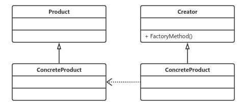

# 工厂模式

# 工厂方法模式
### **定义：**
> 定义一个用于创建对象的接口，让子类决定实例化哪一个类。工厂方法使一个类的实例化延迟到其子类。

工厂模式通用类图：



​		在工厂模式中，抽象产品类Product负责定义产品的共性，实现对事物最抽象的定义；Creator为抽象创建类，也是抽象工厂，具体如何创建产品类是由具体的实现工厂ConcreteProduct完成的。

### **优点：**

> *  良好的封装性，代码结构清晰。一个对象创建是有条件约束的，如果一个调用者需要一个具体的产品对象，只要知道这个产品的类名（或约束字符串）就可以了，不用知道创建对象的细致过程，降低模块间的耦合。
> * 扩展性高。 到要增加产品类的情况下，只要适当地修改具体的实现类或者扩展一个工程类，就可以完成“拥抱变化”。
> * 屏蔽产品类。 产品类的实现如何变化，调用者都不需要关心，它只需要关心产品的接口，只要接口保持不变，系统的上层模块就不要发生变化。因为产品类的实例化工程是由工厂类负责的，一个产品对象具体由哪一个产品生成是由工厂类决定的。
> * 工厂方法模式是典型的解耦框架。高层模块只需要产品的抽象类，其它的类都不用关心，复合迪米特法则。我们不需要的就不用去交流，这符合依赖倒置原则，只依赖产品的抽象。使用产品子类替换产品父类，也符合里氏替换原则。

### **使用场景：**
> * 工厂方法模式是new一个对象的替代品，所以在所有需要生成对象的地方都可以使用，但是需要慎重地考虑是否要增加一个工厂类进行管理，增加代码的复杂度。
> * 可以用再异构项目中。比如WebService与一个非Java的项目交互。

### **工厂方法模式的扩展：**
1. 缩小为**简单工厂方法模式**

```
    一个模块仅仅需要一个工厂类，没有必要把它产生出来，使用静态的方法就可以了。
```
参见：case1案例

2. **具有多个工厂类的工厂方法模式**。

参见：case2案例

3. **替代单例模式**

参见：case3案例

4. **延迟初始化**

参见：case4案例