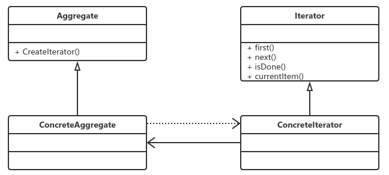

# 迭代器模式

​		一个没落的模式，基本上没有人会去单独写一个迭代器，除非是产品性质的开发。因为改模式太普遍了，基本大多数高级语言就已经自带迭代器的实现，我们直接拿来使用就行了。

## 定义

​		它提供一种方法访问一个容器对象中各个元素，而不需要暴露该对象的内部细节。

各个角色:

- Iterator抽象迭代器

  抽象迭代器负责定义访问和遍历元素的接口，而且基本上是有固定的3个方法，first()获得第一个元素,next()访问下一个元素，isDone()是否已经访问到底部(Java叫做hasNext()方法)。

- Concreteiterator具体迭代器

  具体迭代器角色要实现迭代器接口，完成容器元素的遍历。

- Aggregate抽象容器

  容器角色负责提供创建具体迭代器角色的接口，必然提供一个类似createiterator()这样的方法，在Java中一般是iterator()方法。

- Concreteaggregate具体容器

  具体容器实现容器接口定义的方法，创建出容纳迭代器的对象。

## 应用

​	JDK1.2版本开始增加java.util.iterator这个借口，并逐步把Iterator应用到各个聚集类（Collection）中。

​	java.util.Iterable接口只有一个方法：iterator()，也就是说，通过iterator()这个方法去遍历聚集类中的所有方法或属性，基本上现在所有的高级语言都有Iterator这个接口或者实现，Java已经把迭代器给我们准备好了，我们再去写迭代器，就有点多余了，所以呀，这个迭代器模式有点没落了。

## 最佳实践

​		如果你是做java开发，尽量不要自己写迭代器模式！省省吧，使用Java提供的Iterator一般就能满足你的需求了。