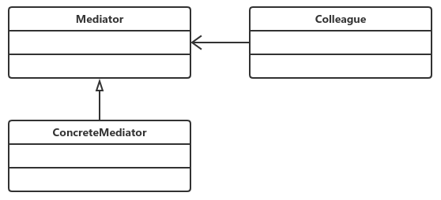

# 中介者模式 （也叫：调停者模式）
## **定义：**
​		用一个中介对象封装一系列的对象交互，中介者使各对象不需要显示地相互作用，从而使其耦合松散，而且可以独立地改变它们之间的交互。

case1中没有引入中介者模式，case2引入了中介者模式

通用源码参见case3

中介者通用类图：

- Mediator抽象中介者角色

  抽象中介者角色定义统一的接口，用于同事角色之间的通信。

- Concrete Mediator具体中介者角色

  具体中介者角色通过协调各同事角色实现协作行为，因此它必须依赖于各个同事角色。

- Colleague同事角色

  每一个同事角色都知道中介者角色，而且与其他的同事角色通信的时候，一定要通过中介者角色协作。每个同事类的行为分为两种：一种是同事本身的行为，比如改变对象本身的状态，处理自己的行为等，这种行为叫做自发行为，与其他的同事类或中介者没有任何的依赖；第二种是必须依赖中介者才能完成的行为，叫做依赖方法。

## **优点：**
​		中介者模式的优点就是减少类间的依赖，把原有的一对多的依赖变成了一对一的依赖，同事类只依赖中介者，减少了依赖，当然同时也降低了类间的耦合。

## **缺点：**
​		是中介者会膨胀得很大，而且逻辑复杂，原本N个对象直接的相互依赖关系转换为中介者和同事类的依赖关系，同事类越多，中介者的逻辑就越复杂。

## 使用场景

​		中介者模式简单，但是简单不代表容易使用，很容易被误用。在面向对象的编程中，对象和对象之间必然会有依赖关系，如果某个类和其他类没有任何互相依赖的关系，那这个类就是一个“孤岛”，在项目中就没有存在的必要了。如果存在多个关系就使用中介者模式，答案是否定的！如果中介者模式使用不当，它的缺点会被放大。

​		中介者模式适用于对象之间紧密耦合的情况，紧密耦合的标准是：在类图中出现了蜘蛛网状结构。在这种情况下一定要考虑使用中介者模式，这有利于把蜘蛛网梳理为星型结构，使原本复杂混乱的关系清晰简单。

## 中介者实际应用

- 机场调度中心  控制飞机的起落，什么跑道，什么位置。
- MVC框架
- 媒体网关
- 中介服务

​		MVC框架应用到产品中，可以提升产品的性能和扩展性，但对于项目开发就未必。因为**项目是以交付投产为目标，而产品则是以稳定、高效、扩展为宗旨。**