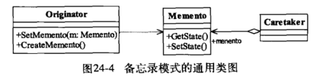

# 备忘录模式

​		提供了一种弥补真实世界缺陷的方法，让“后悔药”在程序的世界中真实可行。

## 定义

​		在不破坏封装性的前提下，捕获一个对象的内部状态，并在该对象之外保存做这个状态。这样以后就可将该对象恢复到原先保存的状态。
​		通俗来说，备忘录模式就是一个对象的备份模式，提供了一种程序数据的备份方法。



**1.Oraiginator 发起人角色**

记录当前时刻的内部桩体，负责定义哪些属于备份范围的状态，负责创建和恢复备忘录数据

**2.Memento备忘录角色**

负责存储Originator发起人对象的内部状态，在需要时提供发起人需要的内部状态

**3.Caretaker 备忘录管理员角色**

对备忘录角色进行管理，保存和提供备忘录

## 使用场景

1.需要保存和恢复数据的场景
2.提供可回滚的操作
3.数据库的事务管理就是用的备忘录模式

## 注意事项

备忘录的生命周期，建立起来就要使用，不使用了就要立刻删除其引用，主动管理它的生命周期 

## 备忘录的性能

不要在需要频繁备份的地方使用备忘录模式
原因有两个：
1.是无法控制备忘录的生成对象数量
2.是大对象的建立是需要消耗资源的

## 备忘录模式扩展

### clone方式备忘录

​		clone方式就是配合原型模式，由一个类控制，备忘录的生产和恢复，由于是一个类包含了所有的功能，所以也不需要中转类备忘录管理员角色了。

#### 示例代码

```java
// 发起人自主备份和恢复
public class Originator implements Cloneable {
    private Originator backup;
 
    private String state = "";
 
    public String getState(){
         return state;
    }
 
    public void setState(String state){
        this.state = state;
    }
 
    //创建一个备忘录
    public void createMenmto(){
       this.backup = this.clone();
    }
 
    //恢复一个备忘录
    public void restoreMenento(){
        this.setState(this.backup.getState());
    }
 
    @Override
    protected Originator clone(){
        try {
               return  (Originator)super.clone();
        } catch (CloneNotSupportedException e) {
            e.printStackTrace();
        }
        return null;
    }
}
```

```java
//场景类
public class Main {
    public static void main(String[] args) {
        //定义一个发起人
        Originator originator = new Originator();
        //建立初始状态
        originator.setState("这是初始状态");
        System.out.println("当前状态:"+originator.getState());
        //建立备份
        originator.createMenmto();
        //修改状态
        originator.setState("修改状态了");
        System.out.println("当前状态:"+originator.getState());
        //恢复状态
        originator.restoreMenento();
        System.out.println("当前状态:"+originator.getState());
    }
}
```

这样的写法程序会精简许多，而且高层模块的依赖也减少了，但是我们得考虑一下原型模式的深拷贝和浅拷贝的问题，在复杂的场景下，它会造成逻辑异常混乱，出现错误也难以跟踪，所以Clone方法的备忘录模式**适用于较简单的场景**

#### 注意
**使用Clone方法的备忘录模式，可以使用在比较简单的场景或者比较单一的场景设计中，尽量不要与其他的对象产生严重的耦合关系**

### 多状态备忘录模式

在以上的实现，全是单状态的情况，实际开发中一个对象不可能只有一个状态，这个时候就要对一个JavaBean多个属性进行备份操作。对象的全状态备份方式有很多，比如Clone的方式可以解决，数据技术也可以，使用反射将全部属性读出来备份也可以。

```java
/**
 * BeanUtils工具类
 *      类似的很多工具已经提供，比如Spring， Apache工具集commons等。
 */
public class BeanUtils {
    // 把bean的所有属性及数值放入到HashMap中
    public static HashMap<String, Object> backupProp(Object bean) {
        HashMap<String, Object> result = new HashMap<>();
        try {
            // 获得bean描述
            BeanInfo beanInfo = Introspector.getBeanInfo(bean.getClass());
            // 获得属性描述
            PropertyDescriptor[] descriptors = beanInfo.getPropertyDescriptors();
            // 遍历所有属性
            for (PropertyDescriptor descriptor : descriptors) {
                // 属性名称
                String fieldName = descriptor.getName();
                // 读取属性的方法
                Method getter = descriptor.getReadMethod();
                // 读取属性值
                Object fieldValue = getter.invoke(bean, new Object[]{});
                if (!fieldName.equalsIgnoreCase("class")) {
                    result.put(fieldName, fieldValue);
                }
            }
        } catch (Exception e) {
            e.printStackTrace();
            // 异常处理
        }

        return result;
    }

    // 把Hashmap的值返回到bean中
    public static void restoreProp(Object bean, Map<String, Object> propMap) {
        try {
            // 获得bean描述
            BeanInfo beanInfo = Introspector.getBeanInfo(bean.getClass());
            // 获得属性描述
            PropertyDescriptor[] descriptors = beanInfo.getPropertyDescriptors();
            // 遍历所有属性
            for (PropertyDescriptor descriptor : descriptors) {
                // 属性名称
                String fieldName = descriptor.getName();
                if (propMap.containsKey(fieldName)) {
                    // 获取属性
                    Object fieldValue = propMap.get(fieldName);
                    // 写属性的方法
                    Method setter = descriptor.getWriteMethod();
                    // 设置值
                    setter.invoke(bean, new Object[]{ fieldValue });
                }
            }
        } catch (Exception e) {
            e.printStackTrace();
            // 异常处理
        }
    }
}
```

### 多备份的备忘录

​	如果要存储多分怎么存储。

```java
/**
 * 备忘录管理者
 */
public class Caretaker {
    // 容纳备忘录的容器
    private Map<String, Memento> mementoMap = new HashMap<>();

    public Memento getMementoMap(String idx) {
        return mementoMap.get(idx);
    }

    public void setMementoMap(String idx, Memento memento) {
        this.mementoMap.put(idx, memento);
    }
}
```

### 封装得更好一点

​	我们的备份是绝对不能更改的，所以要避免数据被污染而让备份失去意义。我们这里可以将备忘录类变为发起人的私有内部类，然后使用一个空接口曝光备忘录的引用。

```java
/**
 * 发起人角色
 */
public class Originator {
    // 内部状态
    private String state = "";

    public String getState() {
        return state;
    }

    public void setState(String state) {
        this.state = state;
    }

    // 创建一个备忘录
    public IMemento createMemento() {
        return new Memento(this.state);
    }
    // 恢复一个备忘录
    public void restoreMemento(IMemento memento) {
        String state = ((Memento) memento).getState();
        this.setState(state);
    }

    // ========私有内部类========
    private class Memento implements IMemento{
        private String state;

        public Memento(String state) {
            this.state = state;
        }

        public String getState() {
            return state;
        }

        public void setState(String state) {
            this.state = state;
        }
    }

}
```

备忘录空接口

```java
public interface IMemento {
}
```