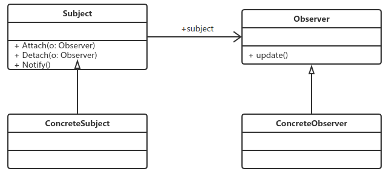

# 观察者模式

​		观察者模式也叫做发布订阅模式，它是一个在项目中经常使用的模式。

## 定义

​		定义对象间一种一对多的依赖关系，使得每当一个对象改变状态，则所有依赖于它的对象都会得到通知并自动更新。

观察者模式的几个角色名称：

- Subject被观察者

  ​		定位被观察者必须实现的职责，它必须能够动态地增加、取消观察者。它一般是抽象类或者实现类，仅仅完成作为被观察者必须实现的职责：管理观察者并通知观察者。

- Observer观察者

  ​		观察者接收到消息后，即进行update（更新）操作，对接收的信息进行处理。

- ConcreteSubject具体的被观察者

  ​		定义被观察者自己的业务逻辑，同时定义对哪些事件进行通知。

- ConcreteObserver具体的观察者

  ​		每个观察者在接收到消息后的处理反应不同，各个观察者有自己的处理逻辑。

## 优点

- 观察者与被观察者之间是抽象耦合：因此无论是增加观察者还是增加被观察者，都十分容易。
- 可以经过扩展，从而建立一条链状的触发机制。

## 缺点

- 在Java中消息的通知默认是顺序执行，一个观察者卡壳，会影响整体的执行效率。这时可以考虑采用异步的方式。（多线程呗）
- 多级触发时的效率更让人担忧，设计时需考虑。（就是上面所说的链状触发）

## 应用场景

1. 使用关联行为的场景。注意是可拆分的关联，而非组合。
2. 事件多级触发场景。
3. 跨系统的消息交换场景，如消息队列的处理机制。

## 注意事项

- 广播链的问题：在一个观察者模式中最多出现一个对象既是观察者又是被观察者，消息转发最多一两次，还比较好控制。
- 异步处理问题：需要考虑线程安全和队列的问题。（可以参考Message Queue）

## 模式扩展

1. Java世界中观察者模式

   在前面的通用类图及其源代码实现中，通过观察你也许会发现，抽象的被观察者subject仅帮我们关联了观察者和确定了通知机制；抽象的观察者仅确立了被通知的方法。

   这些完全可以单独抽象出一个联络类，作为观察者或被观察者的职责，这样就很非常符合单一职责原则。

   幸运的是，Java从诞生就提供了一个可扩展的父类，即Java.util.Observable，这个类专用于让别人去触发，Java.util.Observer接口则专注于对观察者通知。

   此外，还应关注Java.util.Observer接口丰富的方法，可以动态的添加/删除观察者。

2. 项目中真实的观察者模式

   因为前面讲解的都是太标准的模式，在系统设计中会对观察者模式进行改造或改装，主要是下面三方面。

   A。观察者与被观察者之间的消息沟通：被观察者状态改变时会触发观察者的一个行为，同时会传递一个消息给观察者，在实际中一般的做法是：观察者中的update方法接受两个参数，一个是被观察者，一个是DTO（Data Transfer Object,数据传输对象）,DTO一般是一个纯JavaBean，由被观察者生成，由观察者消费。（若远程，则以XML格式传递）

   B。观察者响应方式：观察者是个比较复杂的逻辑，要接受被观察者传递过来的信息，同时还要对他们进行逻辑处理，如果一个观察者对应多个被观察者，则需要考虑性能。备选方法两个：一是多线程，一是缓存技术。

   C。被观察者尽量自己做主：不要把消息传到观察者时才判断是否需要消费。

## 应用举例

- 文件系统：当在目录下新建一个文件，这个动作会同时通知目录管理器增加该目录，并通知磁盘管理器减少1KB的空间，也就是“文件”是一个被观察者，“目录管理器”则是观察者。
- 猫鼠游戏：猫叫一声，惊动了鼠；
- 广播收音机：电台在广播，收音机就能收听。

