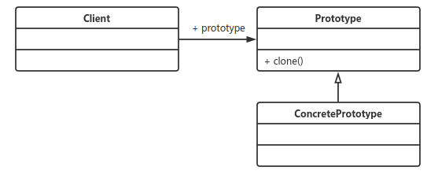

# 原型模式
### **定义：**
> 用原型实例指定创建对象的种类，并且通过拷贝这些原型创建新的对象。

通用源码参见 case1

### **优点：**
* 性能优良

  ​		原型模式是在内存二进制流的拷贝，要比直接new一个对象性能好很多，特别是要在一个循环体内产生大量的对象时，原型模式可以更好地体现其优点。
  注意：：在case1中实际操作发现现在的虚拟机HotSpot中原型反而比new慢。

* 逃避构造函数的约束

  ​		这既是它的优点也是缺点，直接在内存中拷贝，构造函数是不会执行的。优点就是减少了约束，缺点也是减少了约束，需要大家在实际应用时考虑。

### **使用场景：**
* 资源优化场景

  ​	类初始化需要消化非常多的资源，这个资源包括数据、硬件资源等。

* 性能和安全要求的场景

  ​	通过new产生一个对象需要非常繁琐的数据准备或访问权限，则可以使用原型模式。

* 一个对象多个修改者的场景

  ​	一个对象需要提供给其他对象访问，而且各个调用者可能都需要修改其值时，可以考虑使用原型模式拷贝多个对象供调用者使用。

注意：： 原型模式调用clone不会执行构造函数。

### Java创建对象的几种方式（重要）：

1. 用new语句创建对象，这是最常见的创建对象的方法。
2. 运用反射手段,调用java.lang.Class或者java.lang.reflect.Constructor类的newInstance()实例方法。
3. 调用对象的clone()方法。
4. 运用反序列化手段，调用java.io.ObjectInputStream对象的 readObject()方法。
1和2是要调用构造函数的，3和4是不调用构造函数的。

浅拷贝和深拷贝。
浅拷贝参见case2
浅拷贝参见case3

### clone与final两个冤家
当一个属性被final标识了，那么就不能调用clone方法，否则编译器会报错。

> 要使用clone方法，类的成员变量上不要增加final关键字。
