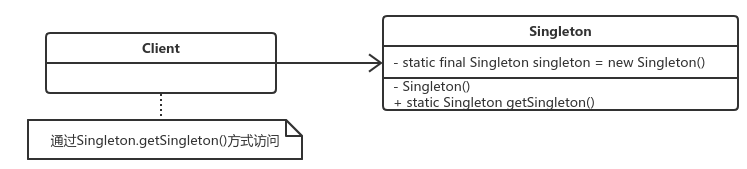

# 单例模式
--------

​		单例模式(Singleton Pattern) 是一个比较简单的模式，定义：确保某一个类只有一个实例，而且自行实例化并向整个系统提供这个实例。




## 定义：

​    保证一个类仅有一个实例，并提供一个访问它的全局访问点。
## 单例的本质：
​    控制实例的数目

## 根据初始化的时间，单例模式分为:饱汉式和饿汉式。
```
    懒汉式是典型的时间换空间，也就是每次获取实例都会进行判断，看是否需要创建实例，浪费判断的时间。当然，如果一直都有人使用的话，那就不会创建实例，则解约内存空间。如果要保证线程安全需要加同步synchronized。
    饿汉式是典型的空间换时间，当类装载的时候就会创建类的实例，不管你用不用，先创建出来，然后每次调用的时候，就不需要
再判断了，节省了运行时间。是线程安全的。
```


## 如何实现懒汉式的线程安全呢？

​		**饿汉式是线程安全的**，因为虚拟机保证只会装载一次，在装载类的时候是不会发生并发的。懒汉式有线程安全问题。

方法一：

    public static synchronized Singleton getInstance()

方法二：

   双重检查加锁：既可以实现线程安全，又能使性能不受到很大的影响。

   所谓双重检查加锁机制，指的是：并不是每次进入getInstance方法都需要同步，而是先不同步，进入方法过后，先检查实例是否存在，如果不存在才进入下面的异步块，这是第一重检查。进入同步块过后，再次检查实例是否存在，如果不存在，就在同步的情况下创建一个实例，这是第二重检查。这样一来，就只需要同步一次了，从而减少了多次在同步情况下进行判断所浪费的时间。

   双重检查加锁机制的实现会使用一个关键字volatile，它的意思是：被volatile修饰的变量的值，将不会被本地线程缓存，所有对该变量的读写都是直接操作共享内存从而确保多个线程能正确的处理该变量。

何时选用单例？
    当需要控制一个类的实例只能有一个，而且客户只能从一个全局访问点访问它时，可以选用单例模式，这些功能恰好是单例模式要解决的问题。


## 单例模式的优点
> * 减少了内存开支，特别是一个对象需要频繁地创建、销毁时，而且创建或销毁时性能又无法优化，单例模式的优势就非常明显。
> * 减少了性能的开销，当一个对象的产生需要比较多的资源时，如读取配置、产生其他依赖对象时，则可以通过在应用启动时直接产生一个单例对象，然后用永久驻留内存的方式解决（在JavaEE中采用单例模式时需要注意JVM垃圾回收机制）。
> * 可以避免对资源多重占用，例如一个写动作，由于只有一个实例存在内存中，避免对同一个资源文件的同时写操作。
> * 可以在系统设置全局的访问点，优化和共享资源访问，例如可以设计一个单例类，负责所有数据表的映射处理。

## 单例模式的缺点
> * 没有接口，扩展困难，若要扩展，除了修改代码基本没有第二种途径可以实现。在特殊情况下是可以实现接口、被继承等，这需要在实际开发中根据情况判断。
> * 单例模式对测试不利。在并行的开发环境中，如果单例模式没有完成，是不能进行测试的，没有接口也不能使用mock方式虚拟一个对象。
> * 单例模式与单一职责原则有冲突。

## 单例模式注意事项
* 在高并发情况下，请注意单例模式的线程同步问题。
* 要考虑对象的复制情况。在Java中，对象默认是不可以被复制的，若实现了Cloneable接口，并实现了clone方法，则可以直接通过对象复制方式创建一个新对象，对象复制是不用调用类的构造函数，因此即使是私有的构造函数，对象仍然可以被复制。