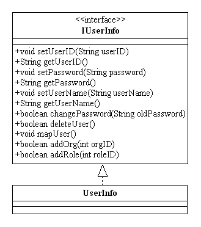
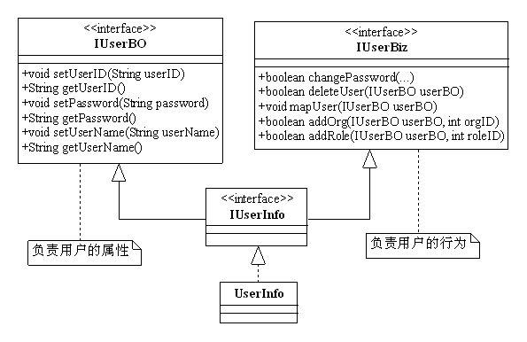
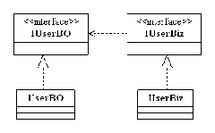

# 6大设计原则SOLID

网络资料： [六大设计原则(SOLID)](https://www.jianshu.com/p/3268264ae581)

## SOLID由来

**设计模式的六大原则有：**

- Single Responsibility Principle：单一职责原则（SRP）
- Open Closed Principle：开闭原则（OCP）
- Liskov Substitution Principle：里氏替换原则（LSP）
- Law of Demeter：迪米特法则（LOD）
- Interface Segregation Principle：接口隔离原则（ISP）
- Dependence Inversion Principle：依赖倒置原则（DIP）

​		把这六个原则的首字母联合起来（两个 L 算做一个）就是 SOLID （solid，稳定的），其代表的含义就是这六个原则结合使用的好处：建立稳定、灵活、健壮的设计。

​		这些设计原则是尽量的遵守，而不是要完完全全的要完全遵守，六大设计原则是设计的理想模式。作为一个项目经理或架构师，应该懂得技术只是实现目的的工具，惹恼了上司，设计做得再漂亮，代码写得再完美，项目做的再符合标准，一旦项目亏本，产品收入大于产出，那整体就是扯淡！~你自己也别想混得更好！~项目盈利第一！~

## 单一职责原则

> 有且仅有一个原因引起类的变更。

​		参考资料：[单一职责原则](https://www.cnblogs.com/cbf4life/archive/2009/12/11/1622166.html)

### 问题由来

​		之所以会出现单一职责原则就是因为在软件设计时会出现以下类似场景：

​		T负责两个不同的职责：职责P1，职责P2。当由于职责P1需求发生改变而需要修改类T时，有可能会导致原本运行正常的职责P2功能发生故障。也就是说职责P1和P2被[耦合](https://baike.baidu.com/item/耦合/2821124)在了一起。

### 产生原因

​		没有任何的程序设计人员不清楚应该写出[高内聚低耦合](https://baike.baidu.com/item/高内聚低耦合/5227009)的程序，但是很多[耦合](https://baike.baidu.com/item/耦合/2821124)常常发生在不经意之间，其原因就是：

​		职责扩散：因为某种原因，某一职责被分化为[颗粒度](https://baike.baidu.com/item/颗粒度/333017)更细的多个职责了。

### 解决办法

​		遵守单一职责原则，将不同的职责封装到不同的类或模块中。

### SRP的好处

- **类的复杂度降低**，实现什么职责都有清晰明确的定义；
- **可读性高**，复杂性降低，那当然可读性提高了；
- **可维护性提高**，可读性提高了，那就更容易维护了；
- **变更引起的风险降低**。变更必不可少的，如果接口的单一职责做得好，一个接口修改只对相应的实现类有影响，对其他的接口无影响，这对系统的扩展性，维护性都有非常大的帮助。
- 适用于类，接口，也适用于方法。

### 注意

> ​		SRP原则提出来一个编写程序的标准，用“职责”或“变化原因”来衡量接口或类设计得是否优良，但是“职责”和“变化原因”都是不可度量的，因项目而异，因环境而异。
>
> ​		SRP原则很难在项目中得到体现，非常难，为什么？在国内，技术人员的地位和话语权都比较低，因此在项目中需要考虑环境，考虑工期，考虑工作量，考虑成本，考虑人员的技术水平，考虑硬件的资源等情况，最终妥协的结果就是违背SRP原则。

### 举例说明

未按SRP原则设计的接口：

按SRP原则设计的接口：

   确实可以如此，问题也解决了，但是我们来回想一下我们刚才的动作，为什么要把一个接口拆分成两个呢？其实，在实际的使用中，我们更倾向于使用两个不同的类或接口：一个是IUserBO， 一个是IUserBiz

## 里氏替换原则

> 所有引用基类的地方必须能透明地使用其子类的对象。

​		里氏替换原则的意思是，所有基类在的地方，都可以换成子类，程序还可以正常运行。这个原则是与面向对象语言的继承特性密切相关的。

**里氏替换原则对继承进行了规则上的约束:**

1. 子类必须完全实现父类的方法
2. 子类可以有自己的个性
3. 覆盖或实现父类的方法时输入参数可以被放大
4. 覆盖或实现父类的方法时输出结果可以被缩小

## 依赖倒置原则

> 1、上层模块不应该依赖底层模块，它们都应该依赖于抽象。
> 2、抽象不应该依赖于细节，细节应该依赖于抽象。

#### **在java中的体现就是：**
> * 模块间的依赖通过抽象发生，实现类之间不发生直接的依赖关系，其依赖关系是通过接口或抽象类产生的。
> * 接口或抽象类不依赖于实现类。
> * 实现类依赖接口或抽象类。

> 更精简的定义就是“面向接口的编程”。

## 接口隔离原则

> 1、客户端不应该依赖它不需要的接口。
> 2、类间的依赖关系应该建立在最小的接口上。

#### **比较区别：**
> 单一职责要求的是类和接口职责单一，注重的是职责，这事业务逻辑上的划分，而接口隔离原则要求接口的方法尽量少。

## 迪米特法则

> 只与你的直接朋友交谈，不跟“陌生人”说话

#### **核心观念：**
> 类的解耦，弱耦合，只有弱耦合了以后，类的复用率才可以提高。

## 开闭原则

> 一个软件实体，如类、模块和函数应该对扩展开放，对修改关闭其含义是说一个软件实体应该通过扩展来实现变化，而不是通过修改已有的代码来实现变化。