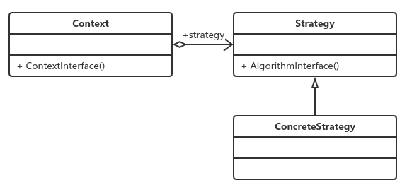

# 策略模式

​		策略模式是一种比较简单的模式，也叫政策模式。

## 定义

​		定义一组算法，将每个算法都封装起来，并且使他们之间可以互换。

策略模式三个角色：

- Context封装角色

  它也叫上下文角色，起承上启下封装作用，屏蔽高层模块对策略、算法的直接访问，封装可能存在的变化。

- Strategy抽象策略角色

  策略、算法家族的抽象，通常为接口，定义每个策略或算法必须具有的方法和属性。

- Concretestrategy具体策略角色

  实现抽象策略中的操作，该类含有具体的算法。

## 应用

### 优点

- 算法可以自由切换；
- 避免使用多重条件判断；
- 扩展性良好。

### 缺点

- 策略类数量增多；

- 所有的策略类都需要对外暴露；

  上层模块必须知道有哪些策略才能决定使用哪一个策略。

### 使用场景

- 多个类只有在算法或者行为上有不同的场景；
- 算法需要自由切换的场景；
- 需要屏蔽算法规则的场景。

## 注意事项

​		如果系统中的一个策略家族的具体策略数量超过4个，则需要考虑使用混合模式，解决策略类膨胀和对外暴露的问题，否则日后的系统维护就会成为一个烫手山芋，谁都不想接。

## 策略模式扩展

​	使用枚举实现策略模式。 参见case3
​	策略枚举是一个非常优秀和方便的模式，但是它受枚举类型的限制，每个枚举项都是public、final、static的，扩展性受到了一定的约束，因此在系统开发中，策略枚举一般担当不经常发生变化的角色。