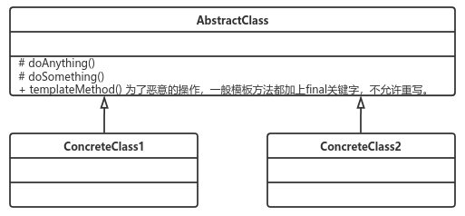

# 模板方法模式
## **定义：**
> ​		定义一个操作中的算法的框架，而将一些步骤延迟到子类中。使得子类可以不改变一个算法的结构即可重定义该算法的某些特定步骤。

  通用源码请查看case1

  ## **优点：**
  > * 封装不变部分，扩展可变部分
  >> 把认为是不变部分的算法封装到父类实现，而可变部分的则可以通过继承来继续扩展。
  > * 提取公共部分代码，便于维护
  > * 行为由父类控制，子类
  >> 基本方法是由子类实现的，因此子类可以通过扩展的方式增加相应的功能，符合开闭

## **缺点：**
> 按照我们的设计习惯，抽象类负责声明最抽象、最一般的事物属性和方法，实现类完成具体的事物属性和方法。但是模板方法模式却颠倒了，抽象类定义了部分抽象方法，由子类实现，子类执行的结果影响了父类的结果，也就是子类对父类产生了影响，这在复杂的项目中，会带来代码阅读的难度，而且也会让新手产生不适感。

## **使用场景：**
* 多个子类有公有的方法，并且逻辑基本相同时
* 重要、复杂的算法，可以把核心算法设计为模板方法，周边的相关细节功能则由各个子类实现。
* 重构时，模板方法模式是一个经常使用的模式，把相同的代码抽取到父类中，然后通过钩子函数约束其行为。