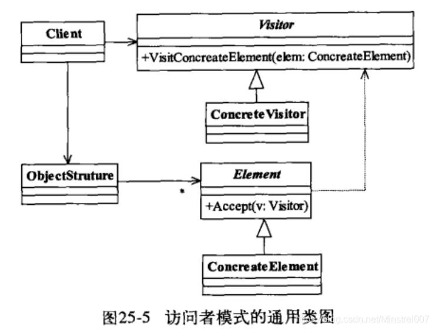

# 访问者模式

​		访问者模式(visitor Pattern)是一个相对简单的模式。

## 定义

​		封装一些作用于某种数据结构中的各元素的操作，它可以在不改变数据结构的前提下定义作用于这些元素的新操作。

**5个角色：**

**visitor抽象访问者**

抽象类或者接口，声明访问者可以访问哪些元素，具体到程序就是visit方法的参数定义哪些对象可以被访问

**ConcreteVisitor 具体访问者**

它影响访问者访问到一个类后该怎么干，要做什么事

**Element 抽象元素**

接口或抽象类，声明接受哪一类访问者访问，程序上是通过accept方法中的参数来定义的

**ConcreteElement 具体元素**

实现accept方法，通常是visit.visit(this),基本上都形成一种模式了

**OjectStruture 结构对象**

元素产生者，一般容纳在多个不同类，不同接口的容器，如list，set，map等，项目中一般很少会抽象出这个角色

## 优点

1.符合单一职责原则
具体元素角色也就是负责数据的加载，而Visitor类则负责数据的处理展现，两个不同的职责非常明确的分离开来，各自工作
2.优秀的拓展性
由于职责分开，继续增加数对数据的操作是非常快捷的，，例如现在要增加一份报表，但是这份报表的格式又有所不同，只要直接在visitor中增加一个方法，传递数据后进行整理打印
3.灵活性非常高
对原始数据可以在Visiot类中进行处理，比如添加乘除系数等

## 缺点

1.具体元素对访问者公布细节
访问者要访问一个类就必然要求这个类公布一些方法和数据，也就是说访问者关注了其他类的内部细节，这是迪米特法则所不建议的
2.具体元素变更困难
具体元素的增加，删除，修改都会比较困难，如果增加了一个成员变量，则Visitor就需要修改，当Visitor有多个时，或者业务逻辑较为复杂时，就容易出现问题
3.违背了依赖倒置原则
访问者依赖的是具体元素，而不是抽象元素，这破坏了依赖倒置原则

## 使用场景

1.一个对象结构包含很多类对象，它们有不同的接口，而你想对这些对象实施一些依赖于其具体类的操作时
2.需要对一个对象结构中的对象进行很多不同并且不相关的操作，而你想避免让这些操作"污染"这些对象的类

 

总结来说，就是业务规则要求遍历多个不同的对象，然后执行不同的操作，也就是针对访问的对象不同，执行不同的操作。访问者模式还有一个用途是充当拦截器角色，这个在后面会说明