# 用户指南

## 如何配置跟踪窗口

前往“设置”面板，找到“跟踪窗口”选项，然后点击“添加”按钮：

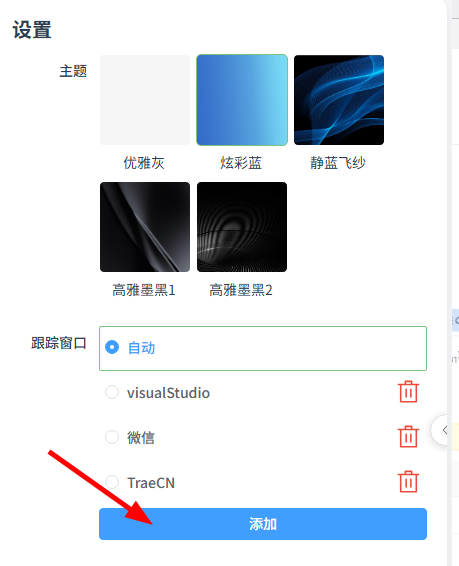

添加跟踪应用，表单信息介绍：

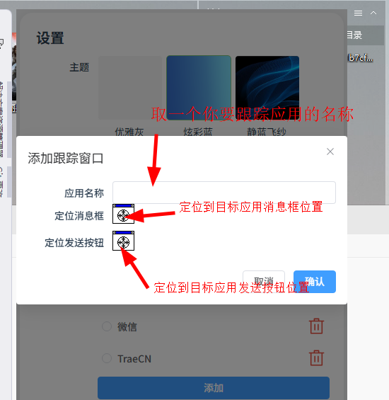

填写表单信息，注意定位按钮是通过鼠标按下不松手然后拖到目标应用对应位置中。

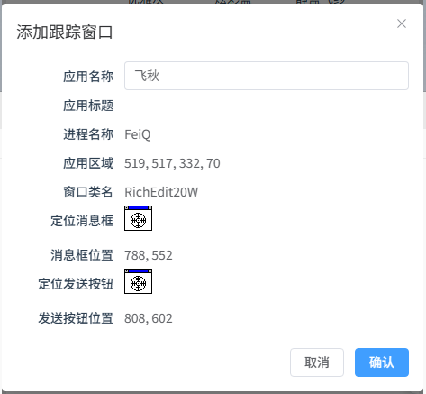

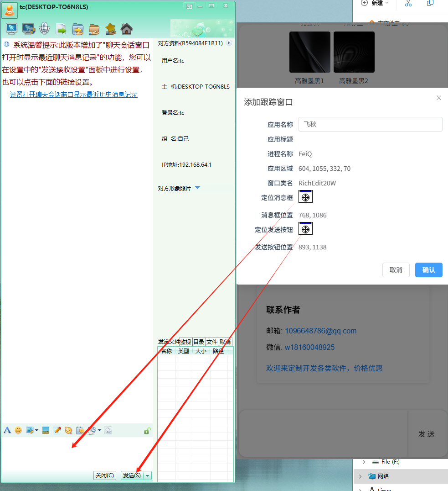

设置好后，然后点击“确认”按钮，然后点击目标窗口，这样窗口就自动挂到目标窗口右侧了。

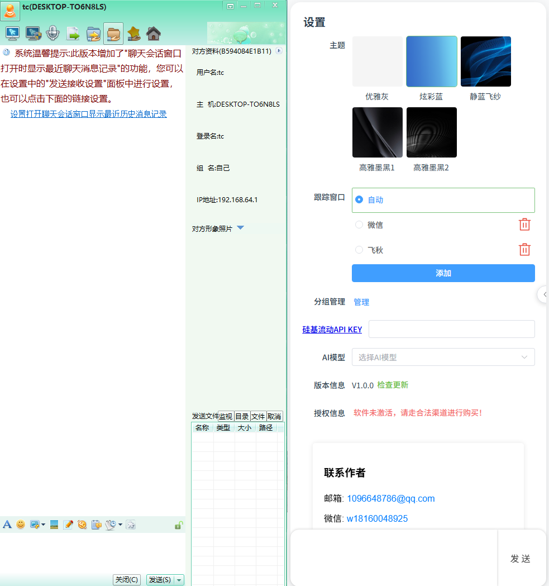

## 如何启用AI服务

前往“设置”面板，配置“硅基流动API KEY”。

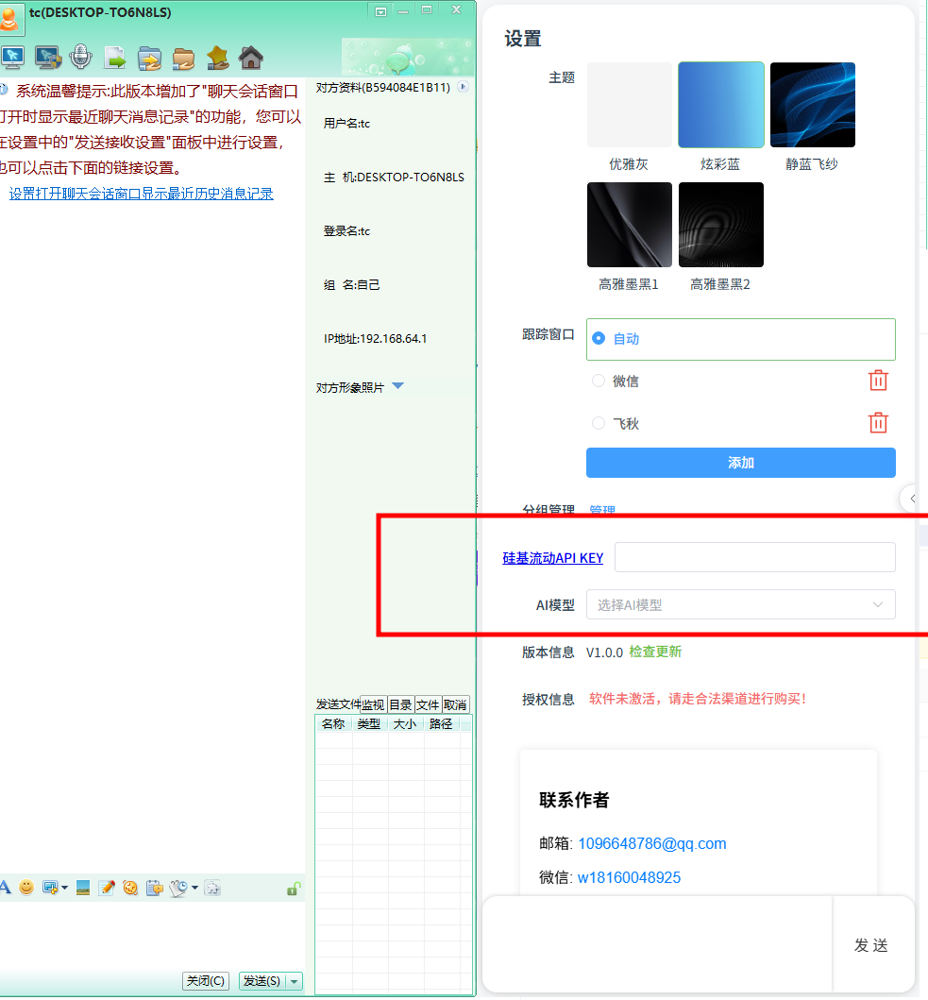

如何申请API KEY：

1. 前往这里：[地址](https://siliconflow.cn/)， 先进行注册账号登录。

2. 在“账户管理”-》“API 秘钥”处“新建API秘钥”。

   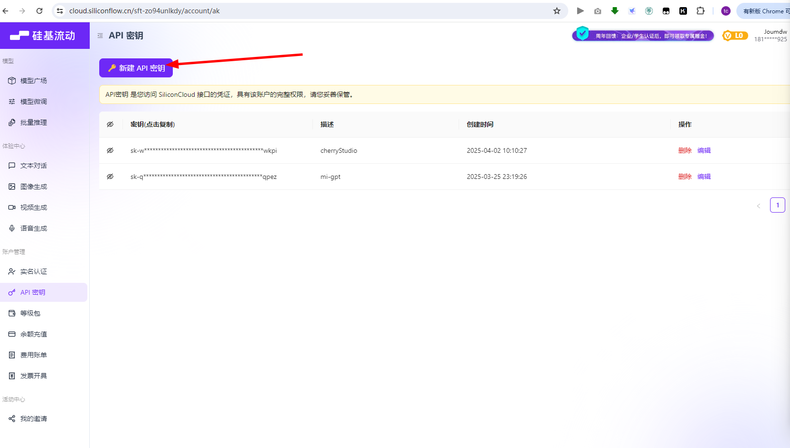

   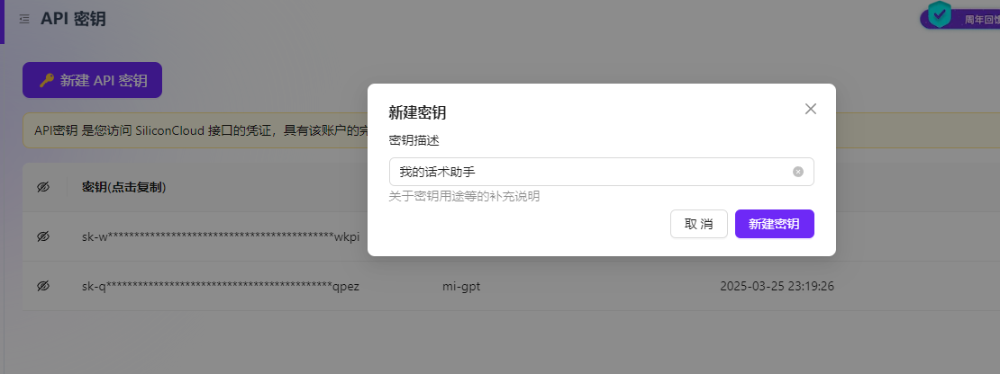

然后点击此处进行复制：

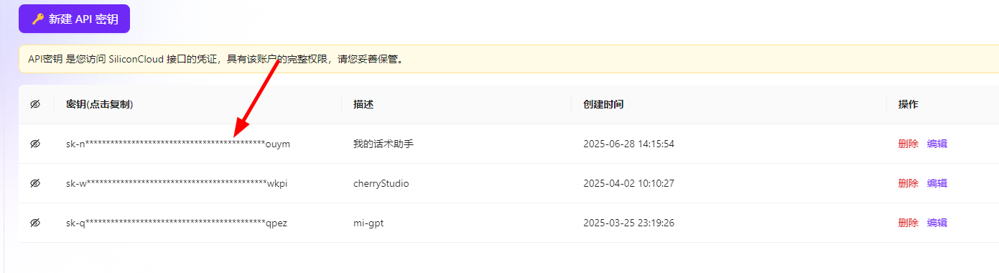

将得到秘钥粘贴到话术助手中去：

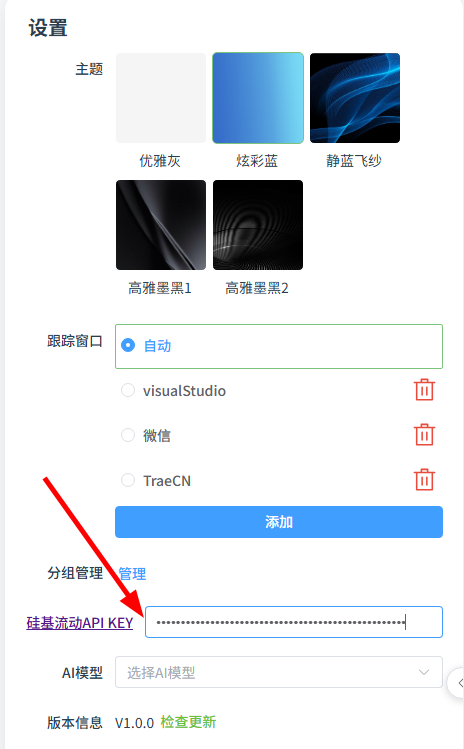

在配置好硅基流动API KEY之后，你就可以选择你进行选择AI功能使用的大模型了。

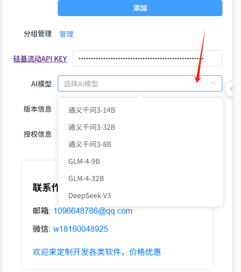

> 默认会查询出硅基流动免费的模型，这些模型通常在使用上也会有一定限制，如果需要更好的AI体验，可以在硅基流动这个平台上的“模型广场”去购买付费模型使用（注意本应用只支持文本对话类型的模型，不支持图像、视频、语音等其他类型）。

# 联系作者

[点击我](https://anthubtc.github.io/AD/contactAuthor.html)

<iframe  src="https://anthubtc.github.io/AD/contactAuthor.html"/>
