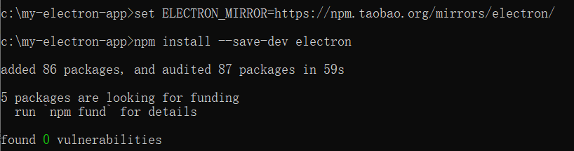

# 入门例子


## 安装Node.js

下载地址：https://nodejs.org/en/download/

也可以使用nvm来管理安装NodeJs

```bash
要检查 Node.js 是否正确安装，请在您的终端输入以下命令：
node -v
npm -v
```

**注意**：因为 Electron 将 Node.js 嵌入到其二进制文件中，你应用运行时的 Node.js 版本与你系统中运行的 Node.js 版本无关。

## 创建应用程序

```bash
创建一个文件夹并初始化 npm 包。
mkdir my-electron-app
cd my-electron-app
npm init --yes
```

2、将 electron 包安装到应用的开发依赖中。
npm install –save-dev electron

此时会大概率的出现超时异常。Error: connect ETIMEDOUT。


解决办法：

```bash
先将electron镜像设置为淘宝镜像。
set ELECTRON_MIRROR=https://npm.taobao.org/mirrors/electron/

然后再执行
npm install –save-dev electron
```



在package.json配置文件中的scripts字段下增加一条start命令，配置好main的入口文件：

```
{
  "name": "my-electron-app",
  "version": "1.0.0",
  "description": "",
  "main": "main.js",
  "scripts": {
    "test": "echo \"Error: no test specified\" && exit 1",
    "start": "electron ."
  },
  "keywords": [],
  "author": "",
  "license": "ISC",
  "devDependencies": {
    "electron": "^24.1.0"
  }
}

```

在项目的根目录下创建一个名为 main.js 的文件

```javascript
const {app, BrowserWindow} = require('electron');
let win;
let windowConfig = {
    width:800,
    height:600
};
function createWindow(){
    win = new BrowserWindow(windowConfig);
    win.loadURL(`file://${__dirname}/index.html`);
    //开启调试工具
    win.webContents.openDevTools();
    win.on('close',() => {
        //回收BrowserWindow对象
        win = null;
    });
    win.on('resize',() => {
        win.reload();
    })
}
 
app.on('ready',createWindow);
app.on('window-all-closed',() => {
    app.quit();
});
 
app.on('activate',() => {
    if(win == null){
        createWindow();
    }
})
```

在项目的根目录下创建一个名为 index.html的文件

```html
<!DOCTYPE html>
<html lang="en">
<head>
    <meta charset="UTF-8">
    <meta http-equiv="X-UA-Compatible" content="IE=edge">
    <meta name="viewport" content="width=device-width, initial-scale=1.0">
    <title>Document</title>
</head>
<body>
    hello world!
</body>
</html>
```

在VsCode中配置启动配置文件launch.json

```json
{
    "version": "0.2.0",
    "configurations": [
        {
            "type": "node",
            "request": "launch",
            "name": "Launch Program",
            "runtimeExecutable": "npm",
            "runtimeArgs": [ "start" ],
            "port": 9229
        }
    ]
}
```

然后就可以运行了（VsCode可以按F5快速启动）

在启动配置中使用“ npm”的文档：[https](https://code.visualstudio.com/docs/nodejs/nodejs-debugging#_launch-configuration-support-for-npm-and-other-tools) : [//code.visualstudio.com/docs/nodejs/nodejs-debugging#_launch-configuration-support-for-npm-and-other-tools](https://code.visualstudio.com/docs/nodejs/nodejs-debugging#_launch-configuration-support-for-npm-and-other-tools)

