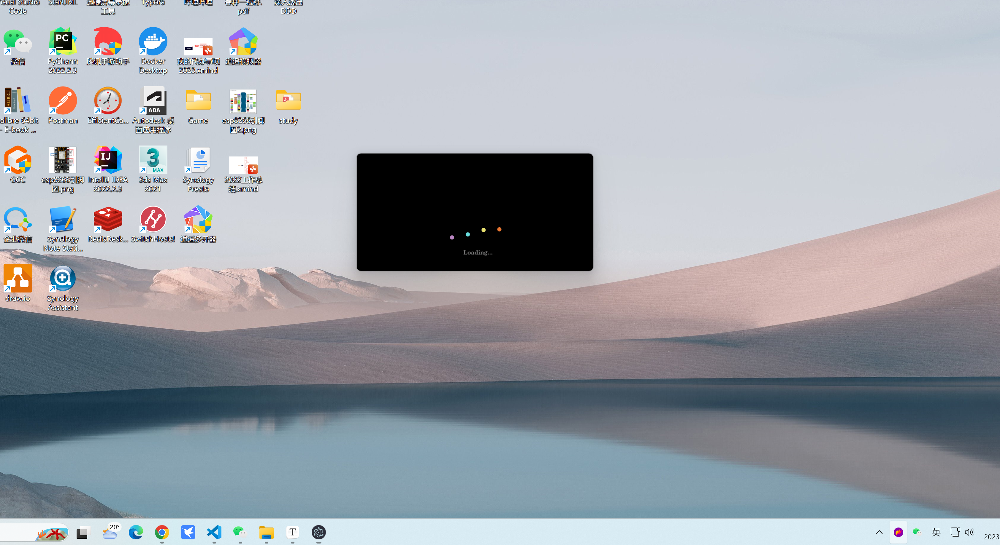

# 将SpringBoot集成到Electron

​	此文档主要记录如何将springboot集成到Electron内部作为界面的服务端，为什么不直接使用nodejs是原因我可能会使用Apache Lunce开发索引工具。

下面实例中，演示了如何在启动加载的时候启动spring boot，然后启动完毕后进入主页面。

## 效果

### 启动效果



### 进入主应用后的效果


### 启动日志


## 程序

最主要的代码main.js:

```javascript
const { app, BrowserWindow, ipcMain } = require("electron");
const { spawn } = require('child_process');

function javaApplication(succCallback, closeCallback, errCallback) {
    // 启动 Java 服务端
    const javaProcess = spawn('java', ['-jar', '../server/target/server-0.0.1-SNAPSHOT.jar']);

    // 监听 Java 进程的输出
    javaProcess.stdout.on('data', (data) => {
        const log = data.toString()
        console.log(`Java stdout: ${log}`);
        if (log && log.indexOf("Started ServerApplication in") != -1) {
            console.log("服务端已经启动，启动主窗口")
            succCallback && succCallback();
        }
    });

    javaProcess.stderr.on('data', (data) => {
        console.error(`Java stderr: ${data}`);
        errCallback && errCallback()
    });

    javaProcess.on('close', (code) => {
        console.log(`Java process exited with code ${code}`);
        closeCallback && closeCallback()
    });
}

app.whenReady().then(() => {
    // 开始加载应用
    ipcMain.emit("loading")
})
// app.on('ready',createWindow);
app.on('window-all-closed',() => {
    app.quit();
}); 
// app.on('activate',() => {
//     if(win == null){
//         createWindow();
//     }
// })
// 加载应用
ipcMain.on("loading", () => {
    console.info("loading start")
    let loadingWin = new BrowserWindow({
        width:400,
        height:200,
        frame:false, // 是否有边框
        webPreferences: {
            nodeIntegration: true,
            contextIsolation: false,
            enableRemoteModule: true
        }
    });
    loadingWin.loadFile('loading.html');
    // 开启调试工具
    // win.webContents.openDevTools();
    loadingWin.on('close',() => {
        //回收BrowserWindow对象
        loadingWin = null;
    });
    // w1.on('resize',() => {
    //     win.reload();
    // })

    javaApplication(() => {
        console.info("java server started")
        // 这里如何通过事件通知electron主进程，主进程接受事件然后打开新的窗口
        ipcMain.emit("loaded", loadingWin)
    });
});
// 启动主应用
ipcMain.on("loaded", loadingWin => {
    console.info("start main GUI")

    let mainWin = new BrowserWindow({
        title: "Image Viewer",
        width:800,
        height:600,
        frame: true, // 是否有边框
        show: false,
        webPreferences: {
            nodeIntegration: true,
            contextIsolation: false,
            enableRemoteModule: true
        }
    });
    require("./menu.js")

    // w1.on('resize',() => {
    //     win.reload();
    // })
    // 开启调试工具
    mainWin.webContents.openDevTools();
    mainWin.on('close',() => {
        //回收BrowserWindow对象
        mainWin = null;
    });
    // win.loadURL(`file://${__dirname}/index.html`);
    mainWin.loadFile('main.html').then(() => {
        // 关闭加载对话框
        loadingWin.close();
        // 显示主窗口
        mainWin.show();
    });
});
```

