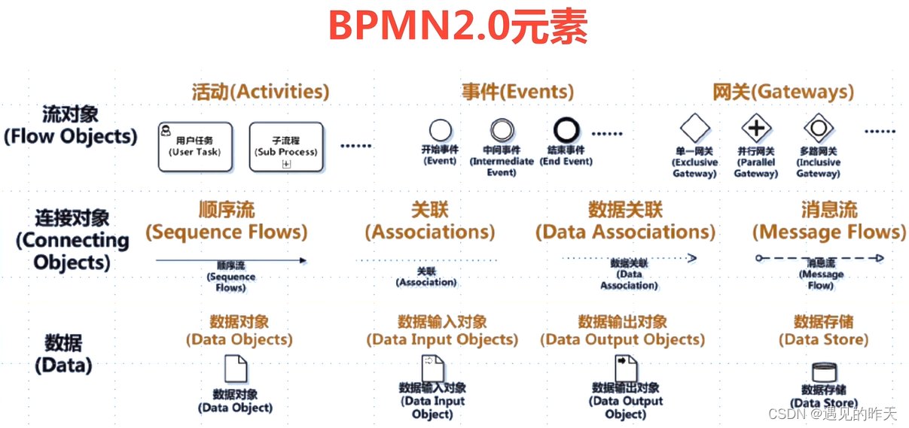
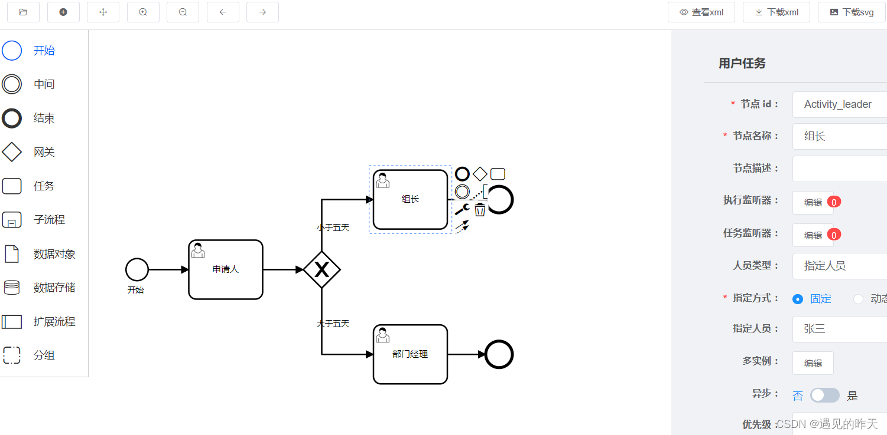

# Flowable

## Flowable是什么

Flowable 是一个使用 Java 编写的轻量级业务流程引擎。Flowable 流程引擎可用于部署 BPMN2.0 流程定义（用于定义流程的行业 XML 标准），创建这些流程定义的流程实例，进行查询，访问运行中或历史的流程实例与相关数据，等等。

简单来说：Flowable将审批节点抽象出来，那么作为使用者而言只需要通过流程设计器定义流程模板，定义动态表单，挂载表单数据，通过流程定义和流程变量启动流程实例即可。使用者不需要知道整个流程具体如何执行，只需要记住审批人是谁，审批通过没有即可。

因此：flowable流程引擎非常适用存在审批的项目上，当然审批是需要提交表单的，因此常常配合表单设计器一起使用。

Java 领域另一个流程引擎是 Activiti，只要你会使用其中一个，另一个就不在话下。

## BPMN2.0 是什么

BPMN（Business Process Model and Notation）是一个业务流程模型标记规范，以精准的执行语义来描述元素的操作，以XML为载体，以符号为可视化业务。

目前端是通过Bpmn.js 实现 BPMN2.0规范，设计出来的流程设计器。

## 版本

v6.8.1(当前学习版本) 		JDK8+

v7.0.0       JDK 17+

## 参考资料

[flowable中文文档](https://tkjohn.github.io/flowable-userguide/#_introduction)

[BILIBILI视频-2024最新Flowable进阶课程](https://www.bilibili.com/cheese/play/ss9979) 没有看它的收费进阶版本

[Flowable Open Source Documentation](https://www.flowable.com/open-source/docs/bpmn/ch02-GettingStarted)

[flowable-engine 开源代码](https://github.com/flowable/flowable-engine)

[官方网址](https://www.flowable.com)
