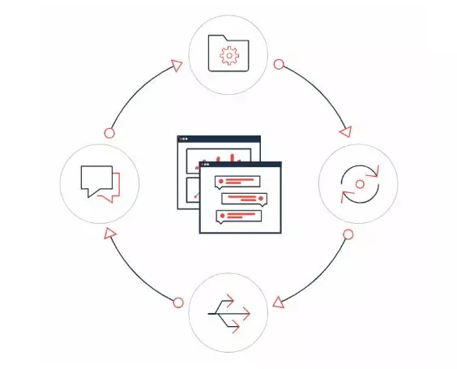

# Flowable

## Flowable是什么

Flowable 是一个使用 Java 编写的轻量级业务流程引擎。Flowable 流程引擎可用于部署 BPMN2.0 流程定义（用于定义流程的行业 XML 标准），创建这些流程定义的流程实例，进行查询，访问运行中或历史的流程实例与相关数据，等等。

简单来说：Flowable将审批节点抽象出来，那么作为使用者而言只需要通过流程设计器定义流程模板，定义动态表单，挂载表单数据，通过流程定义和流程变量启动流程实例即可。使用者不需要知道整个流程具体如何执行，只需要记住审批人是谁，审批通过没有即可。

因此：flowable流程引擎非常适用存在审批的项目上，当然审批是需要提交表单的，因此常常配合表单设计器一起使用。

2016 年 10 月，Activiti 工作流引擎的主要开发者离开 Alfresco 公司并在 Activiti 分支基础上开启了 Flowable 开源项目。基于 Activiti v6 beta4 发布的第一个 Flowable release 版本为6.0。以 JAR 形式发布使得 Flowable 可以轻易加入任何Java环境：Java SE、Tomcat、Jetty 或 Spring 之类的 servlet 容器；JBoss 或 WebSphere 之类的 Java EE 服务器等等。 另外，也可以使用 Flowable REST API 进行 HTTP 调用。

Flowable 项目中包括 **BPMN（Business Process Model and Notation）引擎**、**CMMN（Case Management Model and Notation）引擎**、**DMN（Decision Model and Notation）引擎**、**表单引擎（Form Engine）**等模块。也有许多Flowable 应用（Flowable Modeler、Flowable Admin、Flowable IDM 与 Flowable Task），并提供了直接可用的 UI 示例。模块之间协作关系可以参考下图：

构建 OA、CRM、TMS、财务管理等系统时，若基于 Flowable 生态做定制化开发可以大大减少开发成本，避免写复杂而难以维护的条件代码。Flowable 的关键为其核心引擎，核心引擎是一组服务的集合，并提供管理与执行业务流程的API。Flowable 生态系统中的**业务流程引擎（BPMN）可以与决策引擎（DMN）、案例模型引擎（CMMN）、表单引擎**联动，开发者可以根据业务需求选用其中一个或多个模块，通过模块之间相互协作构建业务系统、以实现强大的功能。

## **工作流引擎使用场景**

工作流在企业管理系统中是高频使用的功能，一个最常见的例子是请假加班申请与审批的过程。事实上，工作流引擎能支持的业务场景远远不止单据审批，几乎所有涉及到业务流转、多人按流程完成工作的场景背后都可以通过工作流引擎作为支撑。基于工作流引擎，可以搭建客户关系管理系统（CRM）、运输管理系统（TMS）、仓储管理系统（WMS）、财务费用系统等多种复杂业务系统。对于达到一定规模的企业，良好的 BPM（业务流程管理，Business Process Management）体系可以支持创建公司内横跨不同部门的复杂业务流程，既提高工作效率、又可推动企业规范化发展。

## BPMN2.0 是什么

BPMN（Business Process Model and Notation）是一个业务流程模型标记规范，以精准的执行语义来描述元素的操作，以XML为载体，以符号为可视化业务。

目前端是通过Bpmn.js 实现 BPMN2.0规范，设计出来的流程设计器。

## 版本

v6.8.1(当前学习版本) 		JDK8+

v7.0.0       JDK 17+

## 参考资料

[flowable中文文档](https://tkjohn.github.io/flowable-userguide/#_introduction)  **-优质文档**

[BILIBILI视频-2024最新Flowable进阶课程](https://www.bilibili.com/cheese/play/ss9979) 没有看它的收费进阶版本

[Flowable Open Source Documentation](https://www.flowable.com/open-source/docs/bpmn/ch02-GettingStarted)

[flowable-engine 开源代码](https://github.com/flowable/flowable-engine)

[官方网址](https://www.flowable.com)
