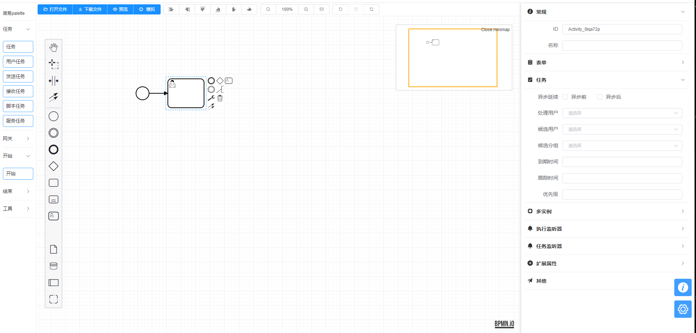

# 使用bpmn-js编辑和显示流程图

flowable鼓励实现自己的编辑和显示流程图。

Use [bpmn-js](https://bpmn.io/ ) to view, create and edit BPMN 2.0 diagrams in your browser. [预览](https://demo.bpmn.io/new)

参考代码（基于bpmn-js开发的）：

https://github.com/miyuesc/bpmn-process-designer?tab=readme-ov-file

https://github.com/moon-studio/vite-vue-bpmn-process

[Flowable集成bpmn.js流程中心开源系统后台](https://blog.csdn.net/liuwenjun05101/article/details/117411712)

参考文档：

[bpmn.js weixin_43359503的博客](https://blog.csdn.net/weixin_43359503/category_10821477.html)

# 其它等待自己深入学习

