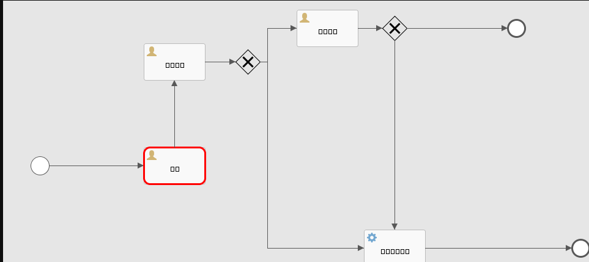
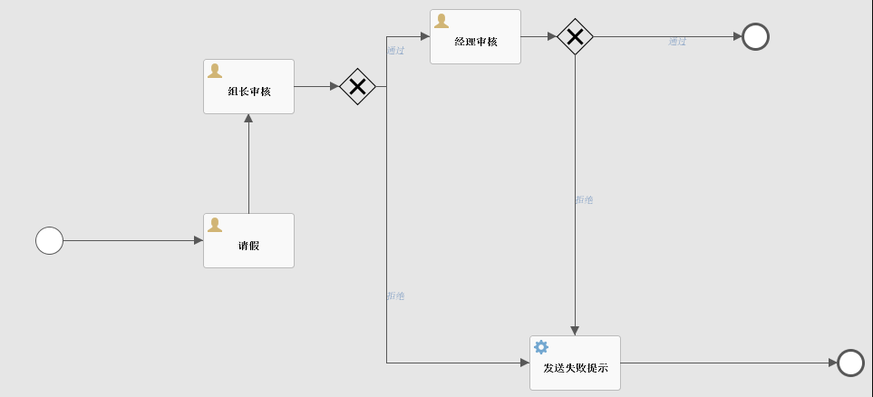
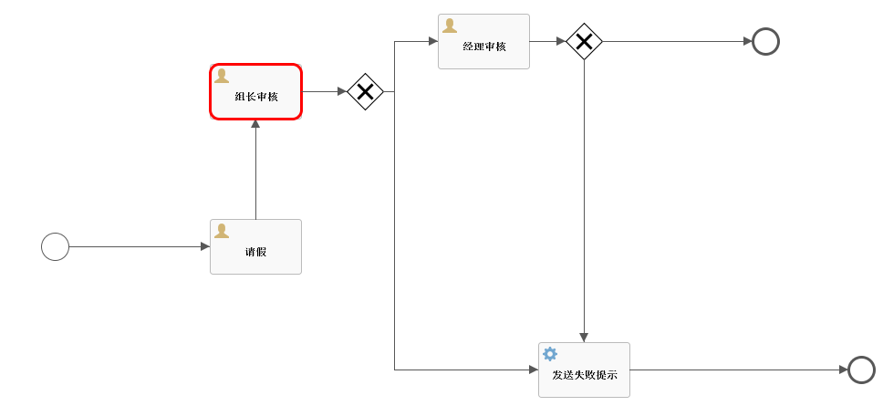
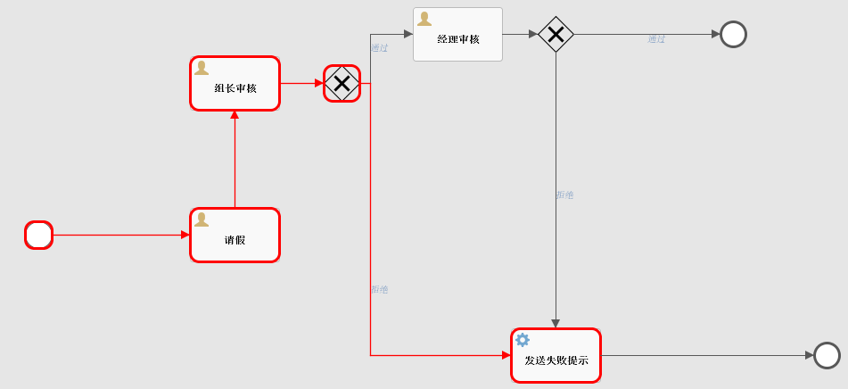

# flowable画图篇

## 画图API解析

画图主要通过flowable-image-generator-6.7.2.jar提供的API来进行画图：

```java
    /**
     * Generates a diagram of the given process definition, using the diagram interchange information of the process.
     * 
     * @param bpmnModel
     *            bpmn model to get diagram for
     * @param imageType
     *            type of the image to generate.
     * @param highLightedActivities
     *            activities to highlight
     * @param highLightedFlows
     *            flows to highlight
     * @param activityFontName
     *            override the default activity font
     * @param labelFontName
     *            override the default label font
     * @param customClassLoader
     *            provide a custom classloader for retrieving icon images
     * @param drawSequenceFlowNameWithNoLabelDI
     *            provide a option to also include the sequence flow name in case there's no Label DI
     */
    InputStream generateDiagram(BpmnModel bpmnModel, String imageType, List<String> highLightedActivities, List<String> highLightedFlows, String activityFontName, String labelFontName, String annotationFontName, ClassLoader customClassLoader, double scaleFactor, boolean drawSequenceFlowNameWithNoLabelDI);
```

generateDiagram参数说明
*     bpmnModel：BPMN模型的实例，表示业务流程模型。
*     imageType：一个字符串，表示要生成的图像类型，例如"png"、"jpg"等。
*     highLightedActivities：包含要在图表中突出显示的活动的ID*的字符串列表。
*     highLightedFlows：包含要在图表中突出显示的流程的ID的字符串列表。
*     activityFontName：指定用于活动标签的字体的字符串。
*     labelFontName：指定用于其他标签的字体的字符串。
*     annotationFontName：指定用于注释的字体的字符串。
*     customClassLoader：用于加载自定义字体的可选ClassLoader实例。
*     scaleFactor：表示图像的缩放比例的双精度值。
*     drawSequenceFlowNameWithNoLabelDI：一个布尔值，指示是否在没有标签时绘制序列流名称。


## 画图中文乱码处理



因为没有配置中文字体导致的乱码，application.yml加配置：

> 注意：如果是线上部署，要注意对应的服务器上是否有对应的字体

```yaml
flowable:
  activity-font-name: "宋体"
  label-font-name: "宋体"
  annotation-font-name: "宋体"
```


## 根据流程定义key画流程图

```java
@RestController
public class DiagramController {

    @Autowired
    RuntimeService runtimeService;
    @Autowired
    TaskService taskService;
    @Autowired
    RepositoryService repositoryService;
    @Autowired
    ProcessEngine processEngine;
    @Autowired
    HistoryService historyService;
    
    /**
     * 通过流程定义获取流程图
     */
	@GetMapping("/diagram")
    public void showDiagramDefinition(HttpServletResponse resp, String definitionKey) throws Exception {
        // 通过流程定义key找到流程定义信息
        List<ProcessDefinition> processDefinitions = repositoryService.createProcessDefinitionQuery()
                .processDefinitionKey(definitionKey)
                .orderByProcessDefinitionVersion().desc()
                .listPage(0, 1);
        if (null == processDefinitions || processDefinitions.isEmpty()) {
            throw new Exception("流程定义key未找到！~");
        }
        ProcessDefinition processDefinition = processDefinitions.get(0);

        // 通过流程定义id获取流程图
        BpmnModel bpmnModel = repositoryService.getBpmnModel(processDefinition.getId());
        // 获取流程引擎配置
        ProcessEngineConfiguration engconf = processEngine.getProcessEngineConfiguration();
        // 获取流程图生成器
        // DefaultProcessDiagramGenerator diagramGenerator = new DefaultProcessDiagramGenerator();
        ProcessDiagramGenerator diagramGenerator = engconf.getProcessDiagramGenerator();

        ArrayList<String> highLightedActivities = new ArrayList<>();
        ArrayList<String> highLightedFlows = new ArrayList<>();
        // 生成流程图片流
        InputStream inputStream = diagramGenerator.generateDiagram(bpmnModel, "png", highLightedActivities, highLightedFlows,
                engconf.getActivityFontName(), engconf.getLabelFontName(), engconf.getAnnotationFontName(),
                engconf.getClassLoader(), 1.0, true);
        writeOutputStream(resp, inputStream);
    }
    
    private static void writeOutputStream(HttpServletResponse resp, InputStream in) throws IOException {
        OutputStream out = null;
        byte[] buf = new byte[1024];
        int legth = 0;
        try {
            out = resp.getOutputStream();
            while ((legth = in.read(buf)) != -1) {
                out.write(buf, 0, legth);
            }
        } finally {
            if (in != null) {
                in.close();
            }
            if (out != null) {
                out.close();
            }
        }
    }
}
```

浏览器访问：http://localhost:8089/diagram?definitionKey=ask_for_leave




## 通过流程实例id获取流程图

​	能够高亮显示出当前应该执行操作任务的节点，一般只有一个节点，如果有并行任务的时候会有多个高亮节点。

```java
    /**
     * 通过流程实例id获取流程图
     */
    @GetMapping("/pic")
    public void showPic(HttpServletResponse resp, String processId) throws Exception {
        ProcessInstance pi = runtimeService.createProcessInstanceQuery().processInstanceId(processId).singleResult();
        if (pi == null) {
            return;
        }

        // 当前流程执行的情况
        List<Execution> executions = runtimeService
                .createExecutionQuery()
                .processInstanceId(processId)
                .list();

        List<String> activityIds = new ArrayList<>();
        List<String> flows = new ArrayList<>();
        for (Execution exe : executions) {
            List<String> ids = runtimeService.getActiveActivityIds(exe.getId());
            activityIds.addAll(ids);
        }

        /*
         * 生成流程图
         */
        generateDiagram(resp, pi.getProcessDefinitionId(), activityIds, flows);
    }

	private void generateDiagram(HttpServletResponse resp, String processDefinitionId, List<String> activityIds, List<String> flows) throws IOException {
        BpmnModel bpmnModel = repositoryService.getBpmnModel(processDefinitionId);
        ProcessEngineConfiguration engconf = processEngine.getProcessEngineConfiguration();
        ProcessDiagramGenerator diagramGenerator = engconf.getProcessDiagramGenerator();
        /*
         * 参数说明：
         *      bpmnModel：BPMN 模型的实例，表示业务流程模型。
         *      imageType：一个字符串，表示要生成的图像类型，例如 "png"、"jpg" 等。
         *      highLightedActivities：包含要在图表中突出显示的活动的 ID 的字符串列表。
         *      highLightedFlows：包含要在图表中突出显示的流程的 ID 的字符串列表。
         *      activityFontName：指定用于活动标签的字体的字符串。
         *      labelFontName：指定用于其他标签的字体的字符串。
         *      annotationFontName：指定用于注释的字体的字符串。
         *      customClassLoader：用于加载自定义字体的可选 ClassLoader 实例。
         *      scaleFactor：表示图像的缩放比例的双精度值。
         *      drawSequenceFlowNameWithNoLabelDI：一个布尔值，指示是否在没有标签时绘制序列流名称。
         */
        InputStream in = diagramGenerator.generateDiagram(bpmnModel, "png", activityIds, flows,
                engconf.getActivityFontName(), engconf.getLabelFontName(), engconf.getAnnotationFontName(),
                engconf.getClassLoader(), 1.0, true);
        writeOutputStream(resp, in);
    }
```



## 通过历史流程实例id获取历史流程图

```java
	/**
     * 通过历史流程实例id获取历史流程图
     */    
	@GetMapping("/pic2")
    public void showPic2(HttpServletResponse resp, String processId) throws Exception {
        List<HistoricActivityInstance> historicActivityInstances = historyService.createHistoricActivityInstanceQuery()
                .processInstanceId(processId)
                .orderByHistoricActivityInstanceStartTime()
                .asc()
                .list();

        List<String> activityIds = new ArrayList<>();
        List<String> flows = new ArrayList<>();
        for (HistoricActivityInstance historicActivityInstance : historicActivityInstances) {
            String activityId = historicActivityInstance.getActivityId();
            activityIds.add(activityId);
            // 如果不加这一句，线条就不会高亮了
            flows.add(activityId);
            historicActivityInstance.getProcessDefinitionId();
        }

        HistoricActivityInstance historicActivityInstance = historicActivityInstances.get(0);
        String processDefinitionId = historicActivityInstance.getProcessDefinitionId();

        /*
         * 生成流程图
         */
        generateDiagram(resp, processDefinitionId, activityIds, flows);
    }
```



### 画线为什么指定activityId？

画线条源码说明：

flowable中线条是由FlowNode表示的，它是通过两个list来表示从哪里来表示哪里去，SequenceFlow是BaseElement的子类，其它flowable流程节点元素也是它的子类。

FlowNode源码

```java
	protected List<SequenceFlow> incomingFlows = new ArrayList();
    protected List<SequenceFlow> outgoingFlows = new ArrayList();
```

然后画图的时候是使用outgoingFlows来进行判断的

```java
		// Draw activities and their sequence-flows
        for (Process process : bpmnModel.getProcesses()) {
            for (FlowNode flowNode : process.findFlowElementsOfType(FlowNode.class)) {
                if (!isPartOfCollapsedSubProcess(flowNode, bpmnModel)) {
                    drawActivity(processDiagramCanvas, bpmnModel, flowNode, highLightedActivities, highLightedFlows, scaleFactor,drawSequenceFlowNameWithNoLabelDI);
                }
            }
        }
```

```java
		// ......
		// Outgoing transitions of activity
        for (SequenceFlow sequenceFlow : flowNode.getOutgoingFlows()) {
	        boolean highLighted = (highLightedFlows.contains(sequenceFlow.getId()));
	        // ......
        }
        // ......
```

> 总结： 所以我们指定高亮线条的时候List\<String\> flows = new ArrayList\<\>();，只需要指定它目标高亮节点activityId即可。
