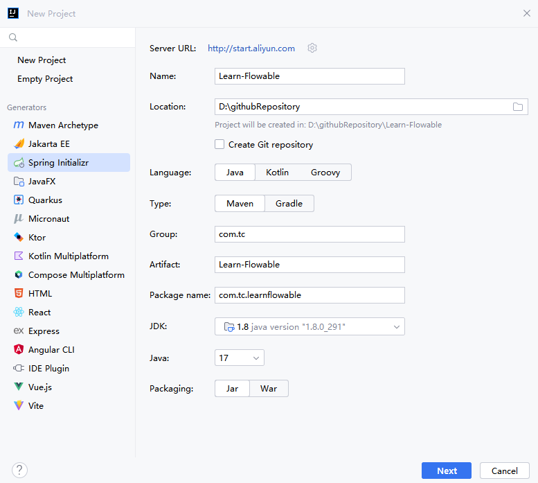
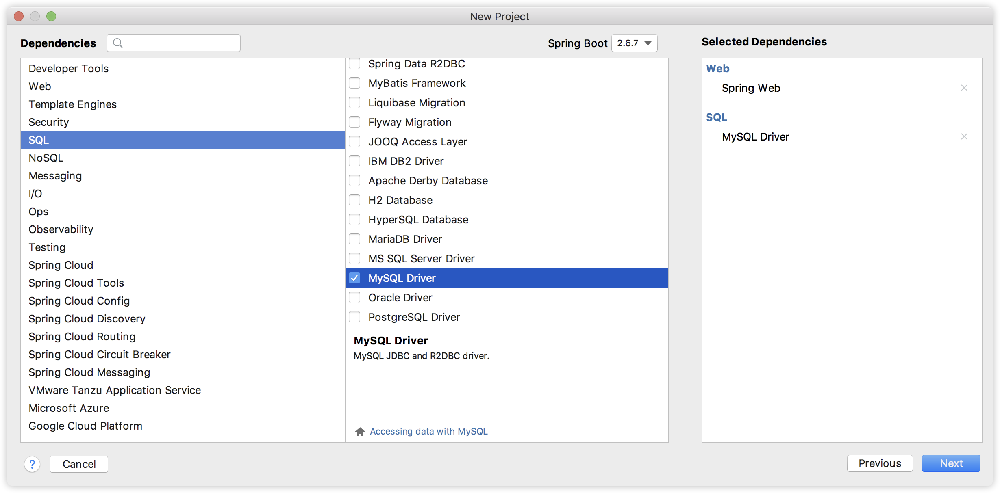
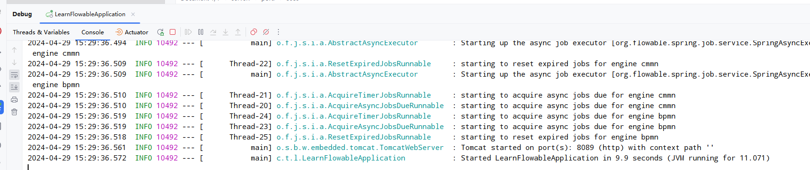
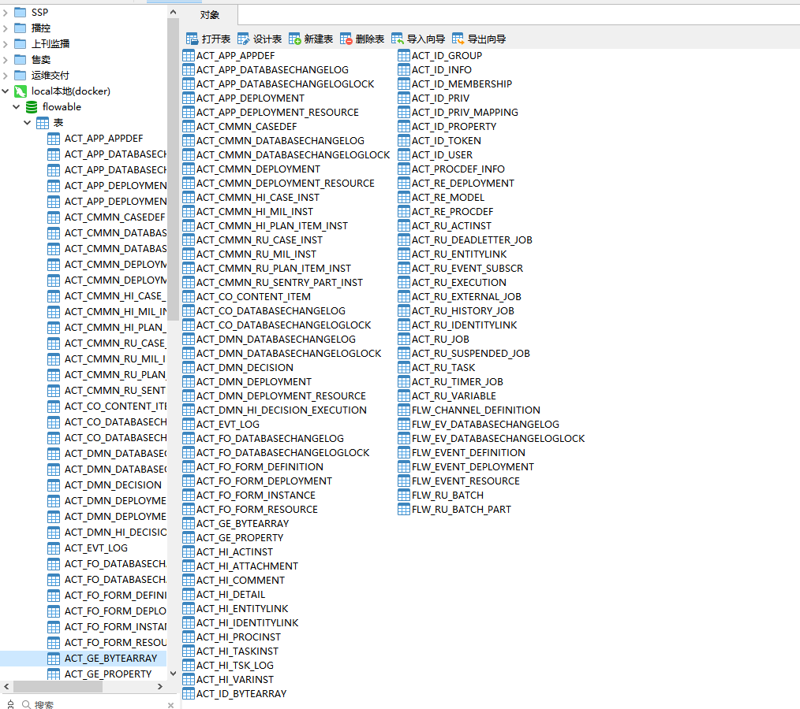

# Spring Boot 整合流程引擎 Flowable

转载文章： https://blog.csdn.net/u012702547/article/details/124834662

## 创建项目



首先我们创建一个 Spring Boot 项目，引入 Web、和 MySQL 驱动两个依赖，如下图：



项目创建成功之后，我们引入 flowable 依赖，如下：

```xml
<dependency>
    <groupId>org.flowable</groupId>
    <artifactId>flowable-spring-boot-starter</artifactId>
    <version>6.7.2</version>
</dependency>
```

这个会帮我们做一些自动化配置，默认情况下，所以位于 resources/processes 的流程都会被自动部署。

```bash
# 简单部署一个docker，并创建一个flowable数据库
docker run --name mysql -d -p 3306:3306 --restart unless-stopped --privileged=true -e MYSQL_ROOT_PASSWORD=123456 -e MYSQL_ROOT_HOST=% mysql:5.7
# --privileged=true 获取root权限
# -e MYSQL_ROOT_HOST=%  远程访问
```

接下来我们在 application.yaml 中配置一下数据库连接信息，当项目启动的时候会自动初始化数据库，将来流程引擎运行时候的数据会被自动持久化到数据库中。配置数据库连接

```yaml
spring:
  datasource:
    username: root
    password: 123456
    url: jdbc:mysql:///flowable?serverTimezone=Asia/Shanghai&useSSL=false
```

好啦，配置完成后，我们就可以启动项目了。项目启动成功之后，flowable 数据库中就会自动创建如下这些表，将来流程引擎相关的数据都会自动保存到这些表中。



首次启动完毕后，在数据库中就会初始化好flowable相关的表。




