# flowable UI


## 下载资源

​	百度云盘 [下载地址](https://pan.baidu.com/s/14y6sqBNnO2jPxAeXHQq3gA?pwd=3qdj) 提取码:3qdj      热心网友分享的

## 资源说明

-- database 包含各种的数据库sql全量以及各版本的增量sql

-- docs floable的java doc文档

-- libs flowable的相关jar包，如果使用maven管理，那么这个就用不上了

-- wars 可以运行的jar包

​	-- flowable-ui 流程UI设计器

​	-- flowable-rest.war 可以使用rest api的接口访问形式操作flowable

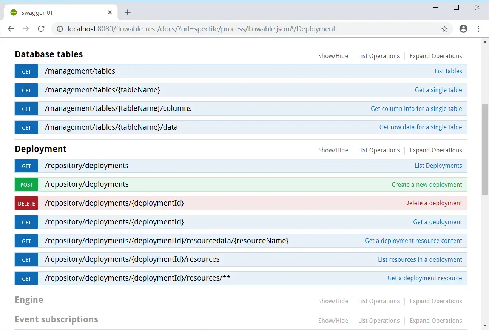


## 安装部署

> 网络上好多是将war包放到Tomcat下启动的，这里通过jar启动感觉更方便一点。

```bash
java -jar flowable-ui.war
# docker版本
# docker run -p8080:8080 flowable/flowable-ui
```

> 拆坑点：不要将资源放到中文路径下执行，否则你使用flowable-ui的时候功能不能正常使用！！

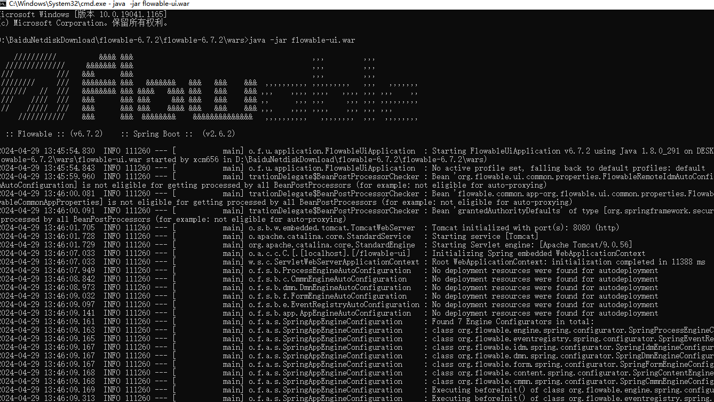

启动后，看关键字眼

```
o.s.b.w.embedded.tomcat.TomcatWebServer  : Tomcat started on port(s): 8080 (http) with context path '/flowable-ui'
```

访问： http://localhost:8080/flowable-ui

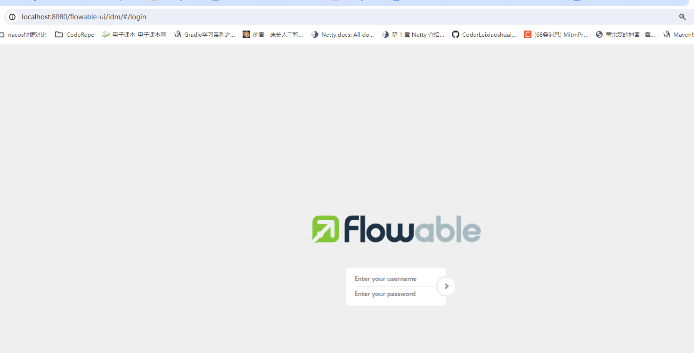

输入默认的**账号/密码**：admin/test

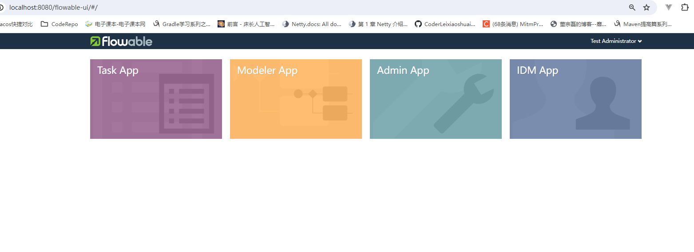

## 初体验-请假流程

### 创建用户

“DIM App” -》 “Users”中配置参与流程的用户

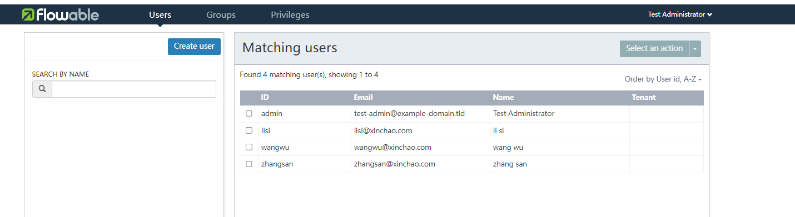

### 配置权限

“DIM App” -》 “Privileges”配置用户权限，让用户能参与流程应用。（当然你可以将用户划分到组里面，然后直接给组配置权限）

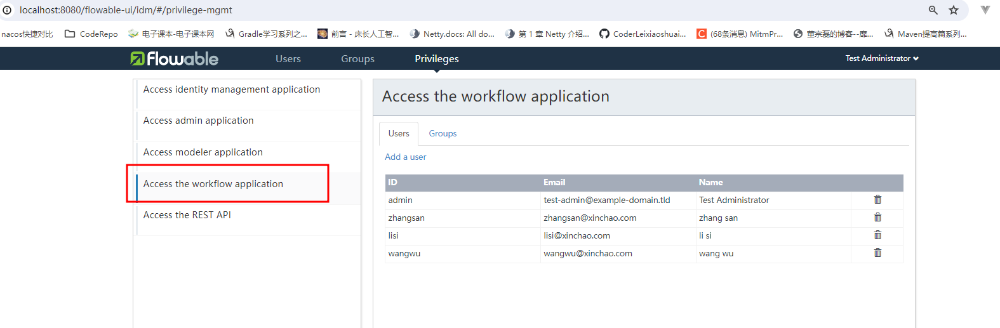

### 绘制流程

“Modeler App” -》 “Processes”

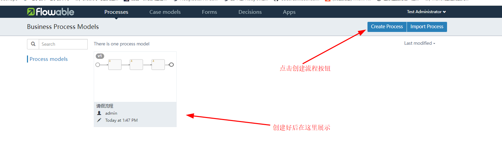

绘制流程图界面

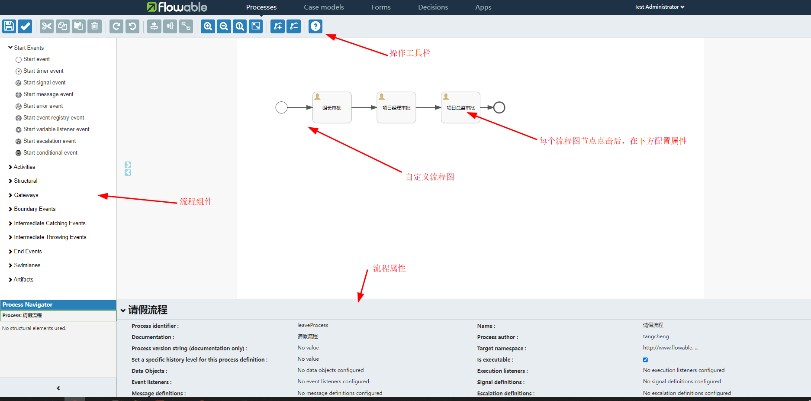

指定审批人，以及如果绘制完毕了点击保存按钮：

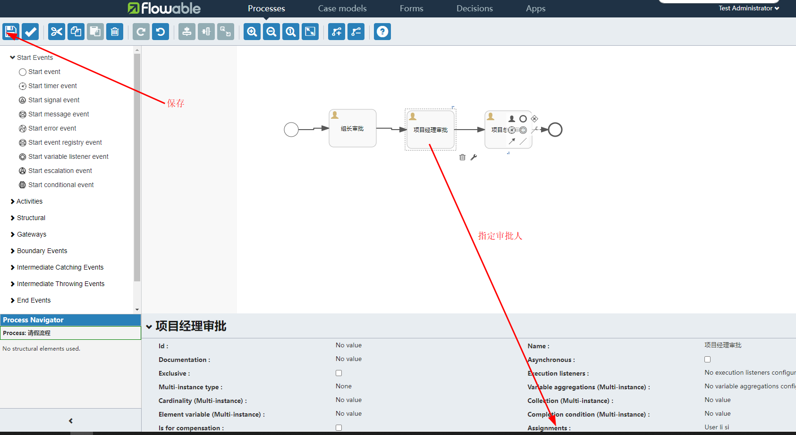

### 创建应用

“Modeler App” -》 “Apps” 创建应用App，添加该流程

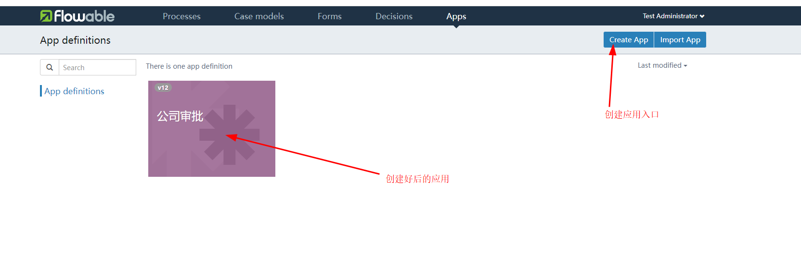

设置应用

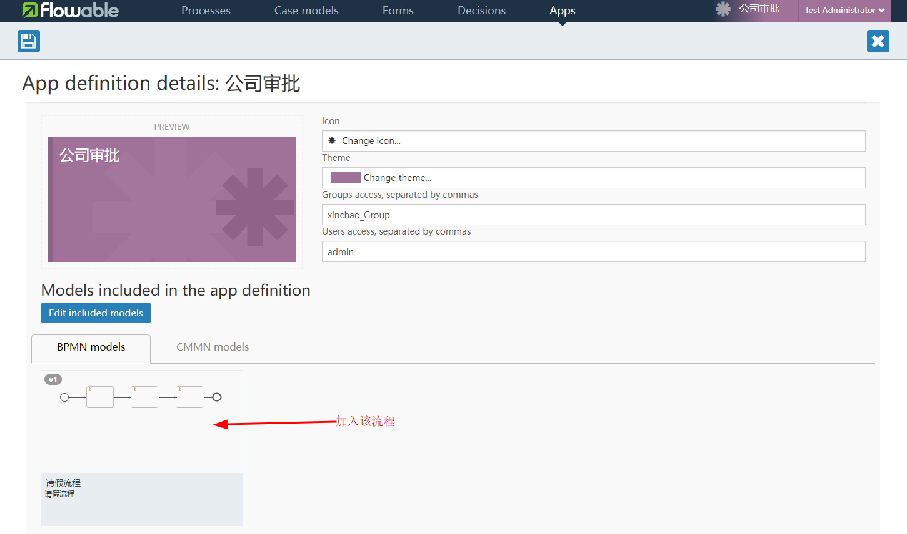

### 发布应用

“Modeler App” -》 “Apps” 

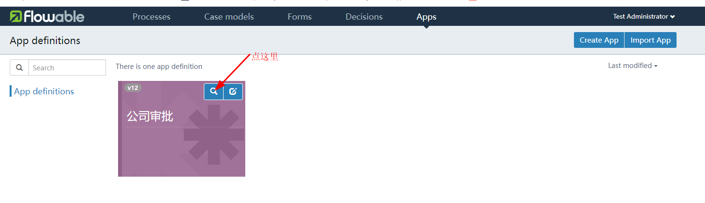

发布

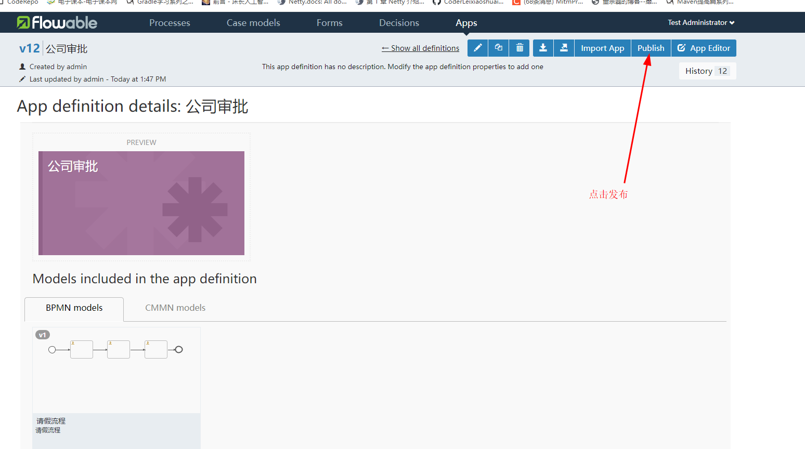

然后到入口页面，就能看见一个“公司审批”的应用了

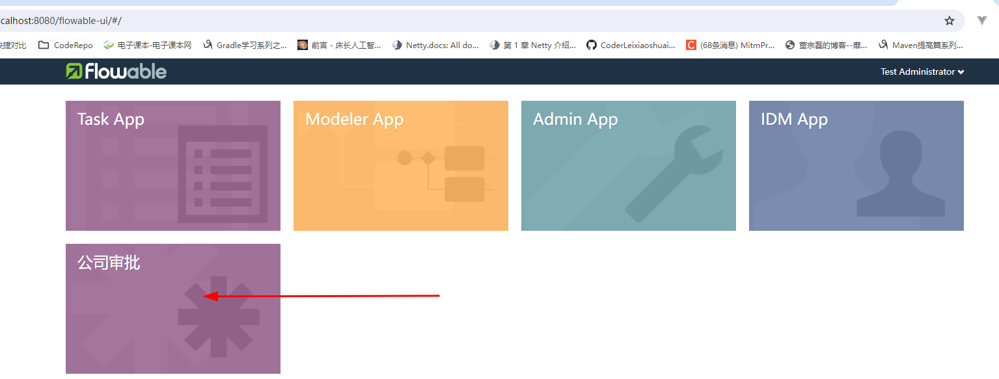

### 发起流程

“公司审批”应用=》“Processes”=》“Start a process”

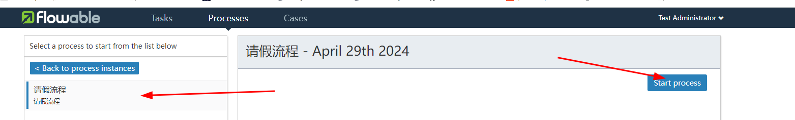

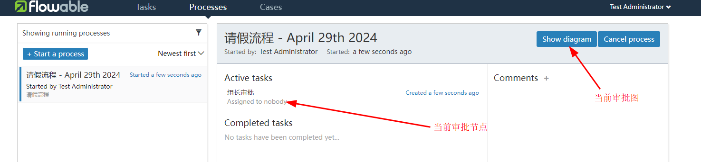

### 用户审批

登录组长的账号，进行审批。

“公司审批”应用=》“Tasks”=》“Claim”=》"Complate"

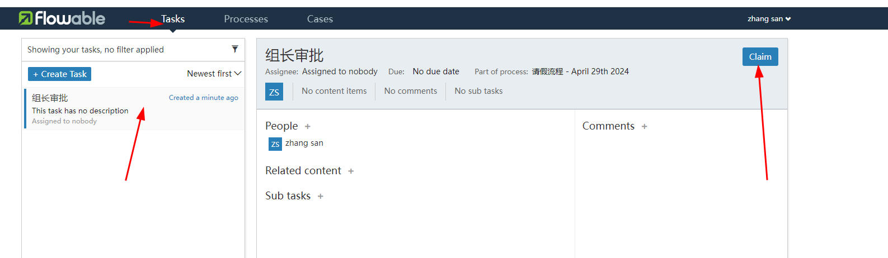

然后可以在“Processes”=》“Show diagram”查看当前流程审批到哪个节点了。

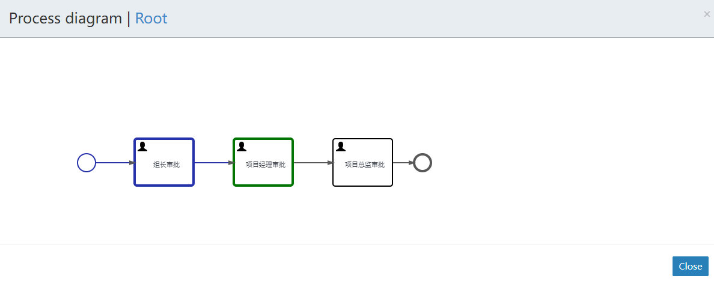

依次登录其它人的账号进行审批，直到整个流程走完。

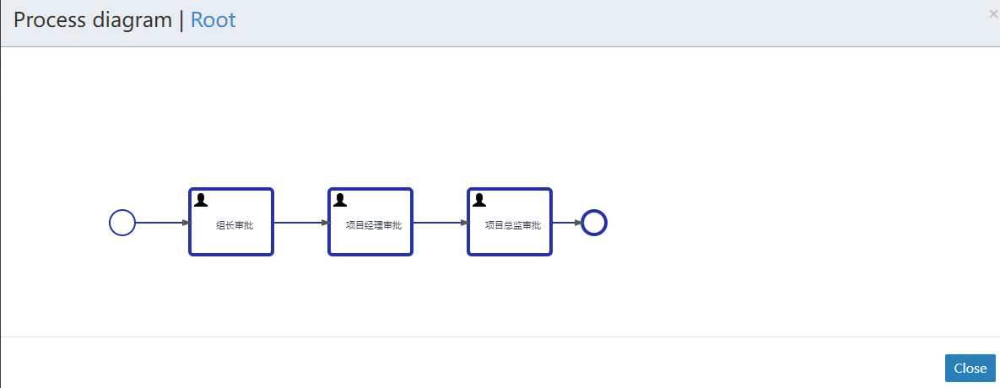