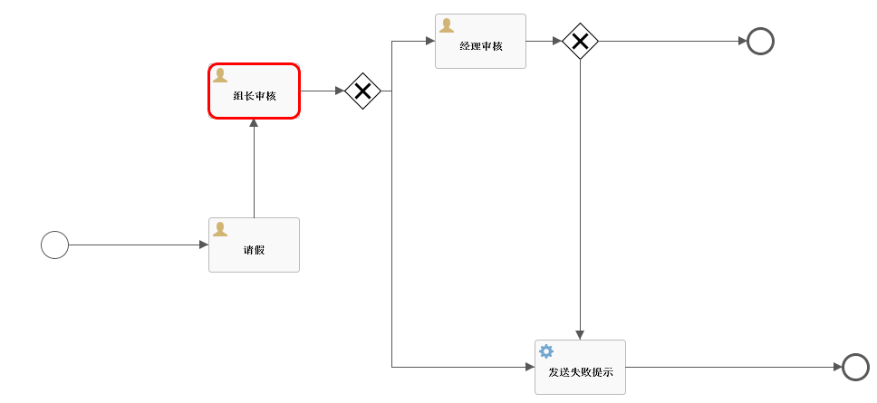
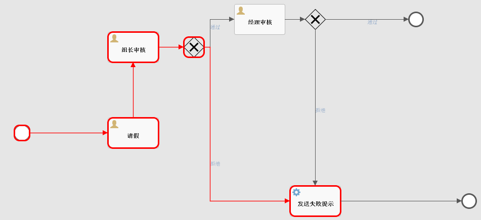

# 跟着案例学API--请假流程

## 制作请假流程

IDEA 插件 **Flowable BPMN visualizer**，说实话，真不好用。

可以就使用Flowable UI来进行设计流程，然后将对应的流程xml导出出来。


员工发起一个请假流程，首先是组长审核，组长审核通过了，就进入到经理审核，经理审核通过了，这个流程就结束了，如果组长审核未通过或者经理审核未通过，则流程给员工发送一个请假失败的通知，流程结束。

我们来看下这个流程对应的 XML 文件，一些流程细节会在 XML 文件中体现出来，如下：

```xml
<?xml version="1.0" encoding="UTF-8"?>
<definitions xmlns="http://www.omg.org/spec/BPMN/20100524/MODEL" xmlns:xsi="http://www.w3.org/2001/XMLSchema-instance"
             xmlns:xsd="http://www.w3.org/2001/XMLSchema" xmlns:flowable="http://flowable.org/bpmn"
             xmlns:bpmndi="http://www.omg.org/spec/BPMN/20100524/DI"
             xmlns:omgdc="http://www.omg.org/spec/DD/20100524/DC" xmlns:omgdi="http://www.omg.org/spec/DD/20100524/DI"
             typeLanguage="http://www.w3.org/2001/XMLSchema" expressionLanguage="http://www.w3.org/1999/XPath"
             targetNamespace="http://www.flowable.org/processdef">
    <process id="ask_for_leave" name="ask_for_leave" isExecutable="true">
        <startEvent id="startLeave" name="开始"/>
        <sequenceFlow id="flowStart" sourceRef="startLeave" targetRef="leaveTask"/>
        <userTask id="leaveTask" name="请假" flowable:assignee="#{leaveTask}"/>
        <sequenceFlow id="modeFlow" sourceRef="leaveTask" targetRef="zuzhangTask"/>
        <userTask id="zuzhangTask" name="组长审核" flowable:assignee="#{zuzhangTask}"/>
        <sequenceFlow id="zuzhangTask_zuzhangJudeTask" sourceRef="zuzhangTask" targetRef="zuzhangJudeTask"/>
        <exclusiveGateway id="zuzhangJudeTask"/>
        <sequenceFlow id="zuzhang_go" sourceRef="zuzhangJudeTask" targetRef="managerTask" name="通过">
            <conditionExpression xsi:type="tFormalExpression"><![CDATA[${checkResult=='通过'}]]></conditionExpression>
        </sequenceFlow>
        <sequenceFlow id="zuzhang_reject" sourceRef="zuzhangJudeTask" targetRef="sendMail" name="拒绝">
            <conditionExpression xsi:type="tFormalExpression"><![CDATA[${checkResult=='拒绝'}]]></conditionExpression>
        </sequenceFlow>
        <userTask id="managerTask" name="经理审核" flowable:assignee="#{managerTask}"/>
        <exclusiveGateway id="managerJudgeTask"/>
        <sequenceFlow id="jugdeFlow" sourceRef="managerTask" targetRef="managerJudgeTask"/>
        <sequenceFlow id="flowEnd" name="通过" sourceRef="managerJudgeTask" targetRef="endLeave">
            <conditionExpression xsi:type="tFormalExpression"><![CDATA[${checkResult=='通过'}]]></conditionExpression>
        </sequenceFlow>
        <sequenceFlow id="rejectFlow" name="拒绝" sourceRef="managerJudgeTask" targetRef="sendMail">
            <conditionExpression xsi:type="tFormalExpression"><![CDATA[${checkResult=='拒绝'}]]></conditionExpression>
        </sequenceFlow>
        <serviceTask id="sendMail" flowable:exclusive="true" name="发送失败提示" isForCompensation="true"
                     flowable:class="com.tc.learnflowable.handler.AskForLeaveFail"/>
        <sequenceFlow id="endFlow" sourceRef="sendMail" targetRef="askForLeaveFail"/>
        <endEvent id="askForLeaveFail" name="请假失败"/>
        <endEvent id="endLeave" name="结束"/>
    </process>
    <bpmndi:BPMNDiagram id="BPMNDiagram_leave">
        <bpmndi:BPMNPlane bpmnElement="leave" id="BPMNPlane_leave"></bpmndi:BPMNPlane>
    </bpmndi:BPMNDiagram>
</definitions>
```

结合 XML 文件我来和大家解释一下这里涉及到的 Flowable 中的组件，我们来看下：

- <process> ： 表示一个完整的工作流程。
-  <startEvent> ： 工作流中起点位置，也就是图中的绿色按钮。
-  <endEvent> ： 工作流中结束位置，也就是图中的红色按钮。
-  <userTask> ： 代表一个任务审核节点（组长、经理等角色），这个节点上有一个 flowable:assignee 属性，这表示这个节点该由谁来处理，将来在 Java 代码中调用的时候，我们需要指定对应的处理人的 ID 或者其他唯一标记。
-  <serviceTask>：这是服务任务，在具体的实现中，这个任务可以做任何事情。
-  <exclusiveGateway> ： 逻辑判断节点，相当于流程图中的菱形框。
-  <sequenceFlow> ：链接各个节点的线条，sourceRef 属性表示线的起始节点，targetRef 属性表示线指向的节点，我们图中的线条都属于这种。

## 开发接口

在正式体验之前，我们先来熟悉几个类，这几个类我们一会写代码会用到。

### Java 类梳理

**ProcessDefinition**
这个最好理解，就是流程的定义，也就相当于规范，每个 ProcessDefinition 都会有一个 id。

**ProcessInstance**
这个就是流程的一个实例。简单来说，ProcessDefinition 相当于是类，而 ProcessInstance 则相当于是根据类 new 出来的对象。

**Activity**
Activity 是流程标准规范 BPMN2.0 里面的规范，流程中的每一个步骤都是一个 Activity。

**Execution**
Execution 的含义是流程的执行线路，通过 Execution 可以获得当前 ProcessInstance 当前执行到哪个 Activity了。

**Task**
Task 就是当前要做的工作。

实际上这里涉及到的东西比较多，不过我们今天先整一个简单的例子，所以上面这些知识点暂时够用了。


### 查看流程图

在正式开始之前，我们先准备一个接口，用来查看流程图的实时执行情况，这样方便我们查看流程到底执行到哪一步了。

```java
package com.tc.learnflowable.controller;

import org.flowable.bpmn.model.BpmnModel;
import org.flowable.engine.*;
import org.flowable.engine.history.HistoricActivityInstance;
import org.flowable.engine.runtime.Execution;
import org.flowable.engine.runtime.ProcessInstance;
import org.flowable.image.ProcessDiagramGenerator;
import org.springframework.beans.factory.annotation.Autowired;
import org.springframework.web.bind.annotation.GetMapping;
import org.springframework.web.bind.annotation.RestController;

import javax.servlet.http.HttpServletResponse;
import java.io.IOException;
import java.io.InputStream;
import java.io.OutputStream;
import java.util.ArrayList;
import java.util.List;

@RestController
public class HelloController {

    @Autowired
    RuntimeService runtimeService;
    @Autowired
    TaskService taskService;
    @Autowired
    RepositoryService repositoryService;
    @Autowired
    ProcessEngine processEngine;
    @Autowired
    HistoryService historyService;

    @GetMapping("/pic")
    public void showPic(HttpServletResponse resp, String processId) throws Exception {
        ProcessInstance pi = runtimeService.createProcessInstanceQuery().processInstanceId(processId).singleResult();
        if (pi == null) {
            return;
        }

        // 当前流程执行的情况
        List<Execution> executions = runtimeService
                .createExecutionQuery()
                .processInstanceId(processId)
                .list();

        List<String> activityIds = new ArrayList<>();
        List<String> flows = new ArrayList<>();
        for (Execution exe : executions) {
            List<String> ids = runtimeService.getActiveActivityIds(exe.getId());
            activityIds.addAll(ids);
        }

        /*
         * 生成流程图
         */
        generateDiagram(resp, pi.getProcessDefinitionId(), activityIds, flows);
    }

    @GetMapping("/pic2")
    public void showPic2(HttpServletResponse resp, String processId) throws Exception {
        List<HistoricActivityInstance> historicActivityInstances = historyService.createHistoricActivityInstanceQuery()
                .processInstanceId(processId)
                .orderByHistoricActivityInstanceStartTime()
                .asc()
                .list();

        List<String> activityIds = new ArrayList<>();
        List<String> flows = new ArrayList<>();
        for (HistoricActivityInstance historicActivityInstance : historicActivityInstances) {
            String activityId = historicActivityInstance.getActivityId();
            activityIds.add(activityId);
            historicActivityInstance.getProcessDefinitionId();
        }

        HistoricActivityInstance historicActivityInstance = historicActivityInstances.get(0);
        String processDefinitionId = historicActivityInstance.getProcessDefinitionId();

        /*
         * 生成流程图
         */
        generateDiagram(resp, processDefinitionId, activityIds, flows);
    }

    private void generateDiagram(HttpServletResponse resp, String processDefinitionId, List<String> activityIds, List<String> flows) throws IOException {
        BpmnModel bpmnModel = repositoryService.getBpmnModel(processDefinitionId);
        ProcessEngineConfiguration engconf = processEngine.getProcessEngineConfiguration();
        ProcessDiagramGenerator diagramGenerator = engconf.getProcessDiagramGenerator();
        InputStream in = diagramGenerator.generateDiagram(bpmnModel, "png", activityIds, flows,
                engconf.getActivityFontName(), engconf.getLabelFontName(), engconf.getAnnotationFontName(),
                engconf.getClassLoader(), 1.0, false);
        writeOutputStream(resp, in);
    }

    private static void writeOutputStream(HttpServletResponse resp, InputStream in) throws IOException {
        OutputStream out = null;
        byte[] buf = new byte[1024];
        int legth = 0;
        try {
            out = resp.getOutputStream();
            while ((legth = in.read(buf)) != -1) {
                out.write(buf, 0, legth);
            }
        } finally {
            if (in != null) {
                in.close();
            }
            if (out != null) {
                out.close();
            }
        }
    }
}

```


### 部署流程

​	自动部署流程： 将流程文件leave.bpmn20.xml放到\resources\processes下，流程会在程序启动后自动部署


代码部署：

```java
    @Test
    @DisplayName("部署流程")
    public void deployProcesses() {
        long count = repositoryService.createProcessDefinitionQuery()
                .processDefinitionName("ask_for_leave").count();
        if (count > 0) {
            log.info("开始部署流程");

            repositoryService.createDeployment()
                    .addClasspathResource("processes_attachement/ask_for_leave.bpmn21.xml")
                    .name("请假流程")
                    .deploy();

            log.info("部署流程完成");
        } else {
            log.info("流程已经部署");
        }
    }
```

### 查询现有流程

```java
	@Test
    @DisplayName("查询流程")
    public void queryProcesses() {
        repositoryService.createProcessDefinitionQuery()
                .list()
                .forEach(processDefinition -> {
                    log.info("流程名称:{},流程key:{},流程版本:{},流程部署id:{}",
                            processDefinition.getName(),
                            processDefinition.getKey(),
                            processDefinition.getVersion(),
                            processDefinition.getDeploymentId());
                });
    }
```

### 删除流程

```java
    @Test
    @DisplayName("删除流程")
    public void deleteProcesses() {
        repositoryService.createProcessDefinitionQuery()
                .list()
                .forEach(processDefinition -> {
                    repositoryService.deleteDeployment(processDefinition.getDeploymentId());
                });
    }
```


### 启动流程

```java
    @Test
    @DisplayName("启动流程")
    public void startProcess() {
        String staffId = "1000";

        HashMap<String, Object> map = new HashMap<>();
        map.put("leaveTask", staffId);
        ProcessInstance processInstance = runtimeService.startProcessInstanceByKey("ask_for_leave", map);
        // 姓名
        runtimeService.setVariable(processInstance.getId(), "name", "javaboy");
        // 请假原因
        runtimeService.setVariable(processInstance.getId(), "reason", "休息一下");
        // 请假天数
        runtimeService.setVariable(processInstance.getId(), "days", 10);
        // runtimeService.setVariables(processInstance.getId(), new HashMap<>());
        log.info("创建请假流程 processId：{}", processInstance.getId());
    }
```

**效果：**


### 审批

接下来，我们就需要将这个请假流程向后推进一步，将请假事务提交给组长

```java
/**
     * 提交给组长审批
     */
    @Test
    void submitToZuzhang() {
        String staffId = "1000";
        String zuzhangId = "90";

        // 员工查找到自己的任务，然后提交给组长审批
        List<Task> list = taskService.createTaskQuery().taskAssignee(staffId).orderByTaskId().desc().list();
        for (Task task : list) {
            log.info("任务 ID：{}；任务处理人：{}；任务是否挂起：{}", task.getId(), task.getAssignee(), task.isSuspended());
            Map<String, Object> map = new HashMap<>();
            //提交给组长的时候，需要指定组长的 id
            map.put("zuzhangTask", zuzhangId);
            taskService.complete(task.getId(), map);
        }
    }
```



组长查询自己要审批的任务进行审批。

```java
/**
     * 组长审批-批准
     */
    @Test
    void zuZhangApprove() {
        String zuzhangId = "90";
        String managerId = "77";
        // 组长认为是否审批通过
        boolean isApproveSuccess = true;

        List<Task> list = taskService.createTaskQuery().taskAssignee(zuzhangId).orderByTaskId().desc().list();
        for (Task task : list) {
            log.info("组长 {} 在审批 {} 任务", task.getAssignee(), task.getId());
            Map<String, Object> map = new HashMap<>();
            if (isApproveSuccess) {
                // 组长审批的时候，如果是同意，需要指定经理的 id
                map.put("managerTask", managerId);
                map.put("checkResult", "通过");
            } else {
                // 组长审批的时候，如果是拒绝，就不需要指定经理的 id
                map.put("checkResult", "拒绝");
            }

            taskService.complete(task.getId(), map);
        }
    }
```


经理审批和组长审批差不多，只不过经理这里是最后一步了，不需要再指定下一位处理人了，同意的代码如下：

```java
    /**
     * 经理审批自己的任务-批准
     */
    @Test
    void managerApprove() {
        String managerId = "77";

        List<Task> list = taskService.createTaskQuery().taskAssignee(managerId).orderByTaskId().desc().list();
        for (Task task : list) {
            log.info("经理 {} 在审批 {} 任务", task.getAssignee(), task.getId());
            Map<String, Object> map = new HashMap<>();
            map.put("checkResult", "通过");
            taskService.complete(task.getId(), map);
        }
    }
```


到此，正常审批流程走完！~

### 拒绝流程

如果组长拒绝了或者经理拒绝了，我们也有相应的处理方案，首先在 XML 流程文件定义时，如下：

```xml
<serviceTask id="sendMail" flowable:exclusive="true" name="发送失败提示" isForCompensation="true" flowable:class="com.tc.learnflowable.handler"/>
```

如果请假被拒绝，会进入到这个 serviceTask，serviceTask 对应的处理类是 org.javaboy.flowable.AskForLeaveFail，该类的代码如下：

```java
public class AskForLeaveFail implements JavaDelegate {
    @Override
    public void execute(DelegateExecution execution) {
        // 可以抽成公共的组件，比如是发送邮件，通过执行参数传入发邮件需要的内容，这里取出参数直接发
        System.out.println("请假失败。。。");
    }
}
```


也就是请假失败会进入到这个方法中，现在我们就可以在这个方法中该干嘛干嘛了。

