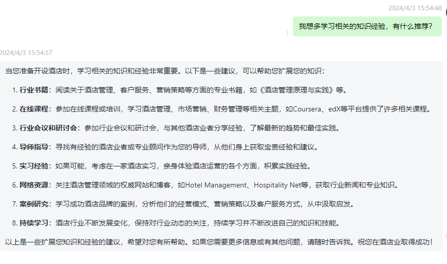

# 不断深耕学习

## 酒店相关书籍

当然有！以下是一些关于酒店管理和行业的经典书籍：

1. "酒店管理学"（Hotel Management and Operations）- edited by Denney G. Rutherford
2. "酒店管理：策略与实践"（Hotel Management: Strategic Management and Operational Issues）- by Michael D. Olsen, Jinlin Zhao, and Paul Lynch
3. "酒店销售与市场营销"（Hotel Sales and Marketing）- by Alan T. Stutts and James R. Abbey
4. "酒店前厅管理"（Hotel Front Office Management）- by James A. Bardi
5. "酒店设计与规划"（Hotel Design, Planning, and Development）- by Walter A. Rutes and Richard H. Penner
6. **《酒店管理原理与实践》（Principles of Hotel Management）** - 编写者：Denney G. Rutherford
   - 这本书提供了酒店管理的基本原则和实践，涵盖了酒店运营、市场营销、财务管理等方面。
7. **《酒店式服务管理》（Hotel Front Office Management）** - 编写者：James A. Bardi
   - 该书重点介绍了酒店前台管理的关键概念和操作技巧，是学习酒店接待服务管理的经典之作。
8. **《酒店市场营销与销售管理》（Hotel Marketing and Sales Management）** - 编写者：Alan T. Stutts, James R. Abbey
   - 这本书详细介绍了酒店市场营销和销售策略的实施，帮助读者了解如何吸引客户并提高销售。
9. **《酒店运营管理》（Hotel Operations Management）** - 编写者：David K. Hayes, Jack D. Ninemeier
   - 该书涵盖了酒店运营的方方面面，从员工管理到客房清洁等各个环节，为读者提供全面的视角。
10. **《酒店金融管理》（Hotel Financial Management）** - 编写者：Raymond S. Schmidgall, James W. Damitio
    - 这本书探讨了酒店财务管理的重要性和方法，帮助读者学习如何有效管理预算和资金。

这些书籍涵盖了酒店管理、市场营销、前厅管理等各方面内容

