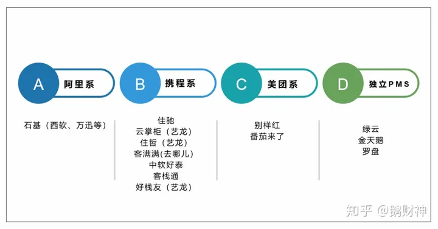

# 酒店基础知识

## 酒店类型

酒店一般可以分为以下几种类型：

1. **星级酒店**：星级酒店是根据设施、服务和管理水平而划分的，通常包括一星至五星不等。星级酒店在房间设施、餐饮服务、会议设施、卫生条件等方面有明显的等级区别(星级酒店的评定通常由各国政府相关部门或行业协会来负责)。
2. **商务酒店**：商务酒店主要面向商务出行者，提供方便快捷的住宿、会议及商务服务。通常地理位置较好，配套设施和服务比较专业。
3. **度假酒店**：度假酒店通常位于风景秀丽的地方，为游客提供休闲度假服务。度假酒店的设计和服务更注重舒适性和休闲体验。
4. **精品酒店**：精品酒店追求独特、个性化的服务和环境，通常装修风格独特，服务贴心周到，注重细节和品味。
5. **经济型酒店**：经济型酒店价格相对较低，主要以提供基本住宿需求为主，设施和服务相对简单。

这些类型的酒店在定位、服务水平、客户群体、价格等方面有所不同，满足了不同消费者的需求。

## 经济型酒店的单个房间分类包括

1. **单人间**：只有一张单人床，适合单人入住。
2. **双人间**：有一张大床或两张单人床，通常供两人入住。
3. **标准间**：与双人间类似，但可能设施略有不同或者房间更宽敞。
4. **家庭间**：提供额外床位，适合家庭入住，一般有双人床或多张单人床。
5. **套房**：通常包含独立的起居室和卧室，设施更为豪华舒适。

## 酒店软件系统

目前酒店经营系统涵盖了各个方面的管理需求，常见的酒店经营系统包括：

1. **预订管理系统（PMS）**：用于管理酒店的客房预订、入住登记、客户信息、房态管理等功能，帮助酒店实现高效的客房管理。
2. **客户关系管理系统（CRM）**：用于管理客户信息、客户互动历史、市场推广活动等，以提升客户体验和忠诚度。
3. **收益管理系统（RMS）**：通过分析市场需求和竞争情况，制定价格策略，优化房价设置，最大化酒店收益。
4. **点餐与POS系统**：用于管理酒店的餐饮服务，包括点菜、结账、库存管理等功能，确保餐饮运营顺畅。
5. **门锁系统**：用于控制客房门锁，实现客房安全管理和智能开锁功能。
6. **会员管理系统**：用于管理会员信息、积分兑换、会员特权等，提升会员忠诚度。
7. **财务管理系统**：用于管理酒店的财务数据、成本控制、报表生成等，确保酒店财务运营的稳健性。
8. **在线预订系统**：用于在官方网站或第三方平台上接受在线预订，提升酒店的销售渠道和曝光度。
9. **员工管理系统**：用于管理员工排班、考勤、培训等，提高员工工作效率和服务质量。

以上系统可以根据酒店的规模和需求进行整合和选择，以提升酒店的运营效率、客户满意度和盈利能力。将以上功能进行融合，有一体化的酒店管理软件系统可以整合多个功能模块，包含了酒店经营所需的各种管理功能，以提升运营效率和服务质量。这种一体化系统通常被称为酒店管理系统（Hotel Management System），也可以简称为HMS。

酒店管理系统通常集成了预订管理、客户关系管理、收益管理、POS系统、门锁系统、会员管理、财务管理、在线预订等多个功能模块，使得酒店能够在一个统一的平台上进行全面的业务管理和数据分析。

通过酒店管理系统，酒店可以实现以下优势：

1. **综合管理**：整合多个功能模块，实现全面的酒店管理，提高工作效率和管理水平。
2. **数据集中化**：将各个部门的数据整合在一起，实现数据共享和交叉分析，帮助管理层做出更明智的决策。
3. **自动化运营**：简化日常操作流程，减少人工干预，提高工作效率，降低错误率。
4. **客户体验提升**：通过CRM模块，记录客户偏好和互动历史，个性化服务，增强客户满意度和忠诚度。

综合来说，酒店管理系统的使用对于提升酒店运营效率、管理水平和客户体验都具有积极影响，是现代酒店经营中不可或缺的重要工具之一。

[2020年十大酒店管理系统（PMS）TOP10排行榜](https://zhuanlan.zhihu.com/p/128117558) 了解即可，这个应该是金天鹅的广告帖。

