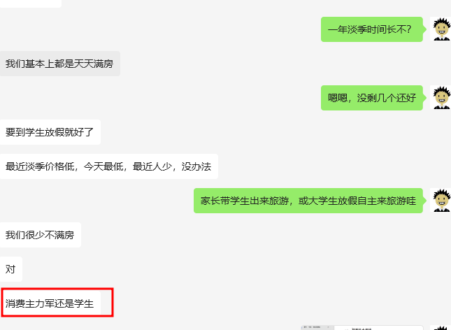
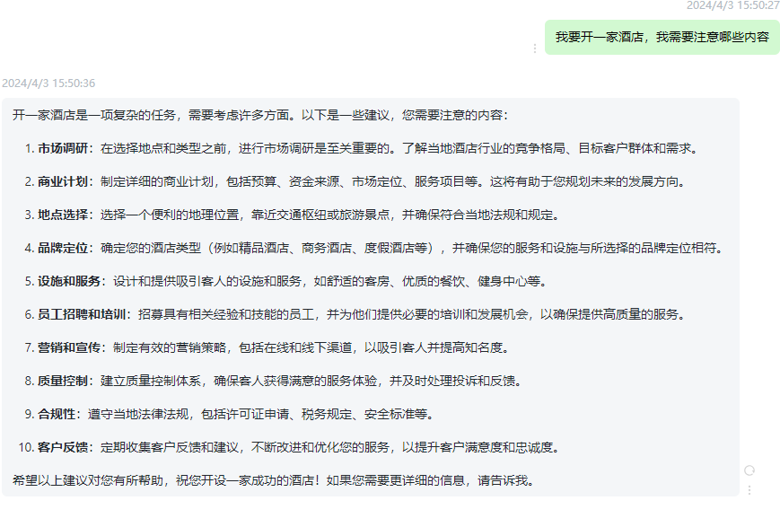

# 前辈疑问解答

## 问答记录

1. 按理说酒店修得离机场越近越好，你之前说那外面那块地也是你的，你为啥修到最里面去了？

   答：那里离油库太近了，不让弄

2. 对面酒店租出去，一年多少钱？

   答：48万/年

3. 你目前经营了多少间房间？

   答：20间

4. 目前人员配置是怎么样的？

   答：一个客房打扫，俩个司机（一个白班，一个夜班），司机同时是前台接待人员和客房服务人员。

5. 一年淡季时间长不？

   答：我们基本都是天天满房，这边消费主力军还是学生为主，放假后很多家长学生等出来旅游。

6. 目前有几种产品

   套房，亲子套房，标间，单间，麻将房

   - **套房**: 通常指的是一个包含卧室、客厅和浴室的独立空间，可以提供更多的私密性和舒适度。
   - **亲子套房**: 是一种专门设计给家庭入住的套房，通常会有两个独立的卧室，适合父母和孩子一起居住。
   - **标间**: 也称为双人间，是一种拥有一张大床或两张单人床的房间，适合两个人入住。
   - **单间**: 通常指的是一间只有一张床的房间，适合单人入住。
   - **麻将房**: 是专门供玩家打麻将的房间，通常会提供麻将桌和椅子等设施。

7. 房间大小多少平方一个？

   套房22，其他18

8. xxx

## 截图记录

