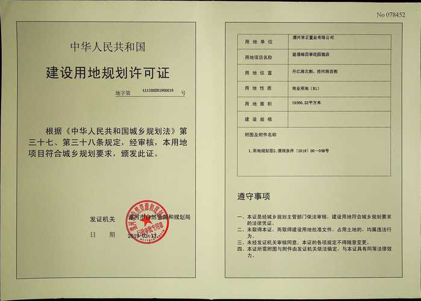
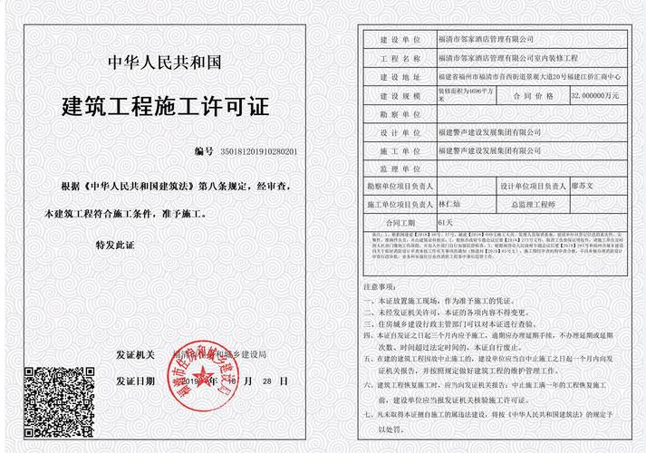
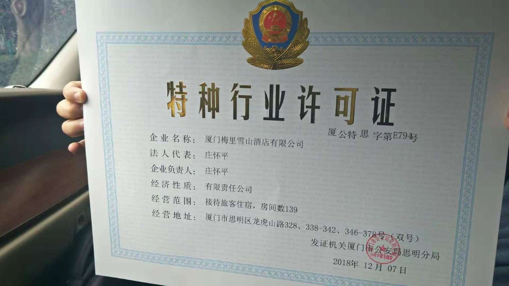
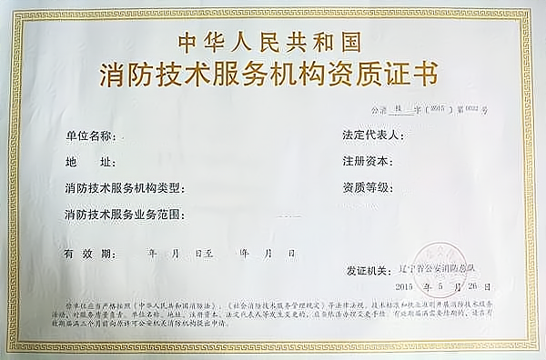
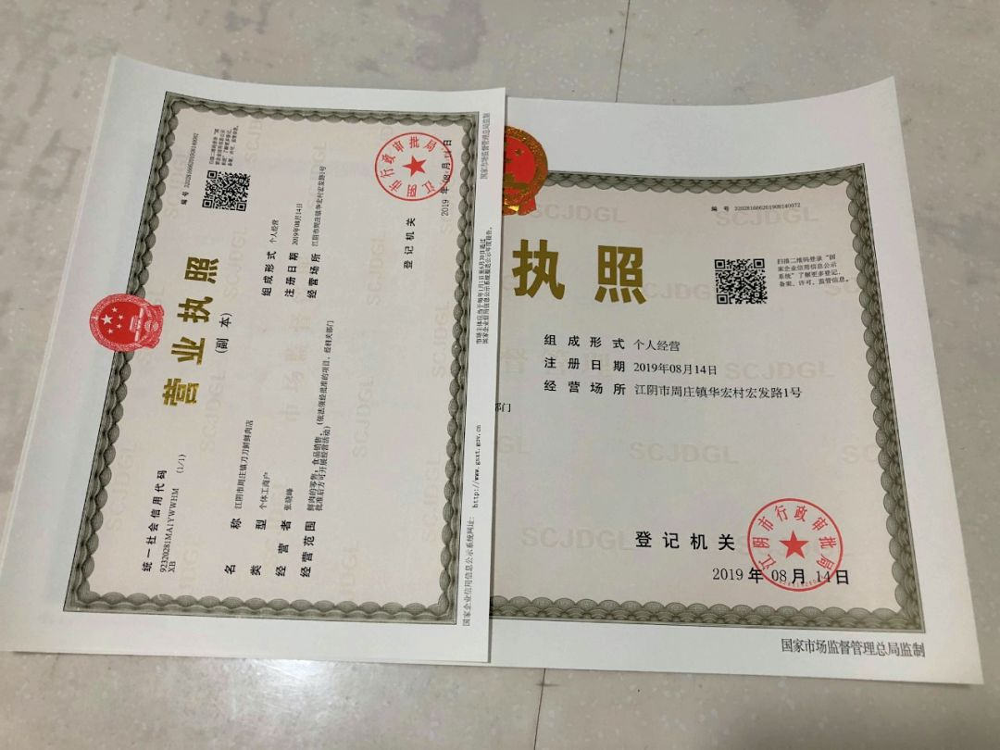

# 前期工作

## 开酒店需要什么资质

**土地使用权**：首先需要获取土地使用权。这通常涉及到地方国土资源局（或自然资源和规划局），你可能需要参与土地拍卖、出让或租赁等方式获得建设用地。土地使用年限根据不同用途而异，商业用途的土地使用年限通常最长为40年。

**项目审批**：随后需要进行项目立项审批，这一步骤可能需要向地方发展和改革委员会（发改委）提交项目申请，以获取建设项目的批准。

**建设用地规划许可证**：在获得土地使用权和项目立项批准后，需要向地方城乡规划部门申请建设用地规划许可证，以确保项目符合地区的规划要求。

**建筑工程许可**：之后需向城市建设（或住房和城乡建设）部门申请建筑工程许可证，提交建筑设计方案等相关资料，以获取施工许可。

**经营许可证**：开酒店必须具备经营许可证，它针对的是特定行业或经营范围，必须经过相关主管部门的许可才能进行经营。通常需要在当地政府部门办理，需要提交一些相关的申请材料，如**营业执照**、**税务登记证**、**组织机构代码证**等。

**消防安全许可证**：为了确保客人的安全，酒店必须通过消防安全检查并取得消防安全许可证。这需要酒店配备足够的消防设施和器材，并保证员工能够熟练地使用这些设施和器材。

​		明显的安全出口和疏散标志,灭火器等消防器

**卫生许可证**：开酒店必须具备卫生许可证，这是酒店卫生状况的证明文件。酒店需要符合卫生部门的要求，如客房清洁卫生、食品卫生等。

**人员资质**：酒店员工需要具备一定的资质和技能，如前厅接待员、客房服务员、厨师等。这些员工需要通过相关的培训和考试，并取得相应的职业资格证书。

**营业执照**和**税务登记证**：开酒店需要具备营业执照和税务登记证，这是企业合法经营的必要证明文件。需要在当地工商部门和税务部门办理。

**特定审批**：此外，还可能需要向**环保部门**、**公安局**等相关部门提交申请，以确保酒店运营符合环境保护、安全等方面的要求。

**充足资金筹备**：开设宾馆需要大量的初始投资，包括**购买或租赁场地**、**装修**、**购买设备和家具**、**雇佣员工**等。你需要制定详细的预算，并确保有足够的资金来支持你的计划。

每个步骤都可能涉及到复杂的文件准备和审核流程。具体情况可能因地区、项目具体情况等而有所不同，建议咨询当地的专业律师或咨询机构，以获得详细和准确的指导。在整个过程中，还需要注意与当地政府建立良好的沟通渠道，以便于及时了解相关政策动态和审批要求。